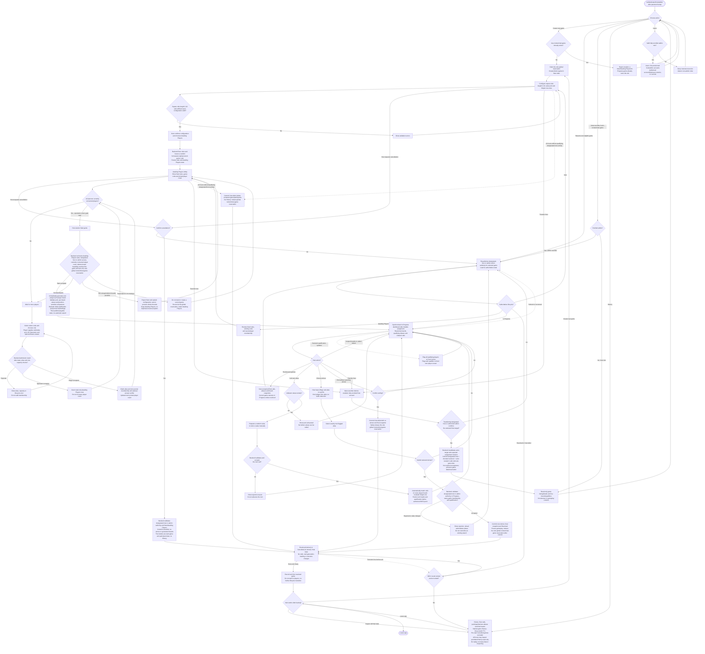
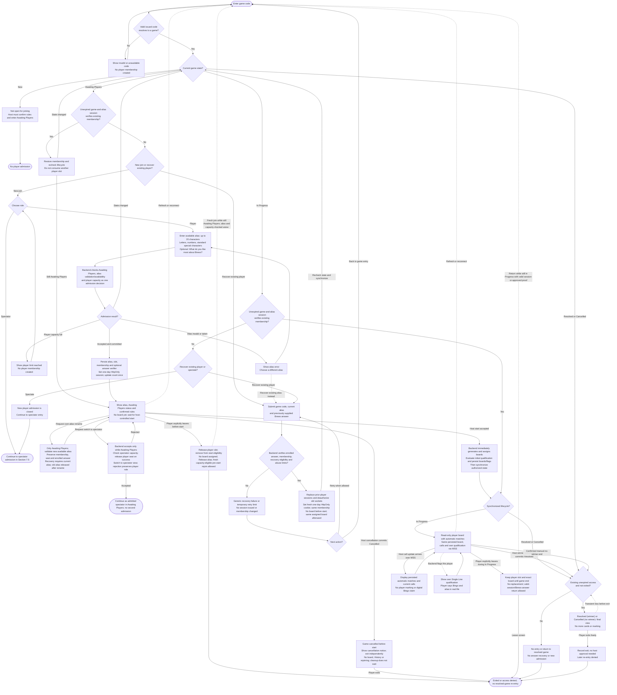
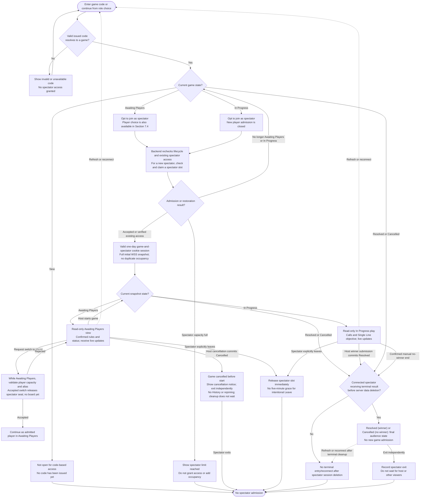

# Brews Bingo — High-Level Design

## 1. Document status and purpose

- **Status:** Cloudflare/Rust/Dioxus, automatic durable boards and Single Line are confirmed. Exact states: **New**, **Awaiting Players**, **In Progress**, **Resolved**, **Cancelled**. HLD-037 supersedes no-winner Resolved: a host-awarded winner produces Resolved; pre-start cancellation or manual no-winner ending produces Cancelled. Both are immutable terminal outcomes with no gameplay/reopening. Host read-only History and existing player identity/recovery rules remain; the existing three-month final History applies to started games ending in either terminal state, while pre-start Cancelled game/participant data is deleted after committed cancellation and excluded from History. HLD-033–HLD-035 settle board rules/assignment; overall HLD sign-off remains open.
- **Business:** Rockville Brews.
- **Requirements source:** [Business requirements](requirements.md).
- **Design input:** [Hosting research](research.md), especially Section 4.1; Cloudflare and Dioxus capability references are listed below.
- **Confirmed architectural constraint:** The system includes a **backend server**, an **app layer**, and a **developer-only CLI layer** for account provisioning. Authentication and authorization are backend responsibilities exposed to app clients through the login and hosting flows.
- **Update scope:** Rename the previous hosting account type to **host** (HLD-073), and introduce distinct **admin** (HLD-074) with host capabilities, privileged account/link/reset management and cross-game mutation authority without designated-host ownership. CLI operation remains developer-only; admin app operations are backend-authorized without cloud credentials in browsers. Preserve game-state/validity/TTL/privacy guards and LLD/implementation gates. Previous decisions carry forward where not superseded.
- **Review cursor:** Role changes, admin creation rule and admin-only Users view recorded through HLD-076. Primary walkthrough complete; UI/quality, source reconciliation and formal HLD approval remain separate. No implementation authorized.
- **Approval boundary:** The directions recorded here are approved at HLD level, not authorization to implement, create accounts/tokens, scaffold applications, or deploy. Online-only recovery supersedes the earlier offline-play direction; unresolved game rules and detailed implementation remain separate review stages.

This document will describe the system's major components, responsibilities, interactions, and trade-offs. Detailed screen designs, database schemas, API payloads, and implementation tasks will follow after the relevant high-level decisions are approved.

**How to use this document:** Replace remaining `TBD` prompts as sections are reviewed, and track decisions in Section 13. Do not treat a listed design topic as a new business requirement or a documented design as implementation/test evidence.

## 2. Scope and design inputs

### 2.1 Confirmed inputs

- **Frontend and delivery order:** Use **Rust with Dioxus**, targeting its latest stable release when implementation begins. Desktop/mobile **web is the initial implementation target and must support all approved app features**. Dedicated Android/iOS implementation is deferred; those clients will use Dioxus-supported platform/distribution paths and support as many app features as technically feasible. Mobile-browser access remains part of the initial web scope (BR-022–BR-024; HLD-003).
- **Multi-platform organization:** Plan `platform/web` initially, with `platform/android` and `platform/ios` added in their later phases. Keep reusable Rust domain/contracts and Dioxus UI outside platform-specific entrypoints so later mobile work does not require duplicating the application (HLD-019; Section 4.3).
- **Compatibility timing:** Apply D-002's latest-generally-available policy at each platform's release. The initial acceptance matrix covers desktop/mobile browsers; Android/iOS app matrices are defined when their deferred phases begin.
- Separate host and audience views and digital player cards (BR-018, BR-026). Backend-validated Single Line qualification is flagged on the host screen and each qualifying player’s own screen. The host selects and submits exactly one qualified player by alias after the real-life Bingo call; this is the current winning-claim workflow, not a player-submitted in-app claim (BR-027; HLD-023, HLD-024).
- Host-controlled random selection or manual entry, with valid-pool and duplicate checks (BR-002, BR-006–BR-008).
- Bingo values represented as strings. First-release numeric values run from `1` through a host-defined upper bound from `1` to `1,000` inclusive, defaulting to `75` (BR-025, BR-028; DO-043). This is a product guardrail, not a measured storage-capacity claim.
- Configurable **square boards only**, from **`2 × 2` through `10 × 10` inclusive**, defaulting to `5 × 5`: width and height must be equal integer side lengths in that range. Preserve sufficient-pool validation; reject non-square configuration before Awaiting Players. Random generation from the valid game pool with no repeated value per board is confirmed (HLD-033). Size bounds are settled; default free-cell placement on even-sized boards is fixed by HLD-035; configurable default-enabled free cells are confirmed in HLD-035; HLD-034 fixes generation/assignment immediately after host start (BR-029; HLD-025).
- In Progress-game recovery and completed-game draw history remain required (BR-013, BR-021). The approved reconnect proposal supersedes the old offline-continuity wording in BR-016/D-005: gameplay requires connectivity; disconnected clients show stale/read-only state and recover from durable state after reconnecting (HLD-020; Section 8).
- Both a backend server and an app layer are required. For the Cloudflare option, the online backend is Rust on Workers with SQLite-backed Durable Objects; the web build is served through Workers Static Assets. This implements the server layer as managed server-side components, not a continuously running VM/container.
- Use ongoing Free-plan allowances for the Cloudflare baseline; do not depend on trial credits or paid upgrades. Usage capacity must still be validated before release.
- **User-directed authentication scope:** Provisioned account types are **host** and **admin** (HLD-073/HLD-074). The developer CLI or authorized existing admins may create accounts; admin creation is restricted specifically to CLI/existing admins (HLD-075). Privileged Cloudflare credentials stay in the developer/server environment. Provisioning persists a one-day single-use enrollment-token verifier and privately returns an HTTPS link instead of an initial password. Valid redemption creates a restricted one-day HttpOnly session; password setup is mandatory before host/admin permissions and later password login (HLD-009/HLD-010/HLD-021). **DO-028** adds canonical-origin, fragment-only delivery and atomic one-time redemption; **DO-029** specifies epoch-bumping reissue and lost-response recovery; **DO-030/031** define the server-side account-session record and protected opaque browser cookie.
- **Random, distinct player boards (HLD-033):** Generate board values randomly from the valid game pool with no value repeated within one board. Identical complete boards across players in the same game are prohibited; regenerate a duplicate candidate with new combinations until valid. Board order matters: the same values in different cell positions form different valid boards; only identical cell-for-cell layouts are duplicates. No row/column-specific value ranges or placement restrictions apply; any valid pool value may occupy any value-bearing cell. HLD-034 fixes generation and assignment immediately after host start; HLD-035 confirms configurable default-enabled free cells; square sizes are `2 × 2` through `10 × 10`; default free-cell placement follows HLD-035 for both odd and even sizes.
- **Configurable free cells (HLD-035):** The host UI has a free-cell checkbox, **enabled/checked by default (`true`)**. Default placement is the center cell of the default `5 × 5` board. The host may disable the feature or configure free-cell placement before rules are fixed in Awaiting Players. Enabled free cells are satisfied from board assignment without a host call and count toward Single Line. Multiple free cells are allowed, with no count cap other than the board’s total cell count; selecting every cell is within that count rule. Free cells have no pool value: generate values only for non-free cells. Before accepting Start, reject a configuration unable to produce distinct boards for the start-time players and explain why. If free cells already complete a Single Line, flag qualification immediately on board assignment before any call; the host is responsible for that setup, and qualification is not an award. Use one-based `(ceil(height / 2), ceil(width / 2))` for the default free cell on both odd and even boards; this selects the odd-board center or the upper-left of the central cells on even boards.
- **Automatic player boards:** Players do not mark or unmark cells. Every accepted host call updates matching cells across that game’s persisted player boards and their qualification, then sends role-filtered WSS updates. Boards remain in the existing Game Durable Object’s SQLite storage even when their players are offline; reconnect restores all accepted matches (HLD-026; Section 6.2).
- **User-directed account capabilities (HLD-073/HLD-074):** **Host** is the renamed ordinary hosting account: creators become designated hosts; other hosts inspect games/live boards/History read-only, while only the designated host can exercise host-role mutations. **Admin** is a distinct privileged type with all host capabilities plus account provisioning/reset/access-link management and game mutations across games without being designated host. An admin action alone does not transfer ownership. Both obey lifecycle, pool/duplicate calls, player minimum/global limits, qualification, terminal immutability and retention.
- **Single nonterminal-game constraint (HLD-077):** At most one nonterminal game—New, Awaiting Players or In Progress—may exist application-wide. Creating New claims the sole global game slot; start retains the same slot. No other game may be created while it is occupied. Resolved and Cancelled are terminal and do not occupy it. Commit a terminal outcome before retry-safe release; viewer exits do not control the slot. The host leaves the result screen before creating another game, independently of old viewers. Start still requires at least two currently connected players. This supersedes the former separate saved-game and In-Progress allowances (HLD-039).
- **Confirmed workflow features:** Resume saved New/Awaiting Players games without recreation. Selecting a prospective winner is not final until backend acceptance of the submitted choice; that acceptance resolves with one winner. As clarified by the user, manual end while In Progress requires confirmation and commits **Cancelled with no winner**. Dismissing the end-confirmation prompt leaves In Progress unchanged; accepting it commits Cancelled. No additional transition from either terminal to a closed state exists; leaving the final screen only records exit/navigation.
- **Awaiting Players and code-based joining:** After creating a game that owns the sole nonterminal-game reservation, the host confirms its rules, grid and value pool, then enters Awaiting Players with fixed configuration and an 8-character alphanumeric code. Players use that code to join. At least two currently connected players permit explicit host-controlled start; the same global reservation remains held throughout. No second game can be created while this one is nonterminal (HLD-015, HLD-077).
- **Role choice and player alias:** Awaiting Players permits new player/spectator admission. A new player supplies a non-empty available alias of **up to 20 characters**, allowing **ASCII letters of either case, digits and printable ASCII punctuation** (HLD-050; outer ASCII spaces trimmed; internal spaces preserved under HLD-051). The approved user revision is exact case-sensitive alias equality after trimming: `Alice` and `alice` are distinct. Per-game uniqueness and recovery use that exact spelling; cross-game reuse is allowed without sharing membership, boards, answers or tokens. HLD-049/DO-045 approve this comparison rule. HLD-050/HLD-051 retain ASCII-only characters, outer-space trimming, preserved internal spaces and post-trim counting; HLD-052 allows own-alias rename only in Awaiting Players with current-alias recovery. HLD-053–HLD-055 release aliases after rename/pre-start Leave/spectator switch and allow fresh pre-start rejoining. Optional **“What do you like most about Brews?”** enrollment stores a private verifier. Skipping does not block joining but leaves no lost-session recovery. In Progress admits new spectators only. Existing players use a valid session or game code + exact current alias + matching enrolled answer; no forgotten-alias lookup or other recovery is supported (HLD-017, HLD-022, HLD-030–HLD-031).
- **Audience/spectator joining:** The same code permits capacity-eligible spectators in Awaiting Players and mid-game In Progress. Spectators never gate start: their presence, absence, count, readiness or connection status neither satisfies nor blocks the two-player prerequisite. Start requires at least two connected players and this game’s continuing ownership of the one global nonterminal-game reservation. No competing nonterminal game may be created while this game exists (HLD-012, HLD-016–HLD-018, HLD-077).
- **Configurable capacity with hard ceilings:** Maintain separate configurable per-game limits with backend-enforced hard-coded maxima of **20 players** and **50 audience spectators**. Configured limits may be lower but cannot exceed the corresponding ceiling. HLD-046–HLD-048 fix defaults at 20 players/50 spectators, integer ranges 2–20/0–50 and designated-host/admin edits only in New. Source-code placement/control layouts remain LLD/UI work, not open product capacity rules. Player-limit settings must permit the existing minimum of two players; these limits do not replace Cloudflare quotas or prove tested capacity (HLD-018).

### 2.2 Boundaries and unresolved scope

- Public account self-registration is not in scope; host/admin accounts are provisioned by the developer CLI or authorized existing admins under HLD-075. Entering a per-game player alias is game membership, not account creation. Payments, prizes, and event administration are not currently requested.
- Digital boards are randomly generated from the valid game pool without repeating a value within a board (HLD-033). Generation/assignment happen immediately after host start (HLD-034); board sizes are `2 × 2` through `10 × 10` inclusive, default `5 × 5`; default free-cell placement on even-sized boards is fixed by HLD-035. Automatic matching, Single Line, one host-submitted winner and terminal Resolved or Cancelled are settled (HLD-023–HLD-027). Resolved or Cancelled prohibits further calls, board generation/reassignment, marking/unmarking, winner replacement and reopening. Other patterns and automatic resolution on pool exhaustion are not introduced.
- Awaiting Players permits new players/spectators; In Progress permits only new spectators and verified existing-player restoration. One-day sessions and answer recovery remain as defined for those nonterminal states. Resolved or Cancelled allows final read-only continuation for existing not-exited viewers, independent exits, no new admission, no answer-based session issuance and no post-exit game re-entry. Hosts subsequently inspect final data only through History, including games hosted by other hosts. HLD-049/DO-045 approve exact case-sensitive alias equality; HLD-050–HLD-052 retain ASCII character/space rules and pre-start rename/current-alias recovery. HLD-045 permits pre-start role switching. Alias reuse is fixed by HLD-053–HLD-055 and concurrent host logins by HLD-061; HLD-042 preserves departed-player winner eligibility. No resolved reopening policy remains undecided.
- Rust and Dioxus are selected, not merely evaluated alternatives. Native Android/iOS apps are later work rather than initial-release blockers; their supported packaging/distribution will follow Dioxus at that time. Exact mobile feature coverage, adapters, signing/store workflow, release timing, and detailed browser/device matrices remain open. Mobile limitations must not reduce the required web feature set or weaken backend authorization.
- Cloudflare is the sole authoritative gameplay backend in this scope. No venue-local/offline authority, offline admission, or queued offline gameplay is planned. Availability, authentication, and state synchronization must be restored before commands resume.
- Event date is not an implementation constraint.

**Source-alignment note:** This HLD incorporates later explicit decisions without rewriting `requirements.md` or renumbering BRs. In particular, its older BR-016/D-005 offline-play wording is **superseded for this design** by the approved online-only recovery proposal (HLD-020), not claimed satisfied by WebSockets. Source-document reconciliation remains a separate edit. Older source prose also leaves backend/accounts/history undecided. BR-023/BR-024 remain deferred native-platform scope, with D-002 applied at each platform release. Per-game membership is not persistent account self-registration. HLD-023–HLD-031 also refine BR-026/BR-027/D-004 with Single Line, host-selected resolution, exact lifecycle names, cross-host visibility, alias limits and bounded player recovery, and constrain BR-029/D-001 board dimensions to equal width/height (square only); their earlier broad wording remains for separate source reconciliation. HLD-074 also supersedes BR-015’s designated-host-only mutation restriction for the new admin role; source BR-015 awaits separately authorized wording reconciliation. Historical host-role behavior remains designated-host-only.

## 3. System context and architecture overview

**Status:** Cloudflare online-only authority and durable recovery are confirmed. Detailed coordination, protocol/security implementation, and operational validation remain LLD work.

- **Actors and interactions:** The host controls setup/start/calls and selects one qualified winner after the real-life Bingo/alias exchange. Accepted submission durably commits Resolved and pushes the final winner/game state to current host/player/spectator views. All participants may leave independently. The host may then create a new game; the old result can be reinspected only through read-only History. Automatic boards, private role-filtered WSS and Awaiting Players/In Progress recovery remain unchanged; random board generation without per-board duplicate values is confirmed; generation/assignment follow host start immediately (HLD-034); default free-cell placement on even-sized boards is fixed by HLD-035.
- **App layer boundary:** Host, audience, and player experiences use a Rust/Dioxus app, initially delivered as a client-rendered web build. Shared UI and application logic are separated from platform adapters; later Dioxus Android/iOS clients use the same backend contract. Framework choice does not transfer authority or privileged CLI capabilities to clients.
- **Backend server boundary:** Backend auth validates single-use access links and subsequent passwords, issues/revokes one-day sessions, and enforces first-password setup and server-held roles. The Worker authorizes requests and routes discovery through the Game Directory Durable Object, then gameplay to the owning Game Durable Object. Each Object keeps its own SQLite state; browsers never receive database/provisioning access.
- **Developer CLI boundary:** Account provisioning is a privileged operational path, not a public registration feature or an host-user capability. Its Cloudflare database-access credentials remain in the developer's controlled execution environment and are never issued to app users.
- **State authority:** One Game Durable Object owns each game’s calls, per-player board layouts and automatic matched-cell state, qualification and selected winner. An accepted call, its affected board states, qualification, revision and deduplicated command result form one durable logical change before acknowledgement/broadcast. No client may submit marks/unmarks, replace a board or self-declare qualification. Host calls cause automatic board changes but do not grant manual board-editing rights. Backend state, not socket delivery or client participation, determines matches.
- **Application-wide lifecycle authority:** The Game Directory owns code lookup and the one global nonterminal-game reservation; Game Objects own their game state and final results. Claim the slot when New is created and retain it through Awaiting Players and In Progress. Winner acceptance commits Resolved; confirmed manual no-winner end commits Cancelled. Freeze the result before retry-safe release, and reconcile failures without letting stale work release a newer game’s reservation. No cross-Object transaction, second Close command or wait for viewer exits is assumed.
- **Game-code resolution and admission:** Resolve only issued codes and enforce lifecycle, role, alias and capacity at the Game Object. Awaiting Players admits players/spectators; In Progress admits new spectators only. Resolved or Cancelled denies new joins and all post-exit game re-entry, including with old cookies, saved codes or recovery answers; a code cannot bypass host History-only access. Before exit, a still-authorized participant may receive a final read-only snapshot under Section 7.7. Unknown codes never create games and code possession never grants host access.

```text
Host / audience / player Dioxus clients (web first)
       | HTTPS: static client assets
       v
Cloudflare Workers Static Assets

Dioxus clients
       | HTTPS: enrollment/login/commands; WSS: snapshots/live updates
       | HttpOnly session cookie; backend validates role, binding and expiry
       v
Rust Worker: access checks and routing
       +--> Game Directory Durable Object + its SQLite storage
       |      Issued code -> stable game ID; one global nonterminal-game reservation
       |
       +--> Game Durable Object + its SQLite storage (one per game)
              Accepted state/revisions/command results/membership
              Role-filtered hibernating WebSocket connections

Developer-only CLI (privileged credentials from environment)
       | Create host + persist single-use access-token verifier
       v
Backend account/token/session authority (physical store: LLD)
       | Access URL -> validate + consume -> restricted HttpOnly session
       | Required password setup -> normal host access
       | Later password login -> one-day account session

No offline gameplay authority; durable recovery after reconnect (Section 8)
```

Rust Workers compile to WebAssembly through `workers-rs`; its tooling generates the JavaScript entrypoint, rather than deploying an ordinary native Rust server binary.[1]
The Rust SDK exposes Durable Object WebSocket and SQL-storage interfaces; exact crate versions and integration compatibility remain to be tested.[7][8]

**Trade-off:** Co-locating game coordination, sockets, and SQLite persistence avoids a second live-state store but couples the hosting adapter to Cloudflare. Keep shared domain rules independent of provider APIs. No additional D1/R2 database is required for reconnection; do not use eventually consistent Workers KV as the authoritative code/admission/nonterminal-game registry.[16]

## 4. App layer

### 4.1 Experiences and platform delivery

| Area | Design to complete | Requirements |
| --- | --- | --- |
| Host experience | Configure, start, call and inspect qualified aliases as before. Select and submit one qualified player; accepted submission shows a terminal Resolved result; confirmed no-winner ending shows Cancelled. Exit that screen to create a new game; do not wait for participants or a second close action. Later inspection of that resolved game is only its final read-only History view, never resume. Layouts remain TBD. | BR-002, BR-008, BR-010–BR-012, BR-015, BR-021, BR-026–BR-029; HLD-011–HLD-015, HLD-023, HLD-027 |
| Host authentication | Open the developer-issued one-day access URL; the backend consumes its valid unused token and sets a one-day restricted session cookie. Complete password setup before hosting. Later password logins create one-day host sessions. Expired/used links do not authenticate. Screen details remain TBD. | BR-015; HLD-007, HLD-009, HLD-010, HLD-021 |
| Admin Users view | Admin-only **Users** lists provisioned admin/host accounts. Backend also rejects non-admin account-list requests, not merely hiding navigation. Account management/link/reset permissions follow HLD-074/HLD-075; columns/layout/pagination remain LLD/UI, and secret credentials/verifiers are never displayed. | HLD-074–HLD-076 |
| Audience experience | Join as spectator in Awaiting Players/In Progress within capacity and receive audience-visible WSS state. On terminal completion show Resolved with the winner or Cancelled without a winner; never show private boards. Spectators may exit independently; no new Resolved or Cancelled admission or return to the game after exit. Detailed layouts remain TBD. | BR-001, BR-003, BR-005, BR-014, BR-017–BR-019; HLD-016–HLD-018, HLD-023, HLD-027 |
| Player experience | Join in Awaiting Players with an available alias and optional Brews recovery answer; wait in the lobby without a board. Immediately after the host starts, the backend generates, assigns and persists the player’s board, then supplies its read-only live display (HLD-034). Matching cells highlight automatically from authoritative WSS updates after host calls; there are no mark/unmark controls or digital Bingo claim button. See own qualification flag, say Bingo/alias in real life, and follow the host-submitted single-winner ending screen. Session/answer recovery restores lobby membership without a board before start, or the same persisted board and all matches after start; recovery never generates a card. Boards are randomly generated from valid pool values without per-board repeats (HLD-033); generation/assignment timing is settled by HLD-034; default free-cell placement on even-sized boards is fixed by HLD-035. | BR-026, BR-027; HLD-017–HLD-018, HLD-020–HLD-026 |
| Platform delivery | Rust/Dioxus client-rendered web build on Workers Static Assets, covering all approved app features on desktop/mobile browsers. Dedicated Android/iOS clients are deferred, follow Dioxus-supported distribution, and target maximum feasible feature coverage with explicit limitations. Reuse shared code and the backend contract through platform adapters; detailed compatibility matrices remain TBD. | BR-022–BR-024, D-002; HLD-003, HLD-019 |
| Announcements | TBD — optional speech controls, playback ownership, platform support, and behavior during outages. | BR-020 |

### 4.2 App-side responsibilities

- **Presentation and interaction state:** TBD.
- **Host controls and visibility:** Distinguish New, Awaiting Players, In Progress, Resolved and Cancelled. The designated host or enrolled admin gets lifecycle-valid controls; other hosts’ viewing is read-only. Resolved shows the winner; Cancelled shows no winner. Both terminal states prohibit gameplay/reopening, release the one global nonterminal-game reservation after terminal commit, and allow independent exit. Started-game final History remains read-only after exit. Pre-start cancellation is excluded from History and its game/participant data is deleted after committed cancellation; detailed layouts remain open.
- **Participant entry and capacity feedback:** Awaiting Players offers player/spectator choice; new players enter an available alias up to 20 characters (either-case letters, numbers, standard special characters) and optional Brews answer. Alias equality is case-sensitive after outer-space trimming under the approved user direction (HLD-049/DO-045). Explain that recovering a lost session requires the exact current alias spelling, game code and enrolled answer: there is no alias lookup or alternative recovery for missing/forgotten information. Permit identical aliases with different casing and same aliases in different games without sharing identity. In Progress offers spectators plus a separate existing-player recovery path. Show applicable alias/capacity errors; client checks never reserve a slot, and rejection never silently converts roles. Validation/comparison implementation and capacity-setting mechanics remain LLD.
- **Resume and end safeguards:** Resume eligible New/Awaiting Players/In Progress games; never return Resolved or Cancelled to gameplay. Transient final-screen restoration before exit requires valid existing access; after exit only an host’s read-only History view is available. Winner submission finalizes directly; no-winner manual end requires confirmation. Exit preserves outcome/data and neither waits for nor ejects other viewers. Navigation/multi-tab/exit-record mechanics are LLD.
- **Authentication experience:** Access-link redemption starts a restricted first-password-setup session, not immediate hosting access. The backend generates the cookie using `Set-Cookie`; frontend code never writes/reads its HttpOnly token. Later logins use the chosen password. Show expired/used-link and expired-session outcomes without revealing credentials; no public account creation is introduced.
- **Input feedback versus authoritative validation:** Clients may validate form input and render committed state, but the Game Object validates all commands and computes board matches. Player cards are read-only; neither optimistic cell marking nor client-submitted marks/unmarks is authoritative or part of the workflow. Reused Rust rules in a client do not confer board or qualification authority.
- **Local persistence and refresh/restart recovery:** Remember non-secret game discovery context as appropriate and retain only a stale/read-only local view during disconnection. Restore from backend SQLite after refresh/reconnect; session secrets exist only in protected cookies, never localStorage/sessionStorage. Cache layout and clearing of role-private data on logout/expiry remain LLD details.
- **Receiving updates and representing stale/disconnected state:** Use Connecting → Synchronizing → Live → Reconnecting, plus expired/unavailable states. All roles receive a full authorized first snapshot and revision-aware WSS updates. Disable mutations until synchronized; no offline command queue. Retry with jittered exponential backoff capped at 30 seconds, heartbeat detection, and revision checks after foregrounding and periodically while live (Sections 7.6 and 8).
- **Accessibility, responsive layouts, and venue-display usability:** TBD — define review criteria without assuming a visual design.

**Web delivery decision for this option:** Serve the Dioxus client-rendered static build through Workers Static Assets; SSR and Dioxus fullstack server functions are not selected. Direct static-asset requests are free, while Worker execution consumes allowances.[3] The Rust Worker/Durable Object HTTPS/WSS backend remains authoritative. Asset caching may improve loading, but does not enable offline gameplay or bypass session expiry.

### 4.3 Dioxus baseline and multi-platform organization

**Confirmed direction (HLD-003, HLD-019):** Rust is the frontend language; Dioxus is the UI framework. Interpret "latest version" as the latest **stable** Dioxus release, not an alpha/beta or repository main branch. On **2026-10-01**, the official latest-release page resolves to **v0.7.10**.[9] Recheck when implementation begins and pin the selected Dioxus/CLI versions and compatible stable Rust toolchain in the LLD/build configuration; this dated lookup is not a permanent version freeze or an automatic-upgrade policy.

Dioxus documents a shared Rust codebase across web and mobile and allows platform API integration where first-party APIs are insufficient.[12] Its current bundling documentation covers Android and iOS outputs, while store distribution still requires platform-specific steps.[10][11] Use those supported paths for the later mobile phases, rechecking the then-current documentation; do not promise automatic mobile parity or store publication merely because the UI is shared.

**Feature coverage and delivery stages:**
- **Initial web:** Deliver approved host/admin/player/spectator features on desktop/mobile browsers. Hosts get hosting and cross-host read-only inspection; admins additionally get privileged account/link/reset management and cross-game actions (HLD-074). Developer CLI stays separate and operationally developer-only. Admin UI/backend interfaces/security details remain LLD; no scaffold authorized.
- **Later Android/iOS:** Reuse the app and backend contract, supporting as many features as technically feasible through Dioxus and platform adapters. Record supported, adapted, and unavailable features with reasons during each mobile phase. Do not narrow web scope to a lowest-common-denominator mobile subset; neither role permissions nor game invariants may be bypassed for portability.
- **Design now, implement later:** Define the separation now without installing dependencies, creating platform packages, or requiring mobile SDKs/signing in the initial web development path. Detailed manifests, crate names, interfaces, and build commands belong in LLD.

**Planned logical folder layout — not an existing scaffold:** `platform/web` and future `platform/android` follow the user's requested names; `platform/ios` follows the same boundary for the deferred iOS target. The supporting folders below express high-level responsibilities, with detailed crate decomposition left to LLD.

```text
brews-bingo/
├── plans/                 # Requirements, research, HLD; future LLD
├── shared/                # Reusable code, independent of platform entrypoints
│   ├── domain/            # Pure Rust game rules and types
│   ├── contracts/         # Shared app/backend contract types
│   └── ui/                # Shared Dioxus components and app interaction logic
├── platform/
│   ├── web/               # Initial web entrypoint, browser adapters and assets
│   ├── android/           # Later: Dioxus Android entrypoint/adapters/packaging
│   └── ios/               # Later: Dioxus iOS entrypoint/adapters/packaging
├── backend/               # Cloudflare Worker, Durable Objects, auth/persistence
└── cli/                   # Developer-only account provisioning
```

**Dependency boundaries:** Platform entrypoints compose shared UI/domain/contracts with platform adapters. Shared domain/contracts must not depend on Dioxus, browser/mobile APIs, or Cloudflare runtime APIs. Keep browser-specific behavior in `platform/web` and later native behavior in the matching platform folder; shared UI must not import a platform entrypoint. The backend/CLI may reuse safe shared domain/contracts but must not become client dependencies or expose privileged credentials. Mobile implementations must be addable without copying the full web application. Exact adapter interfaces and dependency/build isolation are LLD work.

## 5. Backend server

**Status:** Rust/Cloudflare online responsibilities defined for this option; detailed rules and interfaces remain open.

| Concern | Cloudflare-option responsibility / remaining decision |
| --- | --- |
| Game lifecycle and configuration | Exact states: **New** on host creation; **Awaiting Players** after rules/code publication; **In Progress** after eligible host start; **Resolved** after accepted winner submission; **Cancelled** after host cancellation from New/Awaiting Players or confirmed manual no-winner end from In Progress. Resolved and Cancelled freeze game/card data and prohibit restart/reopening; exit is navigation/access, not a sixth state. Fixed configuration and board validation remain unchanged (HLD-037). |
| Game code and player admission | Issue/persist the same random 8-character code in Awaiting Players. For a new player, accept only in Awaiting Players after checking the submitted alias is valid and not taken in this game and a player slot is available; claim alias/slot, record membership and any supplied recovery-answer verifier as one logical admission. Empty/omitted answers enable no recovery credential. Reject new players after start, even if the alias is unused or capacity remains. Competing joins/retries must not duplicate aliases, overfill capacity, or leave partial membership/recovery data; generation/session/atomicity mechanics belong in LLD. |
| Spectator admission and state delivery | Admit code-based spectators in Awaiting Players or In Progress only when spectator capacity allows. Keep spectator membership/count separate from players. Supply audience-visible Awaiting Players state or an In Progress snapshot including prior calls, then live updates across start/end. Never grant private board/account data or gameplay mutations. Recheck lifecycle/capacity on admission; a concurrent start may still permit a spectator, but an end must not be represented as ongoing play. |
| Capacity configuration and enforcement | Persist separate per-game limits bounded by hard-coded maxima of **20 players** and **50 audience spectators**. Reject invalid settings and over-capacity admissions server-side. Count memberships, not sockets; restore a valid session without a second slot. HLD-046–HLD-048 fix defaults/ranges/New-only edits; HLD-041/HLD-042/HLD-044 settle explicit departures; UI/constant placement and enforcement remain LLD; transient disconnects follow Section 8. |
| Resume and manual ending | Resume only eligible New/Awaiting Players/In Progress games. Winner submission resolves with one winner; confirmed manual end terminates as Cancelled with no winner. Dismissing the manual-end confirmation preserves In Progress. Resolved or Cancelled participants leave independently; post-exit data inspection is host History-only, with no game re-entry. No second close-to-finalize operation or deletion on exit. |
| Application-wide lifecycle coordination | The Directory owns the single application-wide nonterminal-game reservation; the Game Object owns its game/result. Claim the slot at New creation and keep it through Awaiting Players and In Progress. Commit/freeze Resolved or Cancelled before retry-safe release of that exact owner’s reservation. Reconcile cross-Object failures; do not rely on viewer exits/browser unloads or let a stale retry release a newer game. Detailed coordination remains LLD (HLD-077). |
| Draw processing | During playable In Progress, validate the designated host’s or enrolled admin’s random/manual call against the pool and prior draws. Automatically mark every matching ordinary value cell across all assigned boards in that game, leave nonmatching cells unchanged, and evaluate Single Line from the updated state. Commit the call, resulting board/qualification state, revision and command result as one logical change before acknowledging/pushing WSS. Disconnected players are included; rejected calls change nothing and accepted retries add no call or effect. Reject new calls after winner submission/end. Algorithm/transaction details remain LLD. |
| Cards and winning qualification | Persist each player’s board and automatic matched-cell state in the game’s SQLite-backed Durable Object under stable game/member identity. Players never mark/unmark; the host cannot manually edit their boards. Accepted calls automatically update matching cells before the backend evaluates Single Line through the pattern trait boundary. Also evaluate at initial board assignment: any complete free-cell line qualifies immediately before calls. Flag qualifiers to authorized fully enrolled host views and each qualifier individually (HLD-062); revalidate one-winner submission as before, with no automatic award or resolution. Random board generation without per-board repeated values and no identical boards across players in the same game are confirmed (HLD-033); regenerate duplicate candidates until valid. HLD-034 fixes generation/assignment immediately after host start; default free-cell placement on even-sized boards is fixed by HLD-035; storage schema/evaluation mechanics belong in LLD. |
| State distribution | Use role-filtered hibernating WSS snapshots and ordered revision-aware updates from the Game Object. After call/board/qualification persistence, push each player’s own board changes to that player, authorized board/qualification changes to fully enrolled host viewers (HLD-062), and only audience-visible calls/status/result to spectators. Keep snapshot/subscription synchronized with mutations and recheck authorization/expiry. Account WSS connections register non-authorizing `AccountSocketSubscription` metadata in AccountsObject against the current enabled Verified/Normal session before any authorized snapshot (DO-035); failed registration closes the socket. Under DO-036, revalidate session/epoch before each account-authorized outgoing frame; stale or unavailable authority suppresses the frame and closes the socket. Account revocations durably enqueue close work with acknowledgements/retries; DO-037 expiry sweeps likewise enqueue bounded, idempotent close work and retain subscription metadata until close/absence acknowledgement, then delete it. Cross-Object network close is not atomic, so a frame already authorized/in flight at commit may race. Socket attachments carry connection metadata, never the durable board record; client delivery/ACK is not required to update boards. |
| Persistence and history | Retain **final ordered announced cards, participating player aliases, winning alias and one final board-state snapshot per player** in History for **three months from resolution**, then automatically delete. No separate one-week player-data TTL remains. Each snapshot includes final layout/string values and matched cells, not a timeline of changes. Confirmed no-winner end has no winning alias. Recovery verifiers/session credentials are not History content; exact operational cleanup and indexing remain LLD (HLD-032; Section 6.3). |
| Authentication and account lifecycle | Persist host identity, role, access-token verifier/issuance/expiry/consumption, mandatory-password-setup state, chosen password verifier, and session verifier/binding/expiry/revocation. Atomically consume one valid one-day enrollment token and create one restricted one-day session, then set its HttpOnly cookie. Hosting stays blocked until password setup. Backend ownership/transaction guarantees are required; concrete physical account-store placement remains LLD work. |
| Access control | Enforce completed password setup and valid host/admin session for cross-host read-only game visibility/History, and designated-host or enrolled-admin permission for live-game mutations, and valid fully enrolled host/admin authority for read-only private live-board/qualification inspection (HLD-062). Player sessions bind to game code + alias and stable membership; spectator sessions bind to game/identity. Verified Brews-answer recovery atomically replaces the player session for that game/alias, invalidates prior tokens and deauthorizes their sockets before serving the same board. No alternate/forgotten-alias recovery, recovery-mediated role upgrade, Resolved or Cancelled recovery or post-exit return. HLD-060 defines confirmed host transfer; HLD-061 permits concurrent host logins; HLD-062 permits read-only non-host live-board/qualification visibility; cross-host History permission does not. |
| Retry and concurrency safety | Persist each accepted game mutation, revision and result under an actor/game-scoped command ID before acknowledgement/broadcast. Resolve interrupted commands by that ID rather than creating another draw. A failed broadcast does not undo a committed mutation; reconnect snapshots and periodic revision checks repair client state. Token redemption similarly requires atomic consume-and-session-create; mechanisms remain LLD work. |

**Server structure, runtime, and scaling model:** Rust Worker and Durable Object classes via `workers-rs`, compiled for Wasm, remain the baseline.[1][7][8] One directory Object supplies durable discovery/global coordination and each game Object handles its own state and sockets. Separate objects do not authorize simultaneous active games. SDK versions, transaction/hibernation integration, account-store placement, data-location policy and measured capacity remain LLD/verification work.

### 5.1 Developer-only CLI and admin account-management boundary

**Superseding privilege direction (HLD-074):** Account creation, enrollment/reset/reissue links and safe account disable/delete are available to authorized admins via backend/app as well as to the developer CLI. HLD-078 adds disabled-account enable through an API/app and CLI, restricted to another enrolled admin account or the developer CLI; no self-enable. The CLI itself remains developer-only. Prior developer-exclusive account-management wording is superseded; ordinary hosts remain excluded. HLD-075 restricts admin creation to CLI/existing admins and makes CLI the first-admin bootstrap path; hosts remain non-provisioning. Cloudflare credentials remain server/developer secrets.

- **Operator:** Only the developer may invoke the credential-bearing local CLI. Existing enrolled admins may invoke equivalent account provisioning/management through authorized app/backend operations (HLD-074/HLD-075), without those credentials. Hosts, players and spectators have neither CLI nor account-provisioning rights.
- **Credentials:** The CLI requires privileged Cloudflare database-access credentials obtained through environment variables in the developer's controlled environment. Environment-variable delivery is not itself proof of operator identity; access to the CLI execution environment and credentials must be restricted to the developer. Missing or insufficient credentials must prevent provisioning.
- **Capability:** Create a **host** or **admin** pending password setup under HLD-075 creator restrictions, generate a one-day single-use enrollment access token, and persist verifier/account/purpose/issue/expiry/consumption state through authorized backend/storage. Only then return the private HTTPS link; DO-029 makes repeated `command_id` retries secret-free and requires an explicit successor reissue to recover an undelivered URL. Reissue is status/disablement-gated, increments the credential epoch once and invalidates predecessor links/sessions. No random initial password or normal-session authority at issuance. Exact CLI commands and atomic/physical mechanisms remain LLD.
- **Boundary:** This is a privileged provisioning path, not a public endpoint or a capability granted by an app-level host role. Do not assume the environment credentials are a conventional SQL username/password or that the CLI connects directly to per-game SQLite storage; the authorized Cloudflare access mechanism and account-store placement belong in the LLD.
- **Deferred detail:** CLI language/packaging, command syntax, environment-variable names, credential scopes, storage/API access, error handling, and operational procedures are not selected here. No credentials or accounts are created by this document.

## 6. Domain concepts and data ownership

**Status:** High-level ownership and lifecycle concepts; not database tables or an approved schema.

**Online ownership and persistence:** Each Game Object owns committed rules, lifecycle, calls and player boards/matches/qualification during gameplay. Persist in SQLite, not memory/sockets alone; retain one Object per game. The Free plan supports SQLite-backed Durable Objects.[4] Resolution freezes gameplay and saves **ordered announced cards, participating aliases, winning alias and each player’s final board snapshot** as History for three months. Store self-contained snapshots, not dependencies on live memberships/sessions or intermediate board revisions. All retained History player information uses that same three-month TTL; the earlier one-week TTL is removed. No new database/client authority is introduced (Section 6.3).

**Cross-game ownership:** The Directory owns code-to-game-ID mappings and the sole application-wide nonterminal-game designation; each Game Object owns its own game data. Claim the designation at creation in New; retain it through Awaiting Players and In Progress; release after Resolved/Cancelled commits. Stable IDs, not reusable codes, preserve isolation.[15] History/index expiry remains three months after terminal; coordination is not a cross-Object transaction.

**Awaiting Players-state ownership:** Commit fixed configuration and Awaiting Players state in the Game Object and publish its code association in the directory through a retry-safe operation. Reopening restores the existing code and saved membership; a failed publication cannot expose an unready game. Unknown codes never initialize games. The code remains stable through Awaiting Players/In Progress and approved recovery; HLD-057/HLD-058 fix code validity/reuse; History retains final announced cards and participating/winning aliases for three months after resolution.

**Admission ownership:** The Game Object persists per-game alias claims, memberships, optional recovery-answer verifiers, role limits, participant-session bindings, and spectator disconnect-grace deadlines. A player join losing a race with start fails. Verified reconnection or HLD-022 recovery restores a membership, not another slot. Answer-based recovery replaces prior player sessions/sockets for that membership before serving its fresh authorized snapshot, only while Awaiting Players/In Progress. Reserve In Progress player membership until resolution; a disconnected spectator has five minutes before capacity must be rechecked. Session expiry is independent of membership and recovery-verifier retention. Explicit-leave policies are fixed by HLD-041/HLD-042/HLD-044; presence detection/cleanup and recovery transaction mechanics remain LLD.

**Account data ownership:** Backend auth owns persistent host/admin account identity and server-owned role, enrollment access-token verifier/consumed state, password-setup state, chosen password verifier, account session verifiers with absolute expiry/revocation, DO-035-approved session-bound socket subscription metadata and DO-036 durable revocation work. Account/session data outlives process and socket lifetimes; subscriptions are revocation/cleanup metadata, never authority, and expire with their linked fixed-deadline session. Subscription registration revalidates current enabled Verified/Normal authority in the AccountsObject before an authorized socket snapshot; Game Objects revalidate before account-authorized outbound frames and fail closed when authority is invalid/unavailable. Revocation work retries until GameObjects acknowledge the exact connections closed or absent; a frame already authorized/in flight may race with the cross-Object commit. At linked session expiry, per-frame checks deny authority immediately; bounded/idempotent cleanup work closes affected sockets and deletes subscription metadata only after close/absence acknowledgement (DO-037). Sweep cadence and physical details remain LLD work.

| Concept | Definition and ownership to complete |
| --- | --- |
| Game configuration | Host-selected square side length **2 through 10 inclusive**, default `5 × 5`, valid string pool and Single Line objective. Reject non-square/out-of-range dimensions and insufficient distinct pool values for non-free cells before Awaiting Players. Free cells are configurable and valueless, enabled by default with one selected location using one-based `(ceil(height / 2), ceil(width / 2))` on both odd and even boards (HLD-035). The host may disable or select multiple locations up to all cells; reject Start if distinct boards for the start-time players are impossible. Rules remain fixed in Awaiting Players; HLD-038 prohibits return to New/editable configuration. |
| Game lifecycle and global reservation | **New → Awaiting Players → In Progress → Resolved** is the winning path. **New, Awaiting Players or In Progress → Cancelled** is the no-winner terminal path. Resolved requires one valid host-selected qualified winner; Cancelled has no winner. Claim exactly one application-wide reservation at New creation and hold it through Awaiting Players/In Progress; release only after a committed terminal transition. Pre-start cancellation deletes its game/participant data after commit and releases that same slot through safe coordination. Preserve all five exact domain state names (HLD-037, HLD-077).
| Game code | Backend-generated random sequence of exactly 8 characters from uppercase ASCII A–Z and digits 0–9 (HLD-056) issued in Awaiting Players. Allows player/spectator choice in Awaiting Players and spectator-only new entry in In Progress. Preserve its association through In Progress; HLD-056 fixes case-insensitive lookup with outer ASCII-space trim and no internal spaces; lifecycle validity/reuse is fixed by HLD-057/HLD-058; lookup/issuance/cleanup mechanics remain LLD. It is not a host/admin or existing-player credential. |
| Player alias and membership | Required non-empty alias, **maximum 20 ASCII characters after trimming outer ASCII spaces**. Allow ASCII letters/digits/printable punctuation and internal spaces; preserve repeated internal spaces and reject Unicode/control characters. Approved user direction: exact case-sensitive per-game uniqueness/recovery after outer-space trimming (`Alice` and `alice` are distinct; HLD-049/DO-045). Cross-game reuse remains independent. Claim with an Awaiting Players slot; alias alone is not a credential. HLD-050/051 retain character/space/counting rules. HLD-052 allows own-alias rename only during Awaiting Players; Item 5.5 uses the exact current alias after rename; HLD-053/HLD-054 release aliases after rename, pre-start Leave or player → spectator switching. HLD-055 permits fresh pre-start rejoin; HLD-067 deletes the verifier on spectator switch. |
| Optional Brews recovery answer | Optional free text collected with the player alias at initial join. The Game Object stores a salted, non-reversible answer verifier with the stable game/member identity, not readable feedback. Omission/blank means no answer-based recovery. Answers need not be unique across players; verification is scoped to the supplied game code and current alias. DO-050 approves version 1 comparison as Unicode NFC, trim outer Unicode whitespace, then case-fold; preserve internal whitespace and punctuation. Verifier profile, exact Unicode implementation/version and retention mechanics remain LLD (Section 9.4). |
| Capacity limits and occupancy | Separate configurable per-game maxima bounded by **20 players** and **50 audience spectators**; player limit may be any integer **2–20 inclusive**, default **20** (HLD-046/HLD-047); spectator limit may be any integer **0–50 inclusive**, default **50**; zero disables spectator admission (HLD-046/HLD-047). Player capacity supports the two-player start prerequisite. Count distinct memberships, not socket handles. Reconnect restores existing occupancy; reserve In Progress player slots until end and disconnected spectator slots for five minutes. Expired sessions do not become valid merely because a slot remains reserved. HLD-041 releases a player slot on explicit Awaiting Players Leave; HLD-042 retains the slot/board on explicit In Progress player Leave; abandoned-game retention follows HLD-068; detailed presence/cleanup remains LLD; HLD-044 releases spectator slots immediately on explicit Leave; HLD-043 fixes disconnected-player slot retention in Awaiting Players. |
| Spectator access | Capacity-limited read-only Awaiting Players/In Progress access, separate from player membership. Existing viewers receive the Resolved or Cancelled result and may exit independently. No new Resolved or Cancelled admission or post-exit re-entry; no private boards, marks, host controls or player count. Exact session/exit enforcement belongs in LLD. |
| In Progress game state and final result | In Progress owns rules/members/calls/boards/qualification. Winner submission freezes Resolved; confirmed manual no-winner end freezes Cancelled. Persist final announced cards, alias roster/winning alias and each player’s final board state for History under the common three-month TTL; final-screen access/exit/session metadata is separate from that read-only record. No intermediate board-state archive or restored gameplay. Immutable forbids edits, not scheduled expiry/deletion. |
| Draw record | Committed string values in call order; the host can inspect the complete current-game sequence. Consistency/recovery metadata belongs in the LLD. |
| Digital player card | Each player’s board layout, string values and automatic matched-cell state are durably associated with the stable game/member identity in that Game Object’s SQLite storage. Players view only their own board; all fully enrolled hosts/admins may inspect all boards/qualifiers read-only under HLD-062. Accepted calls update matching cells server-side, including for disconnected players, and WSS carries the persisted changes. No manual mark/unmark or board replacement via reconnect. Random generation from the valid pool without repeated values within a board is confirmed (HLD-033); generation/assignment timing is settled by HLD-034; default free-cell placement on even-sized boards is fixed by HLD-035; exact record/schema and synchronization mechanics are LLD. |
| Winning qualification and selected winner | A qualifier is an existing player whose board satisfies Single Line against authoritative game data. Multiple players may qualify; this is not an award. The designated host submits exactly one qualifier, identified by stable membership and displayed alias, after judging the real-life first Bingo caller. HLD-042 keeps intentionally departed players eligible if their retained board qualifies; current connection/return is not required for an award. Persist at most one selected winner per game and terminal Resolved status; no in-app player claim or microphone detection is required. |
| Completed-game record | Immutable History of **final ordered announced cards, participating aliases, winning alias and one final board-state snapshot per player**, automatically deleted **three months after Resolved or In Progress → Cancelled**. Winner is absent for confirmed no-winner end. All hosts may inspect across hosts; former player/spectator membership alone gives no History right. Preserve each final board’s layout/values/matches linked to its alias, without board-change timelines, session/recovery credentials or extra personal data. No separate one-week player TTL. Minimal internal game/host/expiry metadata supports routing/authorization/cleanup (Section 6.3). |
| Provisioned account | Backend-owned account ID/type (host initially), pending/completed password setup, and chosen password verifier. Enrollment uses a one-time access link, not an initial password. Concrete schema/physical storage remain LLD work. |
| Enrollment access token | Opaque bearer token linked server-side to an host account and enrollment purpose; verifier and unused/consumed state persisted. One-day TTL from issuance; successful use permanently consumes it. No game code or player alias required for host enrollment. |
| Browser session | Backend-generated opaque token, persistently verifiable, sent only in a Secure/HttpOnly/SameSite cookie. Fixed one-day TTL from session creation, no activity/reconnect extension. Successful HLD-022 recovery issues a new one-day player session, not a revived/extended old credential. Player binding: game code + alias + stable member/game IDs; host: account; spectator: game + spectator identity. Membership, recovery-verifier and session lifetimes are distinct. |

**Cross-cutting decisions:** State ownership, token lifetimes, role bindings and HLD-032 resolved-data content/TTLs are fixed. Revised case-sensitive username/alias comparison rules await final approval; their exact enforcement/serialization, value comparison, reliable expiry/deletion mechanics and non-secret local cache details remain LLD. No authoritative offline copy. Preserve bingo values as strings and keep immutable final History snapshots separate from operational authentication/recovery records.

### 6.1 Winning-pattern trait boundaries

**Confirmed direction (HLD-023):** Model each distinct winning pattern behind its own **Rust trait** boundary. **Single Line** is the only concrete pattern currently specified; row, column and diagonal are qualifying orientations of that pattern, not three separately approved game modes. Future distinct patterns get distinct pattern-specific traits; their behavior is not in current scope. A common orchestration interface may be designed in LLD, but must not silently replace the requested separate pattern traits with only one generic trait.

Keep pattern evaluation in the provider-independent Rust domain layer (`shared/domain`); the backend invokes it against authoritative game/card state. Run pattern evaluation on initial assigned board/free-cell state as well as after accepted calls. Pattern logic determines qualification, not host permissions, networking, UI, who yelled first or who receives the final award. Client-side reuse may assist presentation but cannot become authoritative.

**Departure is not elimination (HLD-042, Item 3.5):** Explicitly leaving during In Progress does not remove qualification or award eligibility. Continue automatic matching/evaluation of the retained board, show qualifying aliases to the host, and permit the host to award an eligible departed player without requiring reconnection first. Real-life Bingo/alias judgment and one immutable selected winner still apply.

**Single Line semantics:** Only square boards are permitted (HLD-025). One complete row, one complete column, or either complete corner-to-corner diagonal is sufficient; the diagonals run top-left to bottom-right or top-right to bottom-left across the full board, not offset/wrapping lines. Allow every integer square side length from 2 through 10 inclusive; the default remains `5 × 5` (HLD-025). Ordinary value cells become matched automatically when their value is called by the host and accepted by the backend (HLD-026); no manual mark is required or accepted. Evaluate qualification against this updated durable board/call state, not client assertions. Generate board values randomly from the valid pool without repeats within a board (HLD-033); generation/assignment immediately after host start is fixed by HLD-034; enabled free cells are satisfied from board assignment and count toward Single Line (HLD-035). Evaluate immediately at assignment; an already complete free-cell line flags qualification before the first call. This host-configured outcome is allowed, but it never selects a winner or resolves automatically. HLD-035 fixes the default on even-sized boards to one-based `(ceil(n / 2), ceil(n / 2))`; odd boards use their single center.

**LLD boundary:** Trait names/signatures, common bounds, types, dispatch, evaluator algorithms, error handling and tests belong in LLD. No Rust trait code, concrete implementations, scaffold or dependencies are created by this HLD update; implementation remains separately authorized after detailed design.

### 6.2 Durable player boards and automatic value matching

**Confirmed direction (HLD-026):** Players never mark or unmark their cards. Here the host generating the “next card” means calling the next bingo **value**, not generating a replacement player board. Both previously approved call modes—backend random selection and host-entered valid values—use the same automatic matching path.

- **Board value generation (HLD-033):** Randomly generate each player’s board from the game’s configured valid value pool, with **no value appearing more than once on the same board**. The backend owns generation and validation; player clients do not choose or replace authoritative boards. Treat this as random selection without replacement within each board, preserving string values and sufficient distinct-pool validation for the non-free value cells (HLD-035). Identical complete boards for different players within the same game are prohibited: regenerate a duplicate candidate with new combinations until a valid, unique board is produced. This does not impose globally disjoint values across players. **Order matters:** compare complete layouts cell by cell; boards with the same values in different cell positions are different valid boards. Regenerate only a cell-for-cell duplicate, not every reuse of the same value set. **Unrestricted placement:** any valid pool value may occupy any value-bearing cell; do not impose row/column-specific ranges, buckets or other value-placement restrictions. Preserve the existing per-board value and per-game layout uniqueness rules. Generate/assign immediately after host start (HLD-034); configurable default-enabled free cells follow HLD-035; square sizes are 2 through 10 per side; default free-cell placement on even-sized boards is fixed by HLD-035; exact randomization algorithms belong in LLD.
- **Distinct-board feasibility at Start (HLD-033–HLD-035):** Before accepting the host’s Start request, verify that the configured board, free-cell locations and valid pool can produce enough position-distinct boards for the start-time player memberships. If not, **reject Start and explain that the configuration cannot produce distinct boards**. Keep Awaiting Players and its existing rules/code/memberships; do not generate/assign gameplay boards or replace the existing global nonterminal-game reservation or silently allow duplicates. An all-free board necessarily fails for the minimum two players because every cell-for-cell layout is identical. This is a feasibility constraint, not a smaller free-cell count cap. Any return to editable configuration remains the separate unresolved pre-start lifecycle policy; rejection does not authorize it.
- **Generation feasibility and retry detail:** Regeneration must preserve valid-pool membership, per-board value uniqueness and per-game complete-board uniqueness. Use position-sensitive board equality. Infeasible configurations are rejected at Start with an explanation; exact feasibility/collision/retry algorithms and handling of operational generation failures remain LLD details. Do not assign an invalid or duplicate board or claim an unbounded retry loop guarantees success.
- **Free-cell option and placement (HLD-035):** Provide a host-controlled checkbox defaulting to `true` (checked/enabled). Select **one free cell by default**, using the same one-based formula for every supported board: **`row = ceil(height / 2)`**, **`column = ceil(width / 2)`**. This is the single center on odd boards and the upper-left of the central cells on even boards; `2 × 2` → `(1,1)` and `5 × 5` → `(3,3)`. The host may disable free cells or choose multiple locations up to the entire board, with no smaller count cap. This is shared game configuration finalized before Awaiting Players, not player marking or an In Progress edit. Free cells have **no pool value**; fill only non-free cells with distinct valid pool values. FREE markers are not repeated pool values. Free cells are satisfied on assignment and count toward Single Line; immediately flag a completed free-cell line before calls, without automatic award/resolution. The host is responsible for such setup. Persist free-cell locations/status in boards and final History. Reject Start with an explanation if distinct layouts are impossible, including all-free boards. Record representation and algorithms remain LLD.
- **Generation and assignment timing (HLD-034):** Immediately after the designated host’s start is accepted, the backend generates and assigns a valid HLD-033 board to each player membership included in that start, including retained members who are temporarily disconnected. No boards are generated or assigned in New/Awaiting Players or merely on admission, refresh or answer recovery. Freeze the start-time roster under the existing admission/start rules, evaluate initial qualification, persist assignments and their qualification consistently, and make them available through authorized WSS state before accepting the first call. Start retries or interrupted initialization must recover existing committed assignments, not replace them or consume extra memberships. No additional user-visible lifecycle state is introduced; precise start/assignment transaction and failure-handling mechanics remain LLD. Player-presence eligibility at start remains its separate open policy.
- **Per-game persistence:** Keep each player’s assigned layout, string cell values and automatic matched-cell state associated with the stable game/member identity in that Game Durable Object’s SQLite storage. Generate and assign immediately after accepted host start (HLD-034), never during New/Awaiting Players admission or recovery. Persist all start-time player assignments before playable board delivery or the first call; exact algorithms and transactional boundaries remain LLD. Each game owns its own board records even when an alias appears in another game. The existing one-Object-per-game architecture is sufficient; no per-board Object or additional store is selected.
- **Call → match → qualify → commit → push:** Validate host, playable phase, pool and non-duplication. For an accepted call, set every matching ordinary value cell on every assigned board in this game to matched, preserve already matched cells and leave other cells unchanged, then evaluate Single Line. Commit the ordered call, resulting board/qualification states, revision and command result as one consistent logical change before acknowledgement/WSS. Failure must not expose a call without its board effects; exact transactional mechanics and value-comparison representation remain LLD.
- **Automatic and idempotent:** Board progression depends on accepted calls, never on clicks, an online player socket or a delivery acknowledgement. Update disconnected players too. Rejected calls and forged client mark/unmark requests have no effects; an accepted-command retry returns the saved result without a duplicate call or toggling matches. HLD-033 prohibits repeated values within a generated board; this is distinct from preventing duplicate host calls. Once a winner submission is accepted, the game is Resolved; a no-winner cancellation produces Cancelled. Neither terminal permits further value calls, board generation/reassignment or marking changes. No later Close action, correction or unmark feature is implied.
- **Role-filtered real-time views:** Push each player’s persisted board changes and own qualification to that player and the authorized board/qualification views to fully enrolled host viewers (HLD-062). Spectators receive calls, objective, status and selected-winner result, never private boards. WSS delivers committed updates, not permission for clients to write board state. Field shapes, batching and view-revision mechanics remain LLD.
- **Recovery:** Before host start, restore lobby membership with no board; recovery must not generate one. After start, a refresh, changed session, socket loss or Object restart restores the same assigned board and all automatic matches from persistent storage using the full-snapshot protocol. Missed/duplicate/out-of-order messages trigger the existing revision repair rules, never regeneration, local mark replay or rollback of committed state. Resolved or Cancelled guards and post-exit access restrictions still apply.
- **Board-rule review status:** Random valid-pool generation, per-board value uniqueness, position-sensitive board uniqueness, unrestricted value placement, start-time assignment, free-cell behavior/defaults and square sizes are settled (HLD-025, HLD-033–HLD-035). Backend automatic matching, WSS privacy and three-month final History remain unchanged. Concrete generation/feasibility algorithms, board representation, retry/transaction mechanics and tests remain LLD; no implementation is authorized. HLD-036–HLD-048 fix pre-start lifecycle, presence and departure policies; HLD-068 adds 24-hour host-idle auto-cancellation of unstarted games.

### 6.3 History content and automatic expiry

**Confirmed direction (HLD-032, latest revision):** Retain one read-only final-game History record for **three months from the first durable terminal transition (Resolved or In Progress → Cancelled)**, for both winner submission and confirmed manual no-winner end. **There is no separate one-week player-data TTL.** Reads, exits, reconnects, command retries, restore operations or another game never renew the deadline.

| History content | Retained final information |
| --- | --- |
| Announced cards | Final ordered list of announced/called string values, preserving announcement order. |
| Participants | Player aliases that participated in that game. Same alias in another game remains unrelated. |
| Winner | Winning alias; absent when the host confirmed manual end without selecting a winner. |
| Player boards | **One immutable snapshot of each player’s final board state**, linked to that game’s participant alias: board layout/cell values, configured valueless free-cell locations/status and final matched-cell state. Store the final snapshot only, not prior boards, per-call board revisions, intermediate marks or a replay archive. |

All of these fields—including the aliases and **final board snapshots**—remain together until the **three-month History TTL**, then are automatically deleted. Preserve the requested month-based duration, not an unstated 90-day substitute; precise calendar/month-end arithmetic belongs in LLD. Necessary internal stable-game/host/issued-code/terminal-time/expiry metadata supports routing, authorization, HLD-058 code collision checks and cleanup. The issued code shares History’s three-month TTL; it is not a permanent registry or credential. No extra personal information, full membership/session records, recovery answers/verifiers, credential values or unrelated configuration is added to the History payload. Board dimensions/layout needed to represent the final snapshot are part of that snapshot, not a retained editable rules document.

**Final state versus replay or recovery:** Capture each board’s last committed state consistently with final calls and the winner/no-winner result at resolution. The snapshot must stand alone, rather than requiring live member/session records to survive or reconstructing every earlier board update. After exit any authenticated host, including another host, can inspect this final History, but cannot reopen the game, edit a board, generate/mark cards, re-award a winner or restore a player session from retained aliases/boards. Existing authorized not-exited viewers may remain on the final result screen within normal access limits; History does not extend those limits. One-day session expiry and no answer recovery into Resolved or Cancelled remain unchanged. There is no new player-recovery privilege or non-host History entitlement.

**Backend-enforced automatic deletion:** Persist the fixed History expiry with resolution and require durable retry-safe scheduled cleanup even without client visits. A TTL column or client timer alone is insufficient. Deny reads/delivery of expired History at the authoritative deadline despite cleanup delay; automatically delete the entire record and related indexes/copies and retry interrupted failures. LLD defines scheduling, month arithmetic and bounded cleanup-lag targets without weakening the three-month deadline. Clear private cached views on expiry/access loss. Logs, replicas, backups and restores must not retain or resurrect expired History through copies. Shared host accounts and unrelated games are not deleted. Operational player/session/recovery artifacts are not History: their existing access/credential expiry and cleanup requirements stay separate, must not be archived as History, and cannot be used to extend expired game access. Exact data-minimization/cleanup mechanisms belong in LLD; the user’s one-week TTL has been withdrawn.

**Pre-start History exclusion (HLD-036, Item 2.4):** Games cancelled from either New or Awaiting Players do not appear in History. No empty History entry is generated; Item 2.5 requires deletion of their game and participant data after cancellation is committed, without an extra retention interval. Do not retain the cancelled game as an operational archive or empty History entry. Safe notification, command-result retries, durable deletion and minimal anti-replay/code protection are LLD concerns; they must not restore a cancelled game or preserve participant secrets unnecessarily. The three-month History TTL above applies only to games that reached In Progress, ending as Resolved or Cancelled.

**Retention/export review complete (HLD-068–HLD-072):** Unstarted games expire after 24 hours of host inactivity and commit Cancelled before deletion, without History. Spectator identity/sessions delete at seat release/end; player recovery verifiers delete at terminal completion, with minimal existing-session/exit state only until Exit/original expiry. Host/admin accounts remain until authorized developer-CLI/admin disable/delete, blocked while hosting nonterminal games. No initial-release History export. Scheduled deletion, notification/anti-replay, audit/backups and storage mechanics remain LLD/operations; no extra storage service is selected.

## 7. Communication and key workflows

### 7.1 App–backend contract

- **Interaction and update mechanisms:** HTTPS handles enrollment redemption, password login/setup, admission, player-answer recovery, mutations, command-result queries and history. Recovery answers travel only in protected request bodies, never URLs or WebSocket messages. All roles use WSS for the initial full snapshot and subsequent authorized live updates from the owning Game Object. Prefer push over routine state polling; periodic lightweight revision checks are a repair path, not replacement for WSS.
- **Authentication boundary:** Backend validation consumes the single-use access token and sets a restricted one-day HttpOnly session; successful password setup permits host access, and subsequent password logins issue one-day account sessions. Participant joins create role-bound one-day sessions. HLD-022 answer recovery creates a fresh player session only after verification against the enrolled game/alias membership, invalidating its predecessors. Backend validity/expiry applies on commands, snapshot/subscription, and ongoing delivery; token and cookie details are in Section 9.3 and recovery in Section 9.4.
- **Operation boundaries:** Worker routes issued-code discovery and start/resolution/manual-end coordination through directory and owning Game Object. Game Object validates lifecycle/admission/access, including durable participant exit and post-exit denials, and serves gameplay snapshots/WSS. Authenticated host History is a separate read-only access mode for immutable resolved results. Cross-Object coordination and exit record/schema are LLD details, not shared transactions.
- **Spectator synchronization:** Admit in Awaiting Players/In Progress within capacity; deliver prior calls/status and live WSS updates without private boards. On terminal transition deliver the final result to connected spectators then delete spectator identity/session data (HLD-069). They may view the delivered local result until independent Exit but cannot reconnect/refresh to fetch it afterward. No new terminal admission, History right or host controls. Exact notice/deletion mechanics remain LLD.
- **Host observations:** During In Progress show joined players, read-only boards, ordered calls and all qualifying aliases; each player receives only their own board/qualification. Accepted host submission commits Resolved and distributes the selected winner/final role-specific state. No further controls affect that state. Exited host inspection is exclusively through History with no resume, replay or edit capability.
- **Consistency contract:** Each accepted call and its automatic board updates/qualification belong to the same committed logical revision and deduplicated command result before acknowledgement/broadcast. Do not expose a new accepted call with old corresponding board state. Restore snapshots from that consistent durable state; serialize subscription with mutations, apply authorized-view revisions and discard obsolete socket messages. Missed/duplicate delivery or reconnect never mutates a board or reapplies a call. Periodic/foreground revision checks repair missed updates; exact transactions/messages remain LLD.
- **Compatibility:** TBD — how app and server versions remain compatible.

**Hibernation decision:** Use hibernatable WebSockets so eligible idle Objects sleep without disconnecting clients.[5] Reconstruct from SQLite when waking; attachments hold only connection metadata and disappear when the socket closes.[5] Persist accepted changes incrementally: shutdown can terminate sockets and has no reliable last-minute save hook.[14] Heartbeats may use the runtime’s fixed automatic response without waking a hibernating Object.[17] Expiry/grace scheduling must use durable deadlines/alarms or equivalent hibernation-safe checks, not permanent in-memory timer loops.

Endpoint names, payload schemas, cookie namespace, transaction mechanisms and adapter APIs remain LLD work; one-day TTLs, role bindings, WSS snapshots/updates and HTTPS commands are HLD decisions.

### 7.2 Workflows to document

For each workflow, add its trigger, participating components, validation, state changes, success outcome, and failure/recovery behavior.

| Workflow | Design status |
| --- | --- |
| Provision an host account | Developer CLI with privileged environment credentials creates an host pending password setup and persists a one-day access-token verifier before returning its private HTTPS URL. No generated initial password. Failed persistence returns no usable link. |
| Access-link redemption and first password setup | Load the issued URL → backend validates purpose/account, unused state and one-day expiry → atomically consume token and create restricted session → `Set-Cookie` HttpOnly one-day session → require a chosen password → persist password setup and rotate the restricted credential into an host session without extending its original deadline. Failed/abandoned setup cannot unlock hosting; later authentication uses password login. |
| Subsequent login and hosting authorization | Validate the chosen password and completed setup; issue a fresh one-day backend account session in a protected cookie. Resolve server-held permissions and designated-host authority per game. Reconnect/activity never extends a session deadline; expired sessions require a fresh login. |
| Review past games | An authenticated host opens unexpired History for their own or another host’s game → inspect **final ordered announced cards, participant aliases, winning alias and one final board snapshot per player**. Winner is absent for confirmed no-winner end. Entry/player snapshots expire and auto-delete together three months after resolution. No intermediate board history, session/answer credentials, membership restoration or gameplay mutation (Section 6.3). |
| Create/configure a new game | After leaving the current Resolved or Cancelled screen, the authenticated host may create a distinct New game only if no other nonterminal game exists application-wide. New creation claims the sole global reservation; preserve every older terminal History/result and remaining viewer. Generate/assign boards only after this game starts under HLD-034. Start still requires at least two currently connected players. HLD-077 limits New, Awaiting Players and In Progress together to one nonterminal game; start does not acquire a second slot.
| Confirm configuration and enter Awaiting Players | Host confirms the rules, grid size, and number/value pool and selects entry to Awaiting Players → backend validates authorization/configuration, fixes the rules, generates and persists the random 8-character alphanumeric code and its game association, and commits Awaiting Players → display the code for the host to share. Failure must not be presented as a successful joinable Awaiting Players state. Detailed consistency and retry mechanics are LLD work. |
| Resume the current unstarted game | The host resumes the sole game occupying the global reservation if its state is New or Awaiting Players → verify access/current lifecycle → restore that same game. New returns to setup; Awaiting Players restores its fixed rules, existing code and saved membership directly to the lobby, without reissuing the code or returning to rule editing. Re-evaluate current membership/start prerequisites; resuming neither starts play nor reopens a terminal game. HLD-040 fixes the two-connected-player start prerequisite; HLD-057/HLD-058 govern code validity/reuse. |
| Choose a role before start | Resolve code to Awaiting Players and offer player/spectator. For a player, collect the alias and optional Brews answer; atomically claim valid available alias, capacity and membership with any supplied answer verifier, then issue a one-day cookie session bound to that code/alias and stable IDs. Spectators use separate capacity and a game/identity-bound one-day session, without alias or recovery question. Failed/retried joins cannot inflate counts or allow a code/alias-only ownership claim. Session delivery/retry details remain LLD. |
| Recover an existing player session | In Awaiting Players/In Progress, submit game code + current alias + the enrolled Brews answer → backend applies abuse controls and verifies that membership’s answer → serialize replacement of its old player sessions with a fresh one-day HttpOnly session → close/deauthorize old sockets → receive lobby membership with no board while Awaiting Players, or the same assigned board and committed state during In Progress, through a fresh WSS snapshot. No new alias, card or slot; failed recovery changes no membership/session authority. See Section 9.4. |
| Enter after start | For a new entrant, offer only spectator access; reject new player admission even with an unused alias and available player slots. Verify any claimed existing player membership before restoring it. Reconnection is not new admission; an alias alone cannot reclaim a card. |
| Configure capacity | Maintain separate effective per-game player/spectator limits within backend-enforced hard-coded ceilings of **20 players** and **50 audience spectators**. Reject out-of-range settings; player capacity must support the two-player start prerequisite. Player default is 20 (HLD-046); spectator default is 50 (HLD-046); HLD-047 permits every integer player limit 2–20 and spectator limit 0–50; HLD-048 permits the designated host or an enrolled admin to configure limits in New and freezes both on entry to Awaiting Players. No post-admission reduction or eviction is permitted; source-code location remains LLD. |
| Start a game | The designated host or an enrolled admin explicitly requests start from Awaiting Players → backend checks authority, fixed valid configuration, at least two distinct currently connected players with valid sessions, feasible distinct layouts for all start-time players, and that this game still owns the sole global nonterminal-game reservation → commit the In Progress transition retaining that same reservation → immediately generate and assign valid distinct boards → evaluate initial qualification → persist boards/qualification → publish role-filtered playable state. No board is generated at join or first call before assignments persist. Spectators never gate start. No automatic start. Rejection retains Awaiting Players and its reservation. An infeasible board configuration is rejected, not duplicated or retried without bound. Retained disconnected memberships receive start-time boards but do not count toward the connected-player minimum (HLD-040).
| Connect host to the intended game | Reauthorize and recover the host view of committed state; a host connection is not automatically a joined player. HLD-059 automatically assigns the creating host as designated host; HLD-060 permits confirmed immediate nonterminal transfer. DO-039 fixes the expected-revision compare-and-set, checked revision/receipt updates and safe target-removal order; physical coordination/recovery, confirmation binding and wire details remain LLD/API work. |
| Join as a spectator in Awaiting Players or In Progress | Validate code/lifecycle/capacity and issue or restore the permitted game-bound session; deliver audience WSS snapshot. Five-minute disconnected-seat grace applies to eligible Awaiting Players/In Progress restoration, not a right to enter Resolved or Cancelled. Existing viewers receive resolution, may exit freely and cannot return afterward. Resolved or Cancelled denies new spectator joins; terminal read-only continuation before exit follows Section 7.7. |
| Generate/assign and persist player boards | Generate each board randomly from the valid game pool, with no value appearing more than once within that board (HLD-033). Compare against the game’s other assigned boards and regenerate an identical candidate with new combinations until it is valid and unique; do not assign the duplicate. Generation and assignment occur immediately after accepted host start, before playable state/first call; not during lobby joining or recovery (HLD-034). Values may occupy any row/column without fixed placement ranges (HLD-033); default free-cell placement on even-sized boards is fixed by HLD-035. Once assigned, persist each board’s layout, values and game/member association before its first gameplay use. Do not regenerate it on refresh, reconnect or session replacement. Board data and matched-cell state live in the owning per-game Object, not a separate board Object (Section 6.2). |
| Randomly draw or manually record a value, then update relevant views | Host requests a turn during playable In Progress → Game Object validates host/phase/pool/non-duplication → update matching cells on every board in this game, including disconnected players → evaluate Single Line → persist call, board states, qualification, revision and command result together → acknowledge and push role-scoped WSS. Invalid calls change nothing; retries do not duplicate effects. New calls after winner submission/end are rejected. Exact UI/error and transaction mechanics remain LLD. |
| Inspect player boards and ordered calls | Fully enrolled hosts see each player’s persisted layout read-only under HLD-062 and automatic matched-cell state alongside ordered calls through authorized snapshots/WSS. Players see only their own board. All views are read-only for cell marking; visibly distinguish stale/offline state. WebSocket transport and backend ownership are settled; detailed payloads/layouts remain LLD. |
| Qualify players and resolve the game | Backend flags Single Line qualifiers to host/own-player screens → real-life Bingo and alias → host selects/submits one qualifier → backend revalidates In Progress/authorized host or admin/membership/qualification and commits winner + immutable final snapshot + Resolved + command result → publish final state and release the sole global nonterminal-game reservation after commit. Flags alone do not resolve. No second Close action or wait for player exits. See Section 7.7. |
| Manual end without a winner / exit after resolution | Designated host confirms End while In Progress → persist Cancelled with explicit no-winner outcome and immutable final snapshot → safely release its reservation and publish final state. Dismissing confirmation leaves In Progress unchanged. Separately, existing Resolved or Cancelled viewers exit freely without another state transition. The host can create a fresh game after leaving; later host inspection is History-only. |
| Exhaust the pool or detect a qualifier | Pool exhaustion blocks calls and Single Line matches raise flags, but neither automatically awards or resolves. Resolution occurs on a valid host-submitted winner or confirmed no-winner manual end. Both terminal states are irreversible and their outcomes cannot be replaced. HLD-036 permits the designated host to cancel in New or Awaiting Players; HLD-058 permits reuse only when absent from live games/unexpired History; Awaiting Players cannot return to New or editable configuration (HLD-038). |
| Refresh/restart, lose connectivity, and reconnect | Awaiting Players restores lobby membership without a board; In Progress restores the same assigned board and automatic matches. Answer recovery only applies in those nonterminal states. If resolution committed during absence, deliver only the final read-only result to an eligible not-exited prior participant. Once exit is recorded, deny game re-entry even with a valid former cookie/answer; direct exited hosts to authenticated read-only History. No reset, generation or mutation of final boards. |

### 7.3 Typical host workflow

**Status:** High-level workflow recorded at the user's request, including confirmed resume/end safeguards (HLD-013, HLD-014) and explicit Awaiting Players-state/code-based joining (HLD-015). Remaining detailed rules and formal HLD sign-off are still open.

**Precondition:** The host has an unexpired account session, has completed first-login password setup, and is online/synchronized before game actions. This diagram uses Mermaid and requires a Markdown renderer with Mermaid support.



**Review notes:**

- **In Progress** means started and unresolved, not a result screen awaiting another close. Winner submission commits Resolved; the global nonterminal-game reservation stays with this game from New through In Progress and is released by durable terminal coordination, independently of viewer exits. Host leaves the result screen before creating another game. New/Awaiting Players and Resolved/Cancelled are not In Progress (HLD-027, HLD-077).
- **Awaiting Players** is an explicit host-selected state after configuration confirmation. Its rules/pool are fixed; visitors enter the random 8-character code and choose player (available alias and player slot) or spectator (spectator slot). Joining continues within separate configured limits; the diagram shows the path to the two-player minimum, not the capacity ceiling. Only the designated host or enrolled admin can start, with eligibility rechecked by the backend.
- **Confirmed features:** Resume existing New/Awaiting Players games and require confirmation for manual end without a winner. Accepted winner submission instead finalizes Resolved directly. Participants exit that result independently; exit does not change the winner/status and does not require all viewers to leave.
- Resuming an Awaiting Players game bypasses setup and restores its existing code and membership; it does not regenerate a code or unlock the rules. HLD-057 keeps codes valid until terminal transition, with reuse governed by HLD-058; HLD-040–HLD-044 fix connected-player start and departure/disconnection retention semantics.
- **Resolution trigger:** Qualification flags and pool exhaustion alone do not resolve. A valid host-submitted winner freezes final state, commits Resolved and releases the sole global nonterminal-game reservation through safe coordination. The host judges the first real-life Bingo caller; software does not hear or timestamp it.
- Spectators can independently join Awaiting Players or In Progress using the existing code, subject to spectator capacity (Section 7.5). This does not add players or grant host controls. New player entry after start is prohibited; Section 7.4 distinguishes it from verified existing-player reconnection.
- **Rejoining does not reset the game.** Awaiting Players/In Progress recovery remains authenticated. A not-exited participant may restore a transiently lost Resolved or Cancelled screen read-only; an exited participant cannot re-enter it. Exited hosts can inspect only the approved final calls, aliases and player-board snapshots through unexpired read-only History. Session renewal, saved code or a stale tab cannot restore gameplay or bypass an exit marker.
- This is a typical high-level workflow, not an exhaustive error/recovery model. Backend authorization and lifecycle checks in Sections 5 and 7.1 still apply; detailed failure paths belong in the LLD.

### 7.4 Player flow by game state

**Entry point:** Validate game code/session and lifecycle. Awaiting Players offers new player/spectator admission; In Progress permits new spectators or verified restoration of existing players. Resolved or Cancelled rejects new joins and post-exit re-entry; an already-authorized, not-exited player can see the final result and leave freely. No answer-based recovery into Resolved or Cancelled. Player cards are always read-only; no reset or marking input is introduced (HLD-017, HLD-020–HLD-027).



- **New:** No join code is issued yet, so ordinary code entry cannot reach this state. The explicit branch documents the lifecycle guard; an unissued/unknown code follows the invalid-code path.
- **Awaiting Players:** Player and spectator are explicit choices; rejection of a player attempt does not automatically admit a spectator. Accept/claim the player alias, slot, and membership as one logical operation; only an accepted distinct player increases the host count. If start wins a race with alias submission, reject player admission and show current role options. Only the designated host or enrolled admin can start, after at least two players are currently connected and no other game is In Progress.
- **In Progress:** No new players or promotion. Valid session/answer recovery restores existing membership and automatically updated board. WSS carries matches/own qualification from accepted host calls even after an offline interval. On accepted winner submission transition to Resolved, stop all calls/card changes and show the final winner; players can leave without host approval or waiting for other viewers.
- **Resolved or Cancelled:** Final and immutable; Resolved has one selected winner, Cancelled has none. Existing eligible viewers can remain read-only or leave independently. No new joins, answer recovery into Resolved or Cancelled, post-exit game return or gameplay restart. Players have no History permission unless independently authorized as hosts; even hosts may only inspect final calls, aliases and final player-board snapshots through unexpired read-only History after exit.
- **Capacity ceiling:** The configurable player limit cannot exceed **20 players per game**; a lower configured limit still governs admission.
- **Admission review status:** HLD-049–HLD-055 define approved case-sensitive alias comparison, alias characters/spacing, rename/current-alias recovery, alias release and fresh pre-start rejoining; HLD-045/HLD-067 define pre-start role switching/answer deletion; HLD-041–HLD-044 define departures and retention; HLD-046–HLD-048 define capacities; HLD-068 defines abandoned-unstarted-game timeout. DO-021's approved case-sensitive username uniqueness/login and existing trim/validation rules remain settled. DO-046/047 approve the alias-rename, role-switch and Leave state transitions, including session expiry preservation; DO-048 approves retaining the latest explicit Leave timestamp after return. DO-052 approves recovery transaction/fencing; DO-053/054 approve spectator record/grace fields and disconnect/reconnect/expiry ordering; DO-055 approves ParticipantSessionRecord fields/types and live/final access policy. DO-056 minimal terminal representation and Exit/replay/deletion rules remain pending. DO-049/050 approve the logical PlayerRecoveryRecord shape and version-1 Unicode NFC/outer-whitespace-trim/case-fold policy; DO-051 approves Argon2id/PHC verifier profile with benchmark-gated production costs/caps; throttling thresholds and physical integration remain open.

### 7.5 Spectator flow by game state

**Confirmed direction (HLD-016–HLD-018, HLD-020, HLD-021, HLD-027–HLD-029):** Admit spectators only in Awaiting Players/In Progress within capacity. Existing viewers receive the one-winner/no-winner Resolved or Cancelled result and may exit independently. No new Resolved or Cancelled joins, post-exit return or spectator History entitlement; host History authorization is separate.



- **New:** As in the player flow, a newly created game has no issued code; the state branch is a guard, not a promise that it is discoverable before Awaiting Players.
- **Capacity ceiling:** The configurable spectator limit cannot exceed **50 audience spectators per game**; a lower configured limit still governs admission in both Awaiting Players and In Progress.
- **Awaiting Players:** Spectator entry is confirmed, optional, and capacity-limited; it does not create a player or start play. A visitor can instead choose the player flow while player admission is still open and capacity allows. HLD-045 permits pre-start spectator → player switching when a player slot and valid available alias are obtained; failed switches preserve the spectator role/slot. In Progress conversion remains prohibited.
- **In Progress:** New entrants may spectate within capacity and receive calls/objective over WSS. If a concurrent winner submission resolves the game, only an already accepted, still-authorized, not-exited spectator may continue to the final result; a new join losing that race is rejected. Resolved or Cancelled is not an In Progress spectator lobby.
- Spectating never grants private boards, marking/winner-selection or host History controls, nor player count. Existing viewers see the winner or no-winner final audience state, may exit freely and cannot return to the resolved game after exit. Resolved or Cancelled does not wait for spectator presence to clear before another game.
- **Reconnect and capacity:** An unexpired session restores the same spectator slot within the five-minute disconnection grace period; healthy hibernation is not disconnection. After grace expiry/release, require normal lifecycle/capacity admission. A valid one-day token is not a perpetual seat reservation. Expired tokens grant no access and cannot be refreshed merely by reconnecting; eligible new spectator admission is distinct from renewal. Keep counts unchanged for verified restoration and supersede older sockets.

Both diagrams are high-level admission flows. Every connected view uses the snapshot/expiry gates in Sections 7.6–9.4 even when not drawn inline. Saved code/cookies support automatic reconnect; retyping is not required each time. Answer-based recovery is separate fresh authentication, not renewal by reconnect. No offline joining, mutation, or synchronization authority is planned.


**Spectator terminal cleanup (HLD-069):** Deliver the terminal result to connected spectators, then delete their server identity/session data. They may view the delivered local result until Exit but cannot reconnect/refresh into it, even before Exit. Final-delivery/deletion sequencing and socket/cookie cleanup remain LLD; disconnected spectators have no later result-fetch entitlement. This supersedes earlier transient spectator final-view restoration, not player/host rules.

### 7.6 Snapshot-based reconnection protocol

**Confirmed direction (HLD-020):** All hosts, players and spectators use hibernating WSS for live delivery and HTTPS for admission/commands. SQLite-backed Durable Object storage is transactional and strongly consistent within its owning Object.[13] The game code discovers a game through the directory; it never replaces a session credential.

1. Resolve entered or remembered code to the existing stable game ID. Reject unknown/unpublished codes without creating games.
2. Validate session, role, game/member binding, lifecycle and durable exit status. Awaiting Players/In Progress may restore membership or run allowed admission/recovery; Resolved or Cancelled admits nobody new and rejects post-exit game re-entry. Before exit only existing, still-valid final-view authorization may continue read-only. An exited host is routed to the separate authenticated History path, never to a game socket via host re-login. HLD-069 excludes spectator terminal reconnect: only the delivered local result remains. Pre-start-cancelled participant data is deleted; no terminal reconnect survives that deletion. HLD-071 preserves started-game player final-view access only until Exit/original expiry; host final-view access requires ordinary valid host authorization.
3. Open the authorized socket in the Game Object. Supersede the older gameplay connection for that participant session without consuming another slot.
4. Send a **full role-specific snapshot as the first application state message**: exact lifecycle, objective, ordered calls, permitted boards/automatic matches/qualification, selected winner and revision. Awaiting Players has no generated/assigned boards; start initialization must persist assignments before any playable board snapshot/call (HLD-034). Resolved or Cancelled must be explicitly final/read-only. Host sees authorized boards/qualifiers, players their own, spectators no private boards; after host exit use History rather than reopening this game subscription.
5. Order snapshot capture/subscription with mutations: each concurrent committed change is either in the snapshot or delivered afterward. Do not perform an uncoordinated fetch-then-subscribe sequence that can miss a draw/start/end.
6. Replace stale state, discard obsolete socket messages and enable only lifecycle-permitted controls. Resolved or Cancelled never exposes gameplay and enables independent exit, not another finalize/Close action. An exit marker takes precedence over reconnect; stale sessions/tabs cannot restore post-exit game access. History reads cannot reactivate any terminal game.

**Live consistency:** Delta updates carry base/result revisions for the authorized view; mismatches cause resynchronization rather than blind application. Invisible private updates must not look like missing public events. Check revisions after foregrounding and periodically while connected to repair committed-but-unbroadcast changes; heartbeat success alone proves neither state freshness nor authorization. Exact intervals, fields, bounded buffers/backpressure and protocol compatibility are LLD work.

**Snapshot-first v1:** Reconnect uses a fresh role-scoped full snapshot, not a transport-message replay archive. Persist each board’s assigned layout/values and automatic matched-cell state together with consistent ordered calls, qualification and winner/phase independently of WSS. Restore missed matches without requiring client replay, clicks or old socket state. Bypass public caches for private snapshots, bound payloads and retain command results for recovery. Exact limits remain LLD; no measured capacity is implied.

### 7.7 Single Line qualification, resolution, exit, and History

**Confirmed direction (HLD-023–HLD-029, updated by HLD-036/HLD-037):** Exact lifecycle values are **New**, **Awaiting Players**, **In Progress**, **Resolved**, and **Cancelled**. Qualification alone is not an award. Only backend acceptance of one designated-host winner submission commits Resolved. Any intentional final no-winner ending commits Cancelled, including cancellation from New/Awaiting Players and confirmed manual end from In Progress. Neither state is a paused/reopenable game. No audio detection, digital claim or network-timestamp tie-break is introduced.

1. During In Progress, accepted host calls automatically update every board and qualification consistently before WSS, including disconnected players. Flags and pool exhaustion alone do not resolve the game.
2. On winner submission, verify designated-host or enrolled-admin authority, In Progress, same-game membership and Single Line; commit one winner, final game/board state, **Resolved**, revision and command result. Alternatively, confirmed manual end during In Progress commits **Cancelled** with no winner. Dismissing confirmation has no effect. Explicitly confirmed host cancellation in New/Awaiting Players also commits Cancelled without generating boards; dismissing confirmation leaves the current game/configuration/code/membership unchanged. Serialize terminal actions with start/admission/calls and each other; only one immutable terminal outcome wins. Delete pre-start game and participant data after cancellation commits (Item 2.5); joined participants receive a cancellation notice and may exit independently (Item 2.6); reliable notice delivery and cleanup/retry mechanics remain LLD.
3. **Both Resolved and Cancelled prohibit all gameplay**: no new called values/cards, board creation/generation/reassignment, marking/unmarking, rule changes, awards or outcome corrections. Persist the terminal result before acknowledgement/WSS. Safely release the sole global nonterminal-game reservation through retry-safe directory coordination, never before gameplay is frozen. No second Close action or viewer exit is required, and stale work cannot clear a newer game’s reservation.
4. Show the selected winner or no-winner result to existing authorized host/player/spectator screens. They may remain read-only or **Exit independently**, without approval or waiting for others. No new admission to Resolved or Cancelled. Exit/access metadata may change but must not alter the final gameplay outcome; scheduled TTL deletion still applies under Section 6.3.
5. **After leaving the current result screen, the host may create a new game only when no other nonterminal game exists.** The prior terminal game and its viewers do not occupy the global slot. Starting still requires at least two currently connected players, and the new game claims the same sole reservation at creation. Do not reuse/reset the resolved game’s identity, boards or outcome.
6. **Once exited, the game cannot be reopened.** The following History contract covers started games ending as Resolved or Cancelled; pre-start Cancelled games are excluded from History and their game/participant data is deleted after cancellation commits. Old cookies/codes/answers/stale tabs cannot restore membership or a game socket. Any authenticated host, including other hosts, may inspect **final announced cards, participating/winning aliases and each player’s final board snapshot through History**, until its common **three-month TTL**. History contains final snapshots only, not board-change timelines, recovery/session material or a membership-restoration route. No separate one-week TTL remains. Non-host former participants have no History right; retention never grants additional game/session access (Section 6.3).

| State | Meaning and allowed behavior | Global nonterminal-game reservation |
| --- | --- | --- |
| New | Host has created the game; eligible configuration/resume behavior remains. | Occupied from creation; no other game may be created. |
| Awaiting Players | Rules finalized, code issued, eligible players/spectators join; host explicitly starts when eligible. | Same reservation remains occupied. |
| In Progress | Game started; designated host may call values, submit one qualified winner or confirm manual no-winner end. | Same reservation remains occupied; start does not acquire another slot. |
| Resolved | Game over with exactly one host-awarded qualified winner; immutable, no gameplay/reopening, independent exits and later read-only History. | Released after durable terminal coordination; independent of exits. |
| Cancelled | Final no-winner outcome after host cancellation from New/Awaiting Players or confirmed manual end from In Progress. Immutable; no start, calls, new boards/matches, winner award or reopening. Started-game final History retains its existing three-month TTL; pre-start game/participant data is deleted after committed cancellation, without History. | Released after committed terminal cancellation and required deletion coordination; never affect a newer game’s slot. |

**Exit versus transient recovery:** Persist per-host/per-member exit/access state separately from the final game snapshot and enforce it on HTTP, socket upgrades and ongoing delivery. A socket/network failure alone does not prove an intentional screen exit. Before exit, valid existing access may recover only the final read-only view if resolution happened while disconnected. After exit, no game return is allowed even if a cookie is unexpired; host login permits History, not renewed game membership. Do not issue a new answer-recovery session into Resolved or Cancelled. Exiting one game must not log an host out, block new-game creation/History or eject other result viewers. Precise navigation/tab-close handling, interrupted exits, multi-tab races and read-only continuity limits are LLD details; no chosen mechanism may bypass the exit restriction. HLD-069 excludes spectator terminal reconnect: only the delivered local result remains. Pre-start-cancelled participant data is deleted; no terminal reconnect survives that deletion. HLD-071 preserves started-game player final-view access only until Exit/original expiry; host final-view access requires ordinary valid host authorization.

**Host visibility versus control:** Hosts may view games hosted by other hosts and their unexpired final-game History: calls, participant/winner aliases and final board snapshots. Viewing never confers handoff/mutation rights, player-session ownership or recovery secrets. Post-exit access is this read-only History, never reopening or intermediate-state replay. HLD-062 permits fully enrolled other non-designated host accounts read-only private live-board/qualification inspection during In Progress; all live mutations require the designated host or an enrolled admin (Sections 6.3, 9).

**Supersession:** HLD-027 removes post-winner held reservation/second Close. HLD-037 now supersedes HLD-028’s four-state/no-winner-Resolved wording: **Resolved is winner-only; Cancelled is every final no-winner outcome**. HLD-036 permits cancellation in both New/Awaiting Players. Both terminals are immutable and cannot restart; the existing In Progress confirmation requirement remains. Code reuse is fixed by HLD-058; HLD-060 defines host transfer; HLD-061 permits multiple host logins. HLD-038 prohibits Awaiting Players → New/configuration editing. HLD-025/HLD-033–HLD-035 board decisions and HLD-029–HLD-032 access/recovery/started-game History remain unchanged except for the new terminal label.

**Pre-start cancellation (HLD-036/HLD-037, HLD-068 timeout exception):** The designated host may cancel an unstarted game in **New** or **Awaiting Players**, for an intentional cancellation only after **explicit confirmation**, committing **Cancelled** with no winner; dismissing confirmation preserves the current game. Commit Cancelled first, then delete the pre-start game and participant data under Item 2.5; never label it Resolved or create a History entry. No board is generated merely to finalize cancellation. Cancelled denies start/new admission/recovery/gameplay and cannot be reopened. For joined players/spectators, show a cancellation notice and let each exit independently (Item 2.6); do not force navigation to game-code entry. The notice does not permit rejoining or delay deletion until acknowledgement/exit. Reliable notice delivery and deletion/retry handling remain LLD; disconnected attempts must fail safely without recreating the game. Code reuse is fixed by HLD-058. Games cancelled in New or Awaiting Players are excluded from History (Item 2.4). Confirmed In Progress no-winner ending now also produces Cancelled, retaining the existing started-game final History contract.

**Fixed Awaiting Players configuration (HLD-038, Item 2.7):** Once a game enters Awaiting Players, the host cannot return it to New or edit its finalized rules, grid, free cells or value pool. Resume restores the same fixed configuration/code/membership. If the host wants different setup, cancel with confirmation under HLD-036 and create a distinct New game. No reset/reissue or editable-return path is authorized; capacity changes are also New-only under HLD-048; both limits freeze in Awaiting Players.

**Single nonterminal-game limit (HLD-077):** Across all hosts, permit at most one game in any nonterminal state—New, Awaiting Players or In Progress. Claim the global slot when New is created; reject every additional create attempt while it is held, without replacing or cancelling the current game. Start is a transition of the same game and retains the same reservation. Resolved/Cancelled frees the slot after terminal commit and durable release coordination; viewer exits do not control it. Terminal History does not occupy the slot. Exact cross-Object create/transition/release/retry recovery remains LLD work. This supersedes the two allowances formerly stated in HLD-039.

## 8. Online-only operation, disconnection, and recovery

**Confirmed scope (HLD-020, HLD-027–HLD-031):** Gameplay requires backend connectivity and synchronization. No local drawing, marking, winner submission, start/end or queued offline gameplay. Disconnected views are stale/read-only. Resolved or Cancelled is final even when online, with no game return after exit and host History-only inspection afterward. Player answer recovery is limited to Awaiting Players/In Progress and has no alternative. Old BR-016/D-005 offline-play wording remains in `requirements.md` pending separate reconciliation, not satisfied by this design.

| Scenario | Confirmed behavior |
| --- | --- |
| One player or spectator loses connectivity | Show a stale/read-only local view. Host calls may continue while the backend is available; every accepted call still automatically updates that disconnected player’s persisted board and qualification. On authorized reconnect, restore the same board with all missed matches and the current phase, not the stale client copy. Client connectivity/acknowledgement cannot determine eligibility. |
| Host loses connectivity | Preserve committed state. The one global nonterminal-game reservation stays held while this game is In Progress, independent of network reconnection. If winner submission/manual end committed, Resolved/Cancelled remains final and its reservation release proceeds independently. Before exit, authorized transient recovery may show only the final result; after exit the host uses History. No lost connection itself resolves, reopens or frees the reservation. |
| Entire venue loses internet, or backend/quota failure | No client becomes authoritative. Disable gameplay, show unavailable/reconnecting status, and resume only when backend authorization and synchronization succeed. |
| Refresh/restart | Restore authorized nonterminal snapshots without regenerating cards/code/calls. Lost/expired player credentials require game code + remembered current alias + enrolled Brews answer; no answer or forgotten alias means no lost-session recovery, not host override. Resolved or Cancelled has only pre-exit still-valid final-view continuity; refresh/stale cookies cannot bypass a committed exit or issue new Resolved or Cancelled membership. Hosts inspect after exit only through History.  HLD-069 excludes spectator terminal reconnect: only the delivered local result remains. Pre-start-cancelled participant data is deleted; no terminal reconnect survives that deletion. HLD-071 preserves started-game player final-view access only until Exit/original expiry; host final-view access requires ordinary valid host authorization. |
| Interrupted command / acknowledgement lost | The outcome is unknown, not automatically failed. Query the durable result using the original actor/game-scoped command ID; any deliberate retry reuses it. Do not generate a second random draw. A request already received before the disconnect may still commit. |
| Commit succeeds but broadcast fails | Keep the committed state. Reconnect snapshots and periodic/foreground revision checks repair stale clients; do not roll back an accepted game action because a client missed delivery. |
| Awaiting Players publication/start/end interrupted | Reconcile the Directory operation with the Game state. Do not publish an unready game, create/admit a second nonterminal game, or release the sole reservation before a committed terminal result. Start retains the same reservation. Exact crash/retry protocol is LLD work. |
| Game resolves during absence | A committed winner submission or confirmed manual no-winner end produces Resolved or Cancelled, immutable final data and retry-safe release of the sole global nonterminal-game reservation after terminal commit. Valid existing not-exited participants may see only the final read-only result; no new/replacement player session into Resolved or Cancelled. If already exited or authorization expired, do not restore game membership. Hosts may inspect History; no terminal result may reactivate gameplay. HLD-069 excludes spectator terminal reconnect: only the delivered local result remains. Pre-start-cancelled participant data is deleted; no terminal reconnect survives that deletion. |
| Session expires while connected or reconnecting | Backend rejects further access, stops authorized delivery and closes/deauthorizes affected sockets at the fixed deadline. A reserved slot does not extend the session. Host password re-login, normal eligible spectator admission, and HLD-022 player-answer recovery are distinct fresh-authentication/admission paths. Successful player recovery issues a new one-day session; it never reactivates the expired token. |

**Client recovery state:** Connecting → Synchronizing → Live → Reconnecting, with explicit expired/unavailable states. Use exponential backoff with jitter capped at **30 seconds**; retry promptly after connectivity returns. Browser online hints do not establish recovery. Heartbeats detect silent loss; runtime auto-responses can preserve hibernation.[17] Session/grace deadlines must still be enforced independently of heartbeat success, even while the Object sleeps.

**Attendance and connection policies:**
- **Pre-start role switching (HLD-045, Item 3.8):** In Awaiting Players, allow player ↔ spectator switching in either direction only within the target role’s configured capacity. Switching to player requires a valid available alias and player admission rules; no board is generated. On accepted switch, release the old role’s seat and count the new role once; spectator presence still never counts toward start. If target admission fails or start has already committed, reject the switch without dropping the existing role/seat. No In Progress spectator → player conversion or new player is permitted; HLD-054 releases the former alias and HLD-067 deletes its answer verifier on spectator switch, and session rotation/race mechanics remain LLD.
- **Explicit spectator leave (HLD-044, Item 3.7):** In Awaiting Players or In Progress, allow intentional spectator Leave and release that spectator slot immediately; do not apply the five-minute disconnection grace to this action. Returning afterward uses normal lifecycle/capacity-eligible spectator admission, not a reserved seat or role upgrade. DO-054 approves setting the grace deadline only on the first matching unexpected disconnect, clearing it on a valid reconnect committed before expiry, and letting `now >= grace_expires_at` expire first; stale disconnect/expiry events are no-ops. Reconnect preserves the same seat and original session expiry, while re-entry after expiry is fresh admission. DO-055 approves current session/epoch authorization and one live connection per participant session. Terminal independent-exit/no-re-entry rules remain unchanged; spectator presence never gates host start. Hibernation reconstruction and terminal-session/Exit details remain DO-056/implementation planning.
- **Disconnected player before start (HLD-043, Item 3.6):** In Awaiting Players, retain a disconnected player’s membership and slot until the host starts or cancels the game; no five-/fifteen-minute player-seat expiry. They do not count toward HLD-040’s connected-player minimum. A valid session/recovery restores that same reserved membership; session expiry does not silently release the seat or grant access. On accepted start, include the retained membership in board assignment and continue In Progress retention; on pre-start cancellation, follow committed Cancelled then deletion. An explicit player Leave still releases the slot under HLD-041. Abandoned-whole-game cleanup follows HLD-068, not a player-disconnect timeout.
- **Explicit player leave during play (HLD-042, Item 3.3):** Allow an intentional Leave action during In Progress, but retain the player’s slot and exact assigned board until the game ends. It does not admit a replacement player, reroll a board or change the game’s lifecycle. Preserve durable automatic board progression/History; Item 3.4 allows return while still In Progress with a valid session or the existing Brews-answer proof, restoring the same board/membership without a new seat. A Leave action alone does not revoke this permitted nonterminal return; expired/revoked credentials still require the existing proof and cannot be revived. Item 3.5 keeps the departed player eligible: backend qualification continues, and the host may award them if the retained board qualifies without requiring return/current connection. The real-life Bingo/alias exchange and single-winner validation still apply; Leave is not elimination. Terminal exit/no-re-entry rules remain distinct and unchanged.
- **Explicit player leave before start (HLD-041, Item 3.2):** In Awaiting Players, allow a player to intentionally Leave and release that player slot. Remove that player from current start-presence/occupancy counts and the eligible start roster; no board has been generated. This is not transient disconnect retention. A departed membership cannot regain a seat through silent socket reconnect/answer recovery; any eligible new admission must obey current lifecycle/capacity rules. HLD-054/HLD-055 release the alias and permit fresh pre-start rejoining; exact credential/membership cleanup remains LLD. Serialize leave/start/join so a leave committed before start is excluded, while a start committed first uses the separately reviewed In Progress departure policy.
- **Start presence (HLD-040, Item 3.1):** Host-controlled start requires at least **two distinct currently connected players**, with valid player-role sessions/membership, as checked by the backend when start is accepted. Retained disconnected players do not satisfy the minimum; spectators and duplicate sockets never count. Other joined players need not all be connected. This is an eligibility rule only: all retained player memberships included in the committed start roster still receive their boards under HLD-034, including disconnected members. Presence detection, stale-connection handling and start races remain LLD. A later disconnection does not automatically cancel a started game; departure rules follow HLD-041/HLD-042/HLD-044.
- **Players:** Retain alias and slot across transient loss while Awaiting Players/In Progress, and the assigned board after start; no board exists in Awaiting Players (HLD-034); no replacement late players. Spectators never count or gate start. HLD-040 requires at least two currently connected players with valid player sessions to start; retained disconnected memberships do not satisfy the minimum. Valid answer recovery replaces credentials, not membership/capacity. Resolved or Cancelled viewers exit independently; Explicit player Leave during Awaiting Players releases the player slot under HLD-041; HLD-042 permits In Progress player Leave while retaining the slot/board; HLD-042 permits valid-session/Brews-answer return while still In Progress; Item 3.5 preserves winner eligibility after departure; HLD-043 retains pre-start disconnected-player membership/slot until host start/cancellation; abandoned-game retention follows HLD-068. Expired credentials neither delete records nor prove ownership.
- **Spectators:** In Awaiting Players/In Progress reserve a disconnected slot for five minutes; normal eligible return within grace reuses it. Explicit Leave releases immediately and deletes spectator identity/session data (HLD-044/HLD-069). At terminal completion deliver the result to connected spectators, delete server identity/session data and leave only the local delivered result until Exit; no terminal reconnect/refresh recovery. Presence never gates start; scheduling/detection/cleanup remain LLD.
- **Connections versus seats:** Count admitted memberships, not socket handles. **One live gameplay connection per participant session**; a newly authorized connection supersedes the old one. Old-socket closure events must not release the replacement connection's seat. Multiple anonymous browsers are not assumed to be one physical person; host account multi-login policy is separate.
- **Code and retention:** Issued codes stay stable through Awaiting Players/In Progress and eligible recovery. Resolved or Cancelled admits no new/recovery or post-exit game access. History—including calls, participant/winner aliases and final player-board snapshots—expires/deletes together three months after resolution. No one-week player TTL; one-day session expiry remains unchanged. HLD-057/HLD-058 fix lifecycle-based code validity and reuse only when absent from live games/unexpired History; mechanisms remain LLD; never rebind old credentials, recreate expired games or treat History aliases/boards as authentication.
- **Privacy on expiry/logout:** Remove private local views when authorization expires or is revoked; clear relevant cookies and reject commands/subscriptions. Final-state availability remains bounded by both retention and valid authorization.

**Implementation boundary:** Share message/command-result types in `shared/contracts`, keep browser cookie/WebSocket handling in `platform/web`, and reuse connection-state UI where portable. Future mobile adapters use the same backend rules. No offline authority or conflict-merge mechanism is needed under the approved scope; transaction, session and failure-handling details and real tests remain LLD/implementation work.

## 9. Security and privacy

**Operational retention (HLD-069–HLD-071):** Spectator seat release/end removes spectator identity/session data; terminal spectators have delivered local results only, no reconnect. At game end remove player recovery-answer verifiers; started-game players retain minimal existing-session/exit authorization only until Exit or original expiry, not a new recovery route. Pre-start Cancelled data is deleted after commit. Host/admin accounts last until authorized developer-CLI/admin disable/delete, which is blocked while they host nonterminal games. These rules do not extend three-month History or one-day sessions; scheduled cleanup mechanisms remain LLD.

### 9.1 Account lifecycle and permission boundaries

**Account enable (HLD-078):** Account-enable functionality and an API are required for disabled host/admin accounts. Only another fully enrolled admin account with valid authority, or the developer CLI, may execute it; the target account cannot enable itself. Ordinary hosts, players, spectators and unauthenticated callers are excluded. Enabling is distinct from password reset, does not grant a new role or recreate a deleted account, and must not revive revoked/expired credentials. **Approved enable outcome:** restore the pre-disable lifecycle state: Verified permits a fresh login with the existing password; PendingEnrollment still requires setup; ResetRequired still requires reset. Previously revoked/expired sessions and links stay invalid. Account disablement is derived solely from populated `disabled_at`, retaining lifecycle status without a duplicate boolean or previous-status copy. Set it on disable; clear it on enable; authorized no-op retries leave it unchanged. Disable blocks authentication/enrollment/reset until authorized enable; pending setup/reset uses fresh links from existing flows. DO-022 approves account-wide credential-epoch invalidation rules: credentials bind to and validate against the current account epoch, with no credential revival on enable. DO-036 approves durable cross-Object socket-revocation work/acknowledgement and fail-closed frame checks; physical transaction/outbox integration remains LLD work. No implementation is authorized.

**Admin-only Users (HLD-076):** Enrolled admins may open Users to list host/admin system accounts. This view and its backing API/data are unavailable to host/player/spectator/unauthenticated roles. Anonymous game memberships are not account-list entries. Render only approved nonsecret account metadata; exact columns/actions/UI are LLD. Creation of new admins requires HLD-075 existing-admin or developer-CLI authority; no client-specified role may self-elevate.

**Read-only host board access (HLD-062):** All fully enrolled hosts/admins may inspect live boards and qualifiers through authorized read-only views; this includes the outgoing host after a transfer. No viewing grants mutation authority or recovery-secret access. This supersedes earlier designated-host-only board-view wording, but not player-own-board/spectator privacy.

**Host assignment/transfer (HLD-059/HLD-060; DO-039/040):** Creator is initially host. In New/Awaiting Players/In Progress, the current host may select a distinct eligible, enabled, fully enrolled Host and confirm transfer in a UI confirmation window; an enrolled admin may also perform otherwise-valid transfers across games. The backend requires the expected host-assignment revision and immediately commits a compare-and-set transfer without recipient acceptance. It increments assignment/game revisions once and records the actual authenticated actor in the command receipt. A designated-host-initiated transfer renews the unstarted-game idle deadline once; an admin-initiated transfer does not, and the target inherits the existing deadline. Gate-first target removal rejects transfer; transfer-first must be visible to removal's hosted-game check. Only the new designated host holds host-role mutation rights afterward; enrolled admins retain override rights (HLD-074); all fully enrolled hosts/admins may inspect live boards/qualification read-only under HLD-062. Viewing or a disconnect never transfers authority. Recheck actor/lifecycle/target at commit; conflicting calls/transfer/terminal actions must respect committed authority. The outgoing host retains ordinary read-only access, including read-only live-board/qualification access under HLD-062. Physical coordination/recovery and confirmation binding remain LLD.

| Actor / account state | Allowed capability | Restriction |
| --- | --- | --- |
| Developer operating the CLI | Provision an account and assign its supported type using privileged environment credentials. | Developer-only operational authority; this is not an additional app account type. |
| Host or admin awaiting first-password setup | Redeem a valid one-day single-use enrollment URL and set a password using a restricted one-day session. | No hosting/History/cross-game control/account management before password setup; token consumption never grants full role authority. |
| Host after password setup | Create eligible games as initial designated host; inspect games/live boards/qualification/History across hosts read-only. Mutate games where designated host, including confirmed transfer. | No account provisioning/reset, self-elevation or mutation of other hosts’ games. Normal session/state/TTL/terminal guards apply. |
| Admin after password setup | All host permissions; provision/manage accounts and enrollment/reset links via backend; enable a different disabled account (HLD-078); perform valid game actions across games even when another account is designated host. | Admin bypasses ownership checks, not lifecycle/value/qualification/start/capacity/global limits, confirmations, terminal immutability or retention. No infrastructure credentials in clients; admin creation follows HLD-075; bootstrap/authorization mechanisms remain LLD. |
| Player | Join with an available alias/slot in Awaiting Players, optionally enroll recovery, view own automatically updated board/qualification and restore existing membership with approved proof. | No cell mark/unmark, board editing, self-declared qualification, in-app Bingo claim, winner selection or host/provisioning authority. No new player admission after start; recovery cannot change board or lifecycle. |
| Audience / spectator | Choose spectator via the game code in Awaiting Players or In Progress, within the separate spectator limit, to receive audience-visible state and updates. | Read-only; no player membership/count, private cards/boards, marking or winner-selection controls, host controls, or provisioning authority. Spectator is not a new account type. |

- **Account-type permissions (HLD-073/HLD-074):** Supported types are **host** and **admin**. The previous hosting-account label is renamed host throughout prior decisions. Hosts cannot provision/reset accounts or mutate other hosts’ games. Admins inherit host rights, manage provisioned accounts/access/reset links and perform valid game actions regardless of designated-host ownership. No client can self-select/elevate a role; HLD-075 permits developer CLI/existing admins to create admins, bootstrapping the first through CLI. Anonymous player/spectator memberships are not provisioned host/admin accounts.
- **Enrollment and password lifecycle:** The one-day single-use access link replaces the generated initial password. Redeem it for a restricted backend session, require the host to choose a password, then rotate the credential on privilege change and invalidate its restricted predecessor without extending the original session deadline (DO-032). After password reset, invalidate the reset-only authority, clear the session cookie and require a fresh password login; do not issue a normal session automatically (DO-033). Later password login creates a new one-day account session. Store chosen-password verifiers, not plaintext passwords. Password hashing/policy/reset/recovery mechanics and exact storage are LLD work; expired/used links never revive.
- **Provisioning security:** The developer-only CLI consumes controlled environment/cloud credentials. Admins invoke equivalent authorized account-management operations through the backend/app, not by receiving those credentials or calling the developer’s local CLI. Server checks enrolled admin role, session, target and action permission; use least-privilege bindings and audit/confirmation safeguards. Hosts/players/spectators cannot provision/reset accounts. HLD-075 fixes initial-admin CLI bootstrap and CLI/existing-admin creation; protocol/security remains LLD.

**Admin override boundary (HLD-074):** An enrolled admin with a valid session may invoke any otherwise-valid host game action without owning the designated-host assignment: random/manual calls, start, valid winner submission, confirmed cancellation and transfer. An action alone never transfers the assigned host. Apply identical lifecycle/value/qualification/capacity/global-slot/terminal/confirmation constraints, record actual actor/override use and serialize concurrent actions. No manual board editing, alternate anonymous-player recovery, terminal outcome rewrite or client cloud credentials is introduced. Admin enrollment/setup and account sessions follow the fixed one-day baseline; HLD-075 fixes CLI/existing-admin creation and first-admin CLI bootstrap.

### 9.2 Game access and remaining security design

- **Host/admin visibility and authorization:** Require valid enrolled host/admin account sessions for cross-game read-only inspection/History. Game mutations require designated-host ownership or admin override (HLD-074); valid enrolled hosts/admins may inspect live boards/qualifiers under HLD-062. Recheck role/state/session/qualification/exit; resolution or screen exit does not log an account out. Transfer changes designated host, not account role. Concurrent account sessions are allowed with independent fixed one-day expiry. Hosts cannot use other-game mutation/account-management/Users rights; admins may under HLD-074–HLD-076.
- **Player/card access:** Sessions bind to game code + alias and stable membership; own boards/automatic matches/qualification remain read-only. Reject forged marks/unmarks, layouts, replacement boards and win assertions. Neither code/alias nor expired cookies prove ownership. Valid Brews-answer authentication restores the same membership only while Awaiting Players/In Progress—no board before start, the existing assigned board afterward— replacing and invalidating prior game/alias sessions/sockets. No alternate/forgotten-alias recovery, Resolved or Cancelled answer recovery or post-exit re-entry. Board values are generated randomly from the valid pool without repeats within a board (HLD-033); generation/assignment timing follows HLD-034, with free-cell behavior defined in HLD-035.
- **Spectator boundary:** Admit via code in Awaiting Players/In Progress only within capacity. Spectators may see the selected-winner alias/result, never private boards or qualification data beyond their audience view. Reject card marking, self-declared awards, winner selection and all host/gameplay mutations. No spectator becomes a new In Progress player, counts toward the start minimum or gains authority from an alias/code. Revalidate access on reconnect.
- **Admission integrity:** Backend enforces required alias/max-20-character validation, permitted character categories, per-game uniqueness and independent role capacities under concurrent requests; cross-game alias reuse is allowed. Render aliases as untrusted text, never HTML/script, and use parameterized persistence so allowed punctuation is not executable. Approved HLD-049/DO-045 rules require exact case-sensitive comparison for uniqueness and recovery (`Alice` differs from `alice`). HLD-050 fixes ASCII letters/digits/printable punctuation with no Unicode/control characters; HLD-051 fixes outer ASCII-space trimming/internal-space preservation and post-trim maximum-20 counting consistently across join/recovery. Spectators cannot gate start; joining races with start/resolution must respect state. Sessions are backend-issued, not CLI accounts; retained seats never extend credentials.
- **Trust and validation boundaries:** Untrusted clients reach Worker endpoints; only server-side bindings reach Object state. Authenticate and authorize before mutation or subscription and on ongoing delivery. No offline writes are accepted and no client can self-select a trusted role or rebind a token. A valid browser cookie is not proof of CSRF-safe intent.
- **Data protection:** HTTPS/WSS only; Secure/HttpOnly/SameSite session cookies set by backend responses. Persist verifiers/hashes and server-owned token bindings; redact raw access URLs, session tokens, cookies and recovery answers from routine logs/analytics. Recovery answers/verifiers are absent from public, host, spectator and player snapshots; host board-inspection permission does not authorize reading them. Never embed Cloudflare secrets in client builds. HLD-032 fixes resolved-game data retention; minimization, reliable deletion and safe token handoff mechanics remain LLD/operations work.
- **Abuse and operational safeguards:** Plan request/payload bounds, per-actor command controls, protection against game-code guessing/join flooding, and reconnect backoff to protect shared free allowances. Random codes do not replace authorization or abuse controls; exact mechanisms and thresholds belong in the LLD. Do not add a paid security or identity dependency by default.

### 9.3 Access-link and browser-session lifecycle

**Confirmed direction (HLD-021):** Access tokens and session tokens are distinct opaque bearer credentials. Neither is derived from the game code or alias; those are server-side associations, not token contents or authentication substitutes. Cryptographically generated, securely stored, single-use expiring URL tokens and restricted sessions are established security patterns.[19] Session-token values should be meaningless to clients, with bindings held server-side.[20] Exact algorithms, lengths, cookie names and endpoints belong in LLD.

| Credential | Creation and binding | Validity / end condition |
| --- | --- | --- |
| **Enrollment access token** | Developer CLI or an authorized existing admin requests an unpredictable token; authorized backend/storage persists its verifier linked to the new host/admin account, enrollment purpose, issue/expiry timestamps and unused state. Only then return its trusted-origin HTTPS URL. | **One day (24 hours / 86,400 seconds) from issuance**, or earlier consumption/revocation. The first successful backend validation permanently consumes it. No reuse, including after its replacement session expires. |
| **Restricted enrollment session** | Backend generates a new token after valid access-token redemption, persists its verifier/account binding and password-setup-only capability, and sets an HttpOnly cookie. | **One day from session creation**, independent of the access link's remaining life. Password completion rotates/invalidates the restricted credential; the resulting host/admin account session retains this original absolute deadline. No host/admin normal permissions before completed setup. |
| **Normal host/admin account session** | Later valid password login issues a fresh backend token bound to the host/admin account. Persist account ID and server-owned type (host/admin); recheck role and designated-host assignment where required on every protected operation. Admin override follows HLD-074, never a client role flag. No game/player alias prerequisite for creating a game or reviewing permitted history. | **One day from that authenticated session's creation**, or earlier logout/revocation. Activity, reconnects and cookie reissue do not renew the deadline. |
| **Player session** | Backend issues after accepted Awaiting Players-state admission or successful HLD-022 recovery of an existing membership. Persist binding to **both game code and player alias**, plus stable game/member ID and role. Recovery replaces prior player sessions for that membership and restores lobby membership with no board before start or the exact assigned board afterward, never an alias-selected replacement. | **One day from creation**, or earlier revocation. Session expiry does not discard the retained membership, but ends its authority. Answer recovery needs the originally enrolled answer plus code and current alias; without it, lost/expired-session or cross-device recovery has no approved fallback. |
| **Spectator session** | Backend issues on permitted admission; binds to stable game/code and spectator identity, without a player alias. No host/admin account generation is required. | **One day from creation**, or earlier revocation. The five-minute disconnected-seat grace is independent: a still-valid token after grace does not bypass capacity/readmission checks. |

**Redemption and enrollment flow:**
1. Authorized developer CLI or existing admin creates a host/admin pending password setup under HLD-074/HLD-075 and registers the access-token verifier server-side; only CLI uses developer environment credentials. Return a private HTTPS URL only after durable success; issuance does not create the target user’s browser session.
2. Loading the link initiates backend redemption. Verify token/purpose/account, unused/unrevoked state and server-time expiry. The check, token consumption and restricted-session creation must form one atomic logical operation; concurrent requests cannot both win.
3. On committed success, set the new cookie in the HTTPS response using **`Set-Cookie` with `HttpOnly`, `Secure`, and an explicit restrictive `SameSite` policy**. Use one-day expiry initially and only remaining lifetime on resend; the backend's persisted absolute expiry is authoritative. JavaScript does not set/read this secret.
4. Remove the bearer token from subsequent navigation/history and use a clean password-setup page. The session remains restricted until the backend durably records a chosen-password verifier and completion flag. Rotate the session credential when granting the account’s server-assigned host/admin scope; invalidate the old credential and keep the original absolute deadline.
5. Subsequent normal sign-in uses the chosen password and establishes a fresh one-day host session. Used/expired/revoked access URLs fail closed; neither refresh nor logout makes them reusable.

**Cookie and transport safeguards:** Scope cookies to the app origin and intended paths without broad domain sharing. Keep restricted enrollment, host/admin account, player and spectator authority separate so joining a game cannot overwrite or elevate another role's session. Exact cookie namespaces and simultaneous game-session handling belong in LLD. Never store session credentials in localStorage/sessionStorage, response bodies exposed to app code, or WebSocket query strings. `HttpOnly` prevents script access to cookies but does not by itself prevent CSRF; enforce explicit Origin checks on socket upgrades, CSRF protection for mutations/redemption, and server-side authorization throughout.[18][20]

**Expiry enforcement:** Fixed absolute TTL, not sliding idle renewal. Validate stored expiry on requests and socket handshakes and stop authorized delivery/commands on already-open sockets at expiry/revocation, including hibernation/wake. Cleanup may run later, but records past their deadline are immediately invalid. Cookie expiry is not the security boundary. Hibernation-safe durable scheduling and checks, not a forever-running interval, must enforce long-lived-connection deadlines. A new session requires a legitimate fresh authentication/admission flow, including HLD-022 answer verification; mere reconnect never renews or revives an expired player token.

**Access-URL exposure and failure handling:** Treat the URL as an enrollment secret: trusted HTTPS origin, no open redirects, no third-party analytics/resources on the redemption path, no-store responses, restrictive referrer policy, and secret-redacted routine logs. Prevent preview scanners/prefetch from unintentionally consuming it and account for login-CSRF; the exact protected navigation/exchange mechanism is LLD work, not permission to weaken single-use behavior. Store only verifiers/hashes as appropriate, not reusable raw credentials. If consumption commits but the response/cookie is lost, the link remains consumed; do not issue a second session by replaying it. HLD-065 permits same-pending-account developer reissue with invalidation of prior enrollment links/restricted sessions; mechanisms remain LLD; never bypass password setup or revive the token.

**Remaining security detail:** Exact host/admin password policy is explicitly deferred (HLD-063). Developer-CLI/admin reset/reissue behavior follows HLD-064/HLD-065 and HLD-074; alias/rejoining follows HLD-049–HLD-055; answer maintenance/switch cleanup follows HLD-066/HLD-067; operational retention follows HLD-068–HLD-071. Account-store/transaction ownership, production recovery-verifier costs/caps, recovery abuse thresholds, cookie/session mechanics, cleanup scheduling, exact Unicode implementation/version and native credential storage remain LLD/later work. DO-050 approves version-1 answer normalization and DO-051 approves Argon2id/PHC with benchmark-gated costs; no alternate player recovery or forgotten-alias lookup is pending, and one-day lifetimes/role bindings remain fixed.

**Alias rename permission (HLD-052, Item 5.4):** An authenticated player may rename their own Awaiting Players alias to a valid available alias; no host override or anonymous ownership claim. Preserve stable membership/seat/enrolled answer and reject after start. Item 5.5 uses the remembered current alias after the latest rename for recovery; old/original aliases are not alternatives or lookup hints. Preserve the enrolled answer and stable membership; Item 5.6 releases the old alias immediately after a successful rename. A new claimant is an independent membership; old credentials/answers never transfer ownership. Updating alias/session bindings must not renew the fixed session deadline.

### 9.4 Optional Brews-answer player-session recovery

**Confirmed direction (HLD-022, HLD-031):** Join optionally asks **“What do you like most about Brews?”**. The **only lost-player-session recovery** is **game code + remembered current alias + matching enrolled answer**. Authenticate all three against one existing membership in Awaiting Players/In Progress, then issue a fresh one-day session and invalidate the old session for that game/alias. There is **no alias discovery, alternate proof, host override or fallback** for skipped/forgotten answers or forgotten aliases. A still-valid ordinary session may reconnect without an answer; that is not lost-session recovery. Resolved or Cancelled admits no new answer-recovery sessions and cannot be re-entered after exit. Host authentication is separate.

**Enrollment and storage:** Explain at join time that the response is private recovery information, not public feedback; encourage a memorable, hard-to-guess answer without collecting other sensitive information. Skipping the field must not block joining. An omitted, empty or whitespace-only answer means no answer-based recovery, never an empty-string credential. Persist a salted, non-reversible verifier alongside the alias's stable game/member association as part of successful admission; do not retain or display readable answers. No separate database or player account is introduced. DO-050 approves version-1 canonicalization as Unicode NFC, trim outer Unicode whitespace, then case-fold, preserving internal whitespace/punctuation; select the comparison profile from the record's stored normalization version. DO-051 approves Argon2id/PHC for answer verifiers with 16-byte salt and 32-byte output; use 19 MiB/2/1 only as the benchmark starting point, and set production costs/caps after target measurements. The exact Unicode implementation/version, storage mapping, CSRF/abuse/confirmation and transaction mechanics remain LLD. Use the same deterministic comparison rules at enrollment and recovery; never accept fuzzy, substring or semantic similarity as proof. Two players may give the same answer; scope verification to the submitted current alias and game, never search for matching aliases across memberships/games.

**Recovery flow:**
1. Select Recover player session and submit the game code, current alias and remembered answer over HTTPS. No host/admin account access link or surviving player cookie is required; this is a separate recovery authentication path. Protect it against request forgery, guessing and automated abuse.
2. Resolve the existing game/membership, apply recovery eligibility and attempt limits, and verify that a non-empty answer was enrolled and matches. Missing enrollment, wrong answers, unknown membership, unavailable game or disabled recovery fail without granting access or changing gameplay. Never let this form enroll/change an answer, claim an unowned alias, bypass explicit membership removal/revocation, or restore another game's player via code reuse.
3. **Approved — DO-052:** Run Argon2 verification outside the write transaction, then under the owning Game Object’s serialized authority recheck eligible lifecycle, stable player membership/current alias, and unchanged recovery-verifier value/normalization version before commit. On success, atomically increment the PlayerRecord `session_epoch` once, invalidate predecessor sessions for that membership, and issue a fresh fixed **one-day session** at the new epoch. Old sockets fail authorization on their next frame after the epoch change; socket-close work is asynchronous and is not complete until closed/already-absent is acknowledged. Concurrent verified recoveries leave only the current replacement session valid. Failed/stale verification must not revoke a legitimate session or alter membership/capacity. Other games reusing that alias are unaffected.
4. For answer set/replace/delete, a valid current player session is required; the atomic update is limited to Awaiting Players/In Progress and does not rotate or extend the caller’s session. A recovery whose verified record was changed/deleted before commit fails closed. After durable recovery replacement, set the new **Secure, HttpOnly, SameSite** cookie from the backend and deliver a fresh role-authorized snapshot of the same alias/membership and current lifecycle: no board while Awaiting Players, or the same assigned board/matches/qualification/calls after start (HLD-034). If session replacement commits but delivery fails, old sessions remain invalid and the player must provide the answer again; never replay the raw session secret or revive a predecessor token. Never create a new slot/card, replay local marks, renew the old token or reopen the game. If the game resolves/cancels only after a successful eligible recovery commit, the existing not-exited session may receive only its permitted final view; if it becomes terminal before commit, reject recovery.

**Lifetimes and failure handling:** Brews-answer proof may be reverified only while Awaiting Players/In Progress; it is not a single-use enrollment token. Recovery stops at Resolved or Cancelled and neither its verifier nor session credentials are History content. The one-week player-data TTL was withdrawn; History player aliases/final board snapshots share its three-month TTL. Existing one-day session expiry/revocation and authorized-player answer-change/reset/private-artifact cleanup mechanics remain distinct, with no alternate recovery proof. A committed-but-lost recovery response requires fresh answer proof for a new session; no secret replay or token revival.

**Privacy and abuse boundaries:** Do not echo answers/verifiers, include them in URLs/WSS messages, keep them in browser storage, or expose them through host board views, snapshots, logs, telemetry or feedback exports. Use generic recovery errors and comparable response behavior that do not disclose whether an alias enrolled an answer or how close a guess was. Apply bounded attempts/backoff per membership plus caller/game-wide controls so rotating identifiers cannot bypass protection; size-limit inputs before expensive verification. Failed recovery attempts must not permanently lock out an already authenticated player. Exact thresholds and CPU/quota-safe hashing require LLD design and testing; rate limits must survive Object restarts and be enforced server-side.

**Security limitation:** This is a convenience recovery choice, not strong identity verification. Common preferences can be guessed or shared; game code and alias are identifiers, not additional secret factors. OWASP warns against security-question answers as the sole password-reset mechanism because they are frequently guessable or obtainable.[19] Hashing and rate limits reduce exposure and guessing opportunities but do not make predictable answers strong. Limit this mechanism to the requested player membership; it cannot recover host credentials, bypass host authorization, or create spectator/player role upgrades. No stronger or alternate player recovery is included; any future scope change requires a new explicit decision.

**No-answer or forgotten-identifier/answer cases:** Without the remembered code and current alias and a matching enrolled answer, a lost session **cannot be recovered**. No alias lookup, answer-only search, code/alias-only authentication, alternate recovery method, host support override or silent late-player replacement is offered. This is a settled scope limit, not a future fallback TBD. Skipping the optional question still permits initial joining. HLD-066 permits valid-session answer set/replace/delete while Awaiting Players/In Progress, but cannot introduce recovery by other proof. Spectator admission and host password/enrollment are separate.

## 10. Quality attributes and verification approach

| Attribute | Target / evidence to define |
| --- | --- |
| Correctness | Plan tests for all five exact states; winner path New → Awaiting Players → In Progress → Resolved and no-winner transitions New/Awaiting Players/In Progress → Cancelled; square side lengths 2 through 10 inclusive, default 5, rejection outside that range and pool/string/duplicate-call constraints; two-player/global start gates independent of spectators. Accepted calls consistently update all matching boards/qualification before push. Winner submission or confirmed manual no-winner end commits immutable Resolved or Cancelled and releases only its reservation safely. No new cards/calls/marks after resolution, no return after exit. Verify generated values belong to the valid game pool and no board repeats a value (HLD-033), including rejection of insufficient distinct-value configurations rather than filling with repeats. Test forced identical-board candidates across players and regeneration before assignment; reject exact cell-for-cell duplicates but accept the same values arranged in different positions. Verify that valid values are not rejected based on row/column-specific ranges or placement rules. Verify no board generation on join/pre-start recovery, immediate assignment after host start, no calls before durable assignments, and retry/reconnect preservation of assigned layouts. Test even-size default free placement at one-based `(ceil(n / 2), ceil(n / 2))` and odd-size center placement; these are planned tests, not execution evidence. |
| Automatic boards and call consistency | Plan matching/nonmatching/prior-match tests across multiple boards, game/member isolation, disconnected-player progression and qualification. Reject forged mark/unmark or board replacement. Exercise persistence failures, atomic call/board/qualification updates, retries, WSS ordering/gaps and recovery. Race calls against winner submission and confirmed no-winner end: no changes after Resolved or Cancelled, even if other viewers remain. Verify own/host-board privacy and no spectator board exposure. These are future tests. |
| Optional player-answer recovery | Test optional enrollment, code + remembered current alias + matching answer, same membership/capacity restored during Awaiting Players/In Progress, with no board before start and the existing board afterward, new fixed one-day token and invalidation of old game/alias tokens/sockets. Same alias/answer in other games must not confer access or revoke their sessions. Reject missing/forgotten aliases/answers, code+alias-only and all fallback/host-override routes. Test concurrency, start/resolution/exit races, generic errors, abuse limits, verifier privacy and failed cookie delivery. Reject recovery committed after Resolved or Cancelled or after exit; failed verification never revokes valid access. No app tests are claimed. |
| Configurable free cells | Plan tests for a checked/enabled default checkbox and center free cell on the default board, disabling free cells, host-selected placement before Awaiting Players, persistence/reconnect/final-History representation, and free cells counting toward Single Line without host calls. Test multiple selected free cells up to the full board, with no smaller count cap. Verify FREE cells have no pool value, only non-free cells are filled from the pool, and per-board value uniqueness excludes FREE markers. Test rejection of Start with an explanation and unchanged Awaiting Players state when insufficient distinct layouts exist, including all-free boards. Test immediate qualification at assignment when free cells complete a line, with no automatic award/resolution; those configurations are allowed if distinct-board feasibility holds. The size range is 2 through 10 per side, default 5; even-size defaults use one-based `(ceil(n / 2), ceil(n / 2))`, and odd-size defaults use the single center; No app tests have been executed (HLD-035). |
| Single Line and single-winner flow | Plan full rows/columns/both full diagonals on supported square sizes, incomplete/non-square rejection and forged qualification. Flag all qualifiers to host and each qualifying player; no automatic award, audio detection or network tie-break. Exactly one valid host-submitted winner resolves; confirmed manual end terminates as Cancelled with no winner. Test winner/end/call races, retries, immutable result and reservation release independent of screen exits. Square sizes are 2 through 10 per side; default free-cell placement on even sizes is fixed by HLD-035; automatic matching stays fixed. |
| Recovery and reconnection | Verify each role survives refresh, network loss, Object hibernation/restart and deployment using a fresh authorized snapshot. Race mutations/start/end with snapshot subscription; test commit-before-ACK loss, commit-before-broadcast failure, revision repair, stale socket replacement, simultaneous reconnects and resolved-while-away behavior. Disconnected clients must not mutate/queue gameplay, and host loss must not release the sole global nonterminal-game reservation. These are planned tests, not executed results. |
| Resume, resolution and exit safeguards | Verify resuming the sole New/Awaiting Players game preserves configuration/code/memberships and never auto-starts. In Progress requires explicit confirmation for no-winner end; dismissing confirmation leaves state/slot intact. Winner submission resolves directly, without another Close action. After terminal state, the host may create the next game regardless of lingering viewers. Test independent exits, transient pre-exit final-view recovery versus post-exit denial, stale tabs/cookies/answers, immutable History and no reservation release on mere network loss. LLD tests must cover interrupted exits and multi-tab races.
| Pre-start cancellation | Plan tests for designated-host cancellation in New/Awaiting Players only after confirmation, dismissal with no changes, durable Cancelled commit before game/participant deletion, no History entry or generated board, and notices to joined players/spectators with independent exit. Notification acknowledgement/exit must not gate deletion. Test cancellation against admission/start, lost notice/acknowledgement, deletion retry and stale credential/code attempts without restoring a game. Exact cleanup/replay protection remains LLD; no app tests executed (HLD-036/HLD-037). |
| Connected-player start and single-game limit | Plan tests for two distinct currently connected, authorized players at accepted start: retained disconnected memberships, spectators and duplicate sockets cannot satisfy the gate. Other retained members still receive committed boards. Race start against connection/session loss; presence detection is LLD. Verify under concurrent creation across hosts that exactly one nonterminal game may exist across New/Awaiting Players/In Progress; another create is rejected, start retains the same slot, and terminal resolution/cancellation safely frees it. These are future tests, not executed behavior (HLD-040, HLD-077). |
| Awaiting Players and code-based joining | Verify only host-confirmed valid configuration enters Awaiting Players; rules/pool remain fixed; issued codes contain exactly 8 allowed letters/digits and resolve without ambiguity. Exercise valid, malformed, unknown, and unavailable-game codes; unsuccessful/duplicate joins must not inflate membership. Verify Awaiting Players resume preserves code/rules, reaching two players never auto-starts, and only an eligible host start changes Awaiting Players to In Progress. Exercise interrupted/retried code issuance and join/start races in the LLD. |
| Role and alias admission | Test required alias and the 20-character boundary, either-case letters, numbers and standard special characters; reject over-limit input rather than truncate. Enforce exact case-sensitive per-game uniqueness under concurrent joins (`Alice` and `alice` may both be retained) while allowing reuse in different games with isolated boards/sessions/answers. Escape punctuation safely in views and storage. HLD-049/DO-045 approve the exact case-sensitive comparison. HLD-050 permits ASCII letters/digits/printable punctuation only and excludes Unicode/control characters; HLD-051 trims outer ASCII spaces, preserves internal spaces and counts all accepted ASCII characters toward the 20-character limit after trimming. In Progress rejects new players even with free slots; recovery requires the exact current alias spelling and restores existing membership only. |
| Awaiting Players and In Progress spectating | Test capacity-eligible joins before and mid-game with audience-only snapshots/WSS. Zero, full, disconnected or unready spectators must neither prevent nor enable start: only the player minimum/global game gate/host action apply. Spectators never count as players. Resolution rejects new spectators, allows existing final viewers to exit independently and denies post-exit return. Exercise admission/start/resolution/grace races and private-board isolation; planned tests only. |
| Configurable admission limits | Verify configured player limits cannot exceed **20** and spectator limits cannot exceed **50**, with settings at those ceilings accepted when otherwise valid. At ceiling settings, verify the final available player/spectator slot is accepted only when otherwise eligible and any further new admission for that role is rejected once full; repeat with lower configured limits. Race multiple joins for the last slot; retries/reconnects must not duplicate occupancy. Filling one role must not consume the other's slots. Player-limit settings must support the two-player minimum; defaults are 20 players/50 spectators (HLD-046); integer ranges are player 2–20 and spectator 0–50 (HLD-047); HLD-048 permits changes only in New and freezes limits afterward; no post-admission reduction/eviction is permitted. |
| Automatic retention and deletion | Plan tests anchored to original Resolved or In Progress → Cancelled time for started-game winner and no-winner outcomes. Verify both New and Awaiting Players cancellations are excluded from History; verify game/participant deletion after committed pre-start cancellation, including crash/retry safety and no stale credential/code resurrection. These are future tests, not executed app behavior. Retain announced calls, participating/winning aliases and exactly one final board snapshot per player for three months; no separate one-week deletion or intermediate-board archive. At expiry delete entry, boards, aliases and indexes/copies together. Test calendar/month-end boundaries, no-winner/empty calls, no-client cleanup, restart/failures, backup restore and no renewal on read/retry/exit. Ensure expired data is inaccessible and History never stores credentials or restores membership. Planned app tests only. |
| Performance and capacity | At most one nonterminal game exists application-wide (New, Awaiting Players or In Progress); Resolved/Cancelled and retained History do not occupy the slot (HLD-077). Per-game ceilings are **20 players** and **50 audience spectators**; lower configured limits are supported, but tested capacity remains TBD. Load-test both populations together at their ceilings, updates/fan-out, reconnects and storage/CPU/quota use before treating them as safe operating capacity. Retained-game volume and latency targets remain open. |
| Cross-host read-only visibility | Verify hosts with completed password setup can view other hosts’ games and unexpired final History; reject unauthorized mutations/reopening/recovery-secret access. History permits final announced cards, participant/winner aliases and final board snapshots only, without intermediate states or live-session restoration. HLD-062 permits fully enrolled other non-designated host accounts read-only live-board/qualification access. History access ends at its common three-month deadline. Planned tests only. |
| Interactive-review security/retention | Plan tests for code alphabet/normalization and collision checks against live games/unexpired History, permitted reuse without old-credential ownership transfer, alias release/current-name recovery and fresh pre-start rejoining. Test confirmed immediate host transfer/revocation of outgoing mutation rights, concurrent host logins, all-host read-only board privacy, developer reset/reissue and session invalidation, answer maintenance/deletion on role switch, 24-hour unstarted host-idle cleanup, spectator local-only terminal result/session deletion, player terminal verifier deletion/final-access cleanup and blocked host removal while hosting. No first-release export; password policy remains explicitly deferred to LLD. These are future app tests, not executed evidence (HLD-053–HLD-072). |
| Host/admin role revision | Plan tests for host-role game ownership restrictions versus admin cross-game overrides, identical lifecycle/value/winner/capacity/terminal guards, fixed one-day account sessions and mandatory enrollment. Verify host accounts cannot provision/reset/elevate or access Users/account-list backing data; only CLI or already-existing admins can create admins. Verify Users lists only host/admin accounts without secrets, CLI credentials never reach clients, and admin actions audit their actual actor without changing designated host unless transfer commits. These are planned tests only (HLD-073–HLD-076). |
| Usability and accessibility | TBD — host operation, mobile interaction, and shared-display readability criteria. |
| Compatibility and feature coverage | Initial release: verify all approved app features in the Rust/Dioxus web client across the selected latest-generally-available desktop/mobile browsers; the concrete matrix remains TBD. Later Android/iOS phases: define Dioxus-supported OS/device/distribution matrices and record feature parity, adaptations, and limitations. Native mobile implementation/testing is deferred, not a web release gate; online-only disconnect/reconnect correctness remains a gate. |
| Multi-platform isolation | In LLD/implementation, verify the web app can build/test without Android/iOS SDKs or signing; shared domain/contracts remain platform-independent; shared UI does not import platform entrypoints; and client builds exclude backend/CLI secrets and privileged code. Exercise each later mobile adapter in its own phase rather than claiming portability from folder names alone. |
| Security | Verify authorized developer-CLI/admin enrollment, no generated initial password, one-day single-use access redemption, atomic rejection of concurrent double-redemption, mandatory first-password setup, rotated restricted-session invalidation, and subsequent password login. Test exact session-expiry boundaries for HTTP/WSS, role/game/alias mismatch, revocation, CSRF/Origin, private-view cleanup, and absence of secrets in logs/URLs/client artifacts. No app tests have been executed. |

**Cloudflare-specific evidence required:** Exercise selected Rust/Wasm crates/SDKs, retried and concurrent commands, winner submission/manual end versus calls and exit, commit-before-broadcast/cookie failures, hibernation/restarts, snapshot recovery, reconnect bursts, quota exhaustion and backup/restore. Measure card generation, qualification evaluation, winner validation, storage/CPU/duration and fan-out against attendance targets. These are future gates, not completed tests or proven free-tier capacity.

## 11. Deployment and operations

**Abandoned unstarted games (HLD-068):** Start a 24-hour host-idle deadline at creation; authenticated designated-host open/resume or accepted action resets it, not background traffic or other users. At expiry, commit Cancelled and delete New/Awaiting Players game/participant data, no History, then release the same global nonterminal-game reservation. Reliable scheduling/notice/retry and deadline races remain LLD; no In Progress game is ended on this timer.

- **Backend location and hosting:** Cloudflare Workers Free with SQLite-backed directory/game Durable Objects is the authoritative online path. No VM, venue-local gameplay server, paid tier, or additional state store is assumed. Exact account-store placement and data-location requirements remain LLD decisions.
- **App distribution:** Initially serve the Rust/Dioxus client-rendered web build through Workers Static Assets; reserve Worker execution for APIs and subscriptions rather than every asset request. Android/iOS apps are deferred and will follow Dioxus-supported packaging/distribution at their implementation phase; exact signing/store steps and release channels are later work. No mobile store account, paid distribution service, or publication is authorized here. SSR is not a baseline dependency.
- **Environments and releases:** Separate production game data from development/test bindings and namespaces; do not assume separate environments multiply account-wide free quotas. Build/deployment tooling, migration sequencing, compatible client/backend releases, and rollback procedures remain TBD.
- **Account provisioning operations:** Developer-only CLI credentials come from the controlled environment. Commit the target host/admin account and access-token verifier/expiry before privately returning the bearer access URL. No initial password is generated. Secure URL handoff, replacement links after expiry/failed delivery, account password recovery, revocation, token cleanup and backups require LLD/runbooks; HLD-074 explicitly authorizes enrolled-admin backend/app provisioning/reset, not anonymous or host access.
- **Persistence operations:** Implement HLD-032’s common three-month expiry from resolution for final calls, participant/winner aliases and each final board snapshot; the separate one-week player TTL is withdrawn. Persist deadline, schedule/retry cleanup without visits and enforce logical expiry despite cleanup lag. Define migrations/calendar math/lag targets/indexes/cache removal/backups/restores so copies cannot outlive the deadline or resurrect deleted data. Operational session/recovery cleanup stays separate and is never a History archive. Never reactivate Resolved or Cancelled or permit more than one nonterminal game. These are LLD/verification tasks, not implementation authorization.
- **Observability and support:** Record enough diagnostic context to investigate failed commands, stale subscriptions, and storage failures without logging secrets. Monitor request/CPU/duration/storage quotas and run a pre-event recovery/remaining-quota check. Logging tools, retention, ownership, and alert thresholds remain TBD.
- **Operating costs and constraints:** Stay on recurring free allowances; paid upgrades require a separate decision. Domain/native-distribution expenses are not covered by this hosting choice. No production deployment or tested $0 capacity is claimed.
- **Capacity operations:** Per-game settings cannot exceed the hard-coded backend ceilings of **20 players** and **50 audience spectators**. These approved ceilings are not proof that the workload fits free allowances; operation at those ceilings still needs measured headroom. HLD-046–HLD-048 fix defaults/ranges and New-only designated-host edits; post-admission limit changes/reductions are prohibited rather than evicting participants; constant locations and deployment mechanics belong in the LLD.

**Free-tier capacity guardrails from the research:**

| Component | Planning constraint | Design consequence |
| --- | --- | --- |
| Static web assets | Direct asset requests are free and unlimited; Worker-invoking requests are separate.[3] | Keep the client static and serve assets without unnecessary API/SSR work. |
| Ordinary Worker | **100,000 requests/day**, **10 ms CPU/HTTP request**, **128 MB per isolate**.[6] | Keep the entrypoint bounded; measure Rust/Wasm CPU and account-wide request use. The CPU figure is not a blanket Durable Object limit. |
| Durable Object compute | Separate **100,000 request-units/day** and **13,000 GB-seconds/day**.[4] | Use hibernation and avoid frequent polling/keepalive work that unnecessarily consumes quotas. One command may consume both Worker and Object allowances. |
| Durable Object SQLite | **5 million rows read/day**, **100,000 rows written/day**, **5 GB total storage**.[4] | Budget joins, cards, qualification/results, history, indexes, and retention together; storage capacity alone does not establish throughput. |
| Free-plan exhaustion | Affected operations fail when a Durable Object allowance is exceeded; Workers also enforce their daily cap.[4][6] | Handle unavailable/failed writes explicitly; no silent paid upgrade or successful acknowledgment without a committed change. |

These are selected guardrails, not a complete quota catalog or a guaranteed TPS/player count. Recheck current limits and measure the intended workload before release; use [research.md](research.md) for the wider comparison and trade-offs.

## 12. Requirements traceability

This is a planning index, **not evidence that a requirement has been designed or implemented**. Update it as sections are approved.

| Requirements | Design coverage to develop |
| --- | --- |
| BR-001, BR-017 | Section 4 — application identity and Rockville Brews branding. |
| BR-002, BR-006, BR-007, BR-008, BR-009, BR-025, BR-028, BR-029 | Sections 5–7 — string pools, validated calls, duplicate prevention, square-only configuration and sufficient-pool validation. HLD-025 narrows board dimensions to equal width/height while preserving default `5 × 5`; source-document alignment remains a separate edit. |
| BR-003, BR-004, BR-005, BR-010 | Sections 4–7 — latest value, draw records, visibility, and order. |
| BR-011, BR-012, BR-021 | Sections 4–9 — distinct new-game configuration; five-state lifecycle with separate winner/no-winner terminals; explicit host start; resolution with winner or confirmed no-winner end; independent exits; and final read-only History accessible across hosts. HLD-027–HLD-029 supersede prior post-winner Close/reservation wording without changing source BR IDs. |
| BR-013, BR-016 | Sections 6–8 and HLD-020 — durable refresh/reconnect recovery. **Source divergence:** old BR-016/D-005 offline-play wording is superseded by approved online-only gameplay, not satisfied by this design. `requirements.md` reconciliation is a separate edit; preserve the IDs. |
| BR-014, BR-018, BR-019, BR-020 | Section 4 — separate views, venue display, objective, and announcements; Sections 5–10 and HLD-016–HLD-018 add code-based Awaiting Players/In Progress spectating, audience boundaries, and capacity constraints. |
| BR-015 | Sections 4–9 — developer-issued enrollment link, mandatory password setup, one-day account session, per-game designated-host checks, and no offline mutation authority; HLD-021 defines token boundaries. |
| BR-022, BR-023, BR-024 | Sections 4, 10, and 11; HLD-003/HLD-019 — full-feature desktop/mobile web first with Rust/Dioxus, reusable platform boundaries, and deferred Dioxus Android/iOS apps with maximum feasible feature coverage. Native mobile delivery is not an initial-release acceptance requirement under the user's subsequent direction. |
| BR-026, BR-027 | Sections 4–10, especially 6.1–6.2/7.7 and HLD-023–HLD-031 — per-player durable automatic boards/WSS; square-board Single Line through distinct traits; qualification flags, human Bingo judgment and one host-submitted winner resolving the game. Alias limit/reuse and answer-only replacement-session recovery refine identity. Random generation from the valid pool without repeated values within a board is confirmed (HLD-033); generation/assignment timing is settled by HLD-034; default free-cell placement on even-sized boards is fixed by HLD-035; player marking and digital claims are absent. |

**Additional design input:** HLD-027–HLD-032 record terminal result/exit rules, lifecycle names (subsequently revised by HLD-037), clarified confirmed no-winner manual end, cross-host visibility, max-20-character aliases with cross-game reuse, spectator non-gating and no additional player recovery beyond code + remembered alias + Brews answer. History now retains announced cards, participating/winning aliases and each player’s final board snapshot for three months; the separate one-week player TTL is withdrawn. These decisions supersede earlier closure, broad History content/retention and recovery-fallback TBDs. HLD-026 settles automatic boards, HLD-023/HLD-025 settle Single Line/square shape, HLD-021 settles access-link/session boundaries, and HLD-022 settles optional answer enrollment. These are later explicit HLD directions, not claims about previously approved source prose. `requirements.md`/research/BR IDs are unchanged; source reconciliation is a separate task.

The user's subsequent host-capability and lifecycle instructions are recorded in **HLD-011**, **HLD-012** and **HLD-077**, including the two-player start gate, player-board visibility, explicit ending and one application-wide nonterminal-game limit. BR-011 now reflects sequential games; other source-document reconciliation remains a review task.

**HLD-013** and **HLD-014** record the user's explicit confirmation of the two workflow proposals: resume saved unstarted games and confirm before ending. These extend the workflow in Section 7.3; the existing BR IDs are unchanged; BR-011 now explicitly limits multiple event games to sequential nonterminal play (HLD-077).

**HLD-015** records the subsequent explicit Awaiting Players state, fixed configuration, random 8-character alphanumeric join code, player-entered code flow, and host start after at least two currently connected players. Existing BR references are preserved; this HLD update does not silently add or renumber business requirements.

**HLD-016** records code-based audience entry after start. **HLD-017** extends spectator choice to Awaiting Players, requires an available per-game alias for new players in Awaiting Players, and closes new player admission after start. **HLD-018** requires separate configurable per-game limits with user-confirmed hard-coded maxima of **20 players** and **50 audience spectators**. These clarify the HLD without adding account types or changing BR numbering; defaults are 20 players/50 spectators (HLD-046); integer ranges are player 2–20 and spectator 0–50 (HLD-047); HLD-048 restricts changes to New; no post-admission reductions are permitted, and implementation is not approved by this update.

**HLD-003** now records the user's selection of Rust/Dioxus, full-feature web-first delivery, and deferred Dioxus-supported Android/iOS clients with maximum feasible feature coverage. **HLD-019** records the requested `platform/web` and future `platform/android` organization, with the same separation for iOS and shared reusable code. This clarifies sequencing without deleting BR-023/BR-024 or silently rewriting requirements; detailed design and implementation remain separately gated.

## 13. Design decision register

HLD IDs track architectural choices separately from business requirements and the D-series business clarifications. `Confirmed constraint` and `Confirmed direction` record explicit user instructions, not implementation approval. `Cloudflare option defined` records the working hosting design, not complete HLD approval. `Partially defined` keeps remaining decisions visible; `Open` is not approval of a solution.

| ID | Decision topic | Status | Decision / rationale |
| --- | --- | --- | --- |
| HLD-001 | Backend server, app, and developer CLI layers | Confirmed constraint | The backend and app remain required; the user's subsequent instruction adds a developer-only provisioning CLI. Sections 3–5 define the logical boundaries without requiring separate deployments. |
| HLD-002 | Online-only state authority and backend location | Confirmed direction | The approved reconnect proposal replaces offline gameplay. Each Game Durable Object owns accepted game state; a SQLite-backed Game Directory owns issued-code lookup and the single application-wide nonterminal-game reservation. No venue-local authority or offline mutation queue. Detailed cross-Object coordination and failure testing remain LLD work (Sections 3, 5–8; HLD-020, HLD-077). |
| HLD-003 | Rust/Dioxus frontend and web-first platform delivery | Confirmed direction | Rust with the latest stable Dioxus at implementation; current version evidence and pinning policy are in Section 4.3. Full-feature desktop/mobile web first, client-rendered on Workers Static Assets with the existing backend. Android/iOS implementation is deferred, follows Dioxus-supported packaging/distribution, and targets maximum feasible feature coverage without reducing web scope. Specific mobile coverage, compatibility matrices, signing/store workflows, and release dates remain later decisions; no mandatory SSR or implementation approval (Sections 2–4 and 10–11; BR-022–BR-024). |
| HLD-004 | Backend structure and technology choices | Cloudflare option defined | Rust via `workers-rs`/Wasm; Worker for access/routing and an Object per game for online commands/state. Keep domain logic separate from provider APIs; exact framework/crates and capacity need verification (Sections 3 and 5; BR-002, BR-006–BR-009, BR-027–BR-029). |
| HLD-005 | Persistence and retention approach | Partially defined | Per-game SQLite owns gameplay/boards/calls/membership; the Directory owns code lookup and the single global nonterminal-game reservation. Commit before push. HLD-032 fixes final History content and three-month retention. HLD-077 fixes the one-game global limit; HLD-068/069–071 fix operational retention. Schema/account-store/index/cleanup/backup mechanics remain LLD; History cannot restore membership. |
| HLD-006 | Communication and synchronization approach | Confirmed direction | HTTPS commands/auth/admission and WSS snapshots/live updates for all roles. Commit-before-ack/broadcast, actor/game-scoped command deduplication, fresh full snapshot on every reconnect, gap-free subscription and role-aware revisions. Hibernation and lightweight revision/heartbeat checks; no transport replay archive needed for v1. Exact protocols remain LLD (Sections 7.1, 7.6–8; HLD-020). |
| HLD-007 | Authentication, permissions and participant identity | Partially defined | Enrollment link/password setup and one-day role-bound sessions are defined. Usernames retain trimming/validation; case-sensitive uniqueness/login is approved under DO-021. HLD-029 allows cross-host read-only games/History; designated-host mutations remain restricted. HLD-030 defines alias length/categories/reuse; case-sensitive alias comparison is approved under HLD-049/DO-045. HLD-022/HLD-031 define the only lost-player-session recovery and old-token invalidation. No alternate/forgotten-alias recovery remains open. Host transfer is defined by HLD-060, alias reuse by HLD-053–HLD-055; HLD-061 permits concurrent host logins; storage/security implementation remains LLD; HLD-050–HLD-052 fix characters/spaces/counting and pre-start renaming/current-alias recovery (Sections 4–9). |
| HLD-008 | Cloudflare hosting and cost boundary | Cloudflare option defined | Workers Free + Static Assets + SQLite-backed directory/game Durable Objects. No paid dependency or provisioning authorized; quota, online recovery and security evidence are release gates. Online-only approval supersedes the earlier offline-evidence gate (Sections 10–11; HLD-020). |
| HLD-009 | Developer-only CLI and privileged app provisioning | CLI restriction retained; app exclusivity superseded by HLD-074 | Developer CLI uses controlled environment/cloud credentials. Hosting accounts are now host (HLD-073). HLD-074 additionally authorizes admins to provision/manage accounts and links through the backend/app without client cloud credentials. Hosts cannot provision. Enrollment TTL/password setup, commands/secure delivery/storage remain LLD; admin creation follows HLD-075; bootstrap/authorization mechanics remain LLD. |
| HLD-010 | Access-link enrollment and first-password setup | Confirmed direction | As clarified by the user, a single-use one-day access link replaces the initial password, not password-based later login. Successful redemption creates a restricted one-day HttpOnly session. Require chosen-password setup before hosting, rotate/invalidate the restricted credential without extending its deadline, and use password authentication for later one-day account sessions. Concrete mechanics remain LLD (Sections 4, 7.2, 9.3; HLD-021). |
| HLD-011 | Host/host game-management capabilities | Confirmed direction | Hosts view games/History hosted by any host; only designated host controls eligible gameplay, private live boards/qualifiers, one qualified winner or confirmed no-winner end. Winner submission produces immutable Resolved and no-winner ending produces immutable Cancelled; host exits then may create a distinct game, later inspecting old final data through read-only History. No board edits, automatic award or audio adjudication. HLD-027–HLD-029 supersede the old extra Close step (Sections 4–9). |
| HLD-012 | Start prerequisite and application-wide game limit | Confirmed direction; limit superseded by HLD-077 | Explicit host start requires at least two currently connected players; spectators never gate start or count as players. Current direction is one nonterminal New/Awaiting Players/In Progress game total, claimed at creation and held through start. HLD-039’s separate slots are superseded by HLD-077. Resolved/Cancelled release after durable terminal coordination, not viewer exits. Network loss/session expiry does not resolve/free an In Progress game. HLD-040 retains the connected-player prerequisite. |
| HLD-013 | Resume saved unstarted games | Confirmed direction | Restore the same New/Awaiting Players game without reset or automatic start. Awaiting Players retains rules, code and memberships. Apply current session/authorization and start checks; snapshot recovery and transient retention follow HLD-020/HLD-021. HLD-043 keeps disconnected-player memberships/slots until host start or cancellation; abandoned-game retention follows HLD-068 and code reuse follows HLD-058; HLD-057 fixes nonterminal code validity, while start presence follows HLD-040 (Sections 2, 4–8, 10). |
| HLD-014 | Explicit confirmation before manual ending | Confirmed direction | Confirm manual no-winner end during In Progress; dismissing confirmation changes nothing, acceptance commits Cancelled with no winner and safely releases its reservation. HLD-027/HLD-028 supersede the old second confirmed Close after winner submission: a valid winner submission itself resolves. Exit is independent navigation/access state, not another game state or outcome mutation. UI/request mechanics remain LLD (Sections 4–10). |
| HLD-015 | Awaiting Players state and game-code joining | Confirmed direction | Host confirms valid rules/grid/pool and enters Awaiting Players with fixed configuration and an 8-character alphanumeric code. At least two currently connected players permit explicit host start. HLD-077 requires this game to retain the sole global nonterminal-game reservation from New creation through Awaiting Players/In Progress; no other nonterminal game may be created in the meantime. Resume preserves state/code. HLD-016–HLD-018 govern admission/capacity, HLD-020/HLD-021 recovery/sessions; HLD-056 code rules; issuance and coordination remain LLD. |
| HLD-016 | Spectator entry before and during a game | Confirmed direction | Existing code permits spectators in Awaiting Players and mid-game In Progress within their separate capacity. Spectators never gate start through count/presence/readiness/connection and never count as players. No player board or host authority. Resolved or Cancelled permits no new joins; existing viewers may see final state then exit without return. Implementation remains LLD (Sections 2–10, especially 7.5). |
| HLD-017 | Role choice, aliases and state-based admission | Confirmed direction | Awaiting Players offers player/spectator; player needs valid available alias/slot and may enroll Brews answer. In Progress admits only new spectators, never players/promotions. Valid sessions reconnect; code + exact remembered current alias spelling + matching enrolled answer replaces a lost session for existing membership. HLD-030 sets alias limits/reuse; HLD-031 excludes fallbacks. Resolved or Cancelled denies new/recovery admission and post-exit return. HLD-053–HLD-055 fix same-game alias release/rejoining; HLD-049/DO-045 approve case-sensitive comparison, while HLD-050–HLD-052 fix characters/spaces/counting and pre-start rename/current-alias recovery; HLD-045 permits pre-start switching in either direction within target capacity (Sections 2–10). |
| HLD-018 | Configurable player and spectator limits with hard maxima | Confirmed direction | Per-game configurable limits cannot exceed **20 players** or **50 audience spectators**, enforced by the backend and not defaults/account-wide quotas. Admission/retry safety prevents duplicate/excess occupancy. HLD-020 fixes transient-disconnect retention; player default is 20 (HLD-046); spectator default is 50 (HLD-046); HLD-047 fixes integer player range 2–20 and spectator range 0–50 (zero disables spectating); HLD-048 restricts designated-host edits to New and freezes both limits after that; constant locations remain LLD; HLD-041/HLD-042/HLD-044 settle explicit departures. No measured capacity claimed (Sections 2–11). |
| HLD-019 | Extensible platform folder boundaries | Confirmed direction | Plan `platform/web` for the initial target and `platform/android` plus `platform/ios` for later clients. Separate reusable Rust domain/contracts and Dioxus UI from platform entrypoints/adapters; keep backend and privileged CLI isolated from client builds. Section 4.3 records the logical layout, not a created scaffold. Cargo/crate decomposition, interfaces, build isolation, and mobile packages remain LLD/implementation work (Sections 2–4 and 10). |
| HLD-020 | Durable WSS recovery and online-only gameplay | Confirmed direction | Directory + per-game SQLite Objects, all-role WSS/HTTPS, full snapshots, revisions/deduplication, capped 30-second retries, retained In Progress player membership, five-minute spectator grace and one live socket per participant session. HLD-027/HLD-028 restrict terminal continuity to existing valid pre-exit final views; no Resolved or Cancelled readmission/reopening. Host History is separate. No offline actions/authority; old BR-016/D-005 wording requires separate reconciliation (Sections 3–12). |
| HLD-021 | Single-use access URLs and one-day role-bound sessions | Confirmed direction | CLI provisioning persists a one-day enrollment access-token verifier and returns its HTTPS URL. Backend atomically validates/consumes it and issues a one-day restricted HttpOnly cookie session; password setup stays mandatory, later login uses password. All sessions have fixed one-day TTL, enforced server-side including open WSS. Players bind to game code + alias/stable membership; hosts to account; spectators to game/identity. No reconnect renewal or alias-only ownership. HLD-022 separately authorizes verified answer-based replacement of a lost player session with a fresh one-day session; concrete protocols remain LLD (Sections 5–9.4). |
| HLD-022 | Optional Brews-answer player-session recovery | Confirmed direction | Optional private answer enrollment; code + remembered current alias + matching enrolled answer restores the same membership in Awaiting Players/In Progress: no board before host start, same assigned board afterward (HLD-034). Atomically issue a fresh one-day HttpOnly session and invalidate prior game/alias tokens/sockets; no additional slot, player or role privilege. HLD-031 explicitly excludes alternatives and forgotten-alias lookup. Resolved or Cancelled recovery is prohibited. Matching/abuse/security/authorized-user answer-change and cleanup mechanics remain LLD/review; HLD-032 defines final-board History under a common three-month TTL, excluding recovery/session credentials (Section 9.4). |
| HLD-023 | Pattern-specific Rust traits and Single Line qualification | Confirmed direction | Each distinct pattern has its own Rust trait boundary; initially only Single Line: a full row, column or either full diagonal on a square board. Evaluate at initial assignment (including free-cell-only lines) and after server-side automatic matches from accepted host calls, then flag qualifiers to host/own-player screens; no manual marking or digital player claim. Trait signatures/algorithms belong in LLD; HLD-033 settles random generation without per-board repeated values; generation/assignment follow HLD-034; free-cell behavior is fixed by HLD-035 (Sections 4–7, 10; HLD-025, HLD-026). |
| HLD-024 | One host-selected winner and final result | Confirmed direction; closure portion superseded | Real-life Bingo/alias exchange, host selects one qualified first caller and submits, backend validates/persists one winner. No digital claim, audio detection, automatic tie-break or second winner. **HLD-027/HLD-028 replace the former post-winner active reservation and later Close step:** accepted winner submission directly commits Resolved and safely releases the sole global nonterminal-game reservation; exit is independent and later host inspection is History-only. Confirmed manual end terminates as Cancelled without a winner (HLD-037) (Sections 2–10, especially 7.7). |
| HLD-025 | Square board sizes and default | Confirmed constraint | Width and height must be equal integer side lengths **2 through 10 inclusive**, default `5 × 5`. First-release numeric string pool is `1..=numeric_upper_bound`, with positive `numeric_upper_bound` no greater than 1,000 and default 75 (DO-042/043). Reject invalid bounds, non-square/out-of-range configuration and insufficient distinct pool values for non-free cells before Awaiting Players; at Start, DO-044 requires the falling-factorial layout count to cover every retained start-time player membership. Single Line uses complete rows/columns or either full corner-to-corner diagonal. HLD-033–HLD-035 define generation, assignment and free-cell behavior; random sampling remains LLD (Sections 2, 5–7, 10; BR-029/D-001 refinement). |
| HLD-026 | Automatic matching and durable per-player boards | Confirmed direction | Players never mark/unmark. Every accepted host call (random or valid manual value) automatically updates matching cells across all boards in that game, including disconnected players, then evaluates qualification. Persist each board’s layout/values and matched state in the existing per-game SQLite-backed Durable Object, with call/revision/result consistency before role-filtered WSS push. Restore the same board and missed matches on reconnect; reject client edits and stop new call effects after winner submission. No per-board Object, new database or implementation is introduced. Random generation from the valid pool without repeated values within a board is confirmed (HLD-033); generation/assignment timing is settled by HLD-034; default free-cell placement on even-sized boards is fixed by HLD-035; concrete mechanics belong in LLD (Sections 4–10, especially 6.2). |

| HLD-027 | Final Resolved outcome, independent exits and History-only return | Confirmed direction | Winner acceptance commits immutable Resolved; no more calls/cards/marks/outcome edits. Safely release reservation, allow independent exits and host new-game creation after leaving. No post-exit game return. Later host inspection is only the minimal History retained under HLD-032, not full operational snapshots. Supersedes a second Close/held reservation. TTL deletion is not reopening or outcome editing (Sections 6.3, 7.7). |
| HLD-028 | Original lifecycle values and manual no-winner ending | Partially superseded by HLD-037 | New, Awaiting Players and In Progress retain their meanings. Earlier four-state/no-winner-Resolved wording is superseded: winner submission commits Resolved; host cancellation or confirmed manual no-winner end commits Cancelled. Dismissing the end-confirmation prompt leaves In Progress unchanged. Five exact states now apply; no post-terminal gameplay/reopening (Sections 5–8; HLD-036/HLD-037). |
| HLD-029 | Cross-host game and History visibility | Confirmed direction | Hosts can view games hosted by other hosts and unexpired final History: announced cards, participating/winning aliases and each final board snapshot under HLD-032. No intermediate-board archive, player-session ownership, recovery material, handoff/mutation or reopening rights. HLD-062 permits read-only private live-board/qualification access for all fully enrolled hosts (Sections 4–10). |
| HLD-030 | Player alias length, character categories and reuse | Confirmed direction | Required alias up to **20 characters**, permitting **letters of either case, numbers and standard special characters**. Unique within one game; **reusable across different games** with independent identity/board/answer/session state. HLD-049's approved case-sensitive comparison (`Alice` and `alice` are distinct); HLD-050/051 retain ASCII-only validation, outer-space trimming/post-trim counting and preserved internal spaces; HLD-052 fixes pre-start rename/current-alias recovery; HLD-053–HLD-055 fix same-game reuse/rejoining. Enforce validation server-side, escape display and preserve punctuation safely (Sections 2, 4–10). |
| HLD-031 | No alternate player recovery; replacement invalidates old session | Confirmed direction | Only **game code + exact remembered current alias spelling + matching enrolled Brews answer** authenticates lost-player-session recovery while eligible (the case-sensitive alias rule is approved under HLD-049/DO-045). Issue a fresh fixed one-day token and invalidate old token(s)/sockets for that game/alias atomically. Forgotten alias or skipped/forgotten answer has **no recovery fallback or lookup**, including no host override. No Resolved or Cancelled/post-exit recovery. Other games and host authentication remain separate; HLD-066 permits authenticated answer changes/deletion but not alternative proof (Section 9.4). |

| HLD-032 | Final-board History and common three-month TTL | Confirmed direction — latest user revision | From first durable terminal transition (Resolved or In Progress → Cancelled), retain **final ordered announced cards, participating aliases, winning alias and one final board-state snapshot per player for three months**, then automatically delete the entire History. No winner for confirmed manual no-winner end. User explicitly withdrew the earlier one-week player TTL: player alias/board snapshots use the same three-month deadline. Final layout/values/matches only, no intermediate-board history or session/recovery credentials. TTL never extends access; backend expiry/scheduled cleanup must work without visits. Schema/calendar/cleanup/backup mechanics remain LLD (Section 6.3). |

| HLD-033 | Random board generation and position-sensitive uniqueness | Confirmed direction | Fill non-free cells randomly from the valid game pool without a repeated value within one board. Values may occupy any value-bearing position, without row/column-specific ranges. Boards in one game must have distinct cell-for-cell layouts; the same values in different positions are valid different boards. DO-044 approves the exact feasibility test: with `N` pool values and `k` non-free cells, possible layouts are `P(N,k)` (`P(N,0)=1`), capped for comparison at the retained start-time membership count; reject Start if fewer layouts exist than memberships. Regenerate duplicate candidates until valid. FREE cells have no pool value (HLD-035). HLD-034 fixes generation/assignment timing; random sampling/collision recovery/transaction algorithms remain LLD (Sections 2, 4–7, 10; BR-026/BR-029). |

| HLD-034 | Board generation and assignment immediately after host start | Confirmed direction | Start first validates DO-044 feasibility against all retained start-time player memberships (including disconnected members), separately enforces the two-connected-player start minimum, and rejects with an explanation if insufficient position-distinct layouts exist. Accepted host start immediately triggers backend HLD-033 generation/assignment for the start-time player memberships. No pre-start boards or generation on joining/recovery. Evaluate initial qualification and persist boards/flags before playable delivery/first call; retried start and reconnect preserve committed boards. No new lifecycle state or client authority. Random sampling/atomicity/coordination/failure mechanics remain LLD (Sections 2, 4–10; BR-026). |

| HLD-035 | Configurable valueless free cells and initial qualification | Confirmed direction | Host checkbox defaults to `true`/checked with one free cell using the same one-based formula for all sizes: `(ceil(height / 2), ceil(width / 2))` (`2 × 2` → `(1,1)`, `5 × 5` → `(3,3)`). Before rules are finalized, host may disable or select locations up to all cells, without a smaller count cap. Free cells have no pool value; sample only non-free cells and validate the distinct pool accordingly. Free cells count as satisfied on assignment; a complete free-cell line immediately flags qualification before calls, but never awards/resolves automatically. Host is responsible for that allowed setup. Reject Start with an explanation when distinct boards cannot be produced, including all-free boards; no duplicate-board exception. Persist free-cell locations/status through recovery and final History. Mechanisms/tests remain LLD (Sections 2, 6.1–6.3, 7, 10; BR-026/BR-029). |
| HLD-036 | Pre-start cancellation permission | Confirmed permission and terminal outcome — remaining behavior open | The designated host may cancel in both New and Awaiting Players (Item 2.1); HLD-037 settles Cancelled as the no-winner terminal outcome (Item 2.2). Item 2.3 requires explicit confirmation in both New and Awaiting Players; dismissing it leaves state/configuration/code/membership unchanged. Item 2.5 requires deletion of game/participant data after cancellation commits. Item 2.6 shows joined players/spectators a cancellation notice with independent exit, not forced redirection. Do not make cleanup wait for notices to be acknowledged or viewers to exit. Safe code reuse remains unanswered; reliable notice/cleanup/retry mechanisms remain LLD. Item 2.4 excludes both New and Awaiting Players cancellations from History; do not generate an empty History entry. No board generation, restart or winner award in Cancelled; In Progress end-confirmation requirement is preserved. No LLD or implementation is authorized (Section 7.7). |
| HLD-037 | Winner-only Resolved and no-winner Cancelled terminal states | Confirmed direction — user revision | Accepted host award commits Resolved; pre-start cancellation and confirmed In Progress no-winner end commit Cancelled. Both terminal states freeze gameplay and do not reopen. Under HLD-077, any terminal transition releases the sole global nonterminal-game reservation after commit; pre-start deletion/History policy, code reuse, notices and independent exits remain unchanged. No auto-ending due to qualification, pool exhaustion, disconnect or session expiry. |
| HLD-038 | Awaiting Players configuration stays fixed | Confirmed direction | Item 2.7 prohibits Awaiting Players → New or a return to editable game configuration. Resume preserves the same finalized rules/grid/free cells/pool and existing code/membership. To change setup, cancel with confirmation and create a distinct game; do not reset the original or reopen Cancelled. HLD-048 also restricts capacity changes to New. No LLD or implementation is authorized (Sections 2, 5–7, 10). |
| HLD-039 | Former independent saved-unstarted and In-Progress limits | Superseded by confirmed user revision HLD-077 | Historical decision allowed one New/Awaiting Players game plus a separate In Progress game. The user later directed one game total across all nonterminal states. Do not implement/apply these independent allowances; HLD-077 is authoritative. |
| HLD-040 | Two currently connected players required to start | Confirmed direction | Item 3.1 requires at least two distinct currently connected players with valid player sessions/membership at accepted host start. Spectators, disconnected retained memberships and duplicate sockets do not satisfy the minimum. All other joined players need not be connected. Existing HLD-034 assignment to retained start-time player memberships is unchanged. No automatic start or post-start cancellation on attendance loss. Presence/race/detection mechanisms remain LLD; explicit departure remains a separate product review (Sections 2, 7, 8, 10). |
| HLD-041 | Explicit player departure while Awaiting Players | Confirmed direction | Item 3.2 allows explicit player Leave and releases the player slot before start. The departing player no longer counts toward occupancy, connected-player start eligibility or the unstarted roster, and has no board. Temporary disconnect retention remains different. HLD-054 releases the alias, HLD-055 permits fresh pre-start rejoining; exact credential cleanup remains LLD; no capacity-bypassing restoration or post-start new player admission is introduced (Sections 7–10). |
| HLD-042 | Explicit player departure during In Progress | Confirmed direction | Item 3.3 allows explicit Leave during In Progress and retains that player’s slot and assigned board until game end. No replacement/late player admission or regenerated board; automatic durable matching/History remains unchanged. Item 3.4 allows return during the same In Progress game using a still-valid session or code + remembered current alias + enrolled Brews answer. Restore the retained membership/board; no new slot/player. Item 3.5 keeps departed players eligible for qualification and a host-selected award if their retained board qualifies; current connection/return is not an award prerequisite. The real-life Bingo/alias exchange and one-winner rules remain. Precise credential/socket cleanup and race enforcement are LLD (Sections 7–10). |
| HLD-043 | Disconnected player retention before start | Confirmed direction | Item 3.6 retains the Awaiting Players membership and slot until host start or cancellation unless the player explicitly Leaves. No timed disconnect-based player-seat release; disconnected members do not count toward the two-currently-connected start gate. Start includes retained members in board assignment and continued In Progress retention; pre-start cancellation deletes their data after commit. Fixed one-day sessions/approved recovery and five-minute spectator grace stay separate. Abandoned unstarted whole-game cleanup follows HLD-068; no implementation authorized (Sections 7–10). |
| HLD-044 | Explicit spectator departure releases slot immediately | Confirmed direction | Item 3.7 allows spectator Leave in Awaiting Players/In Progress and immediately releases the spectator slot. Five-minute grace applies only to unintentional disconnect, not deliberate Leave. A later spectator join must obey current lifecycle/capacity; no guaranteed reserved seat, player admission or terminal re-entry. Race/credential/socket cleanup remains LLD; start remains spectator-independent (Sections 7–10). |
| HLD-045 | Bidirectional role switching before start | Confirmed direction | Item 3.8 permits player ↔ spectator switching during Awaiting Players, bounded by target-role capacity. Player admission needs a valid available alias; no pre-start board. Commit the role/occupancy change consistently and preserve old role/seat on rejection; target player eligibility must not race past start. No In Progress promotion/new player admission. Alias release and answer deletion follow HLD-054/HLD-067; session/credential/transaction mechanics remain LLD (Sections 7–10). |
| HLD-046 | Default player and spectator capacities | Confirmed direction | Items 4.1/4.2 set default per-game limits to **20 players** and **50 spectators**, equal to their independent hard ceilings. Defaults do not authorize higher limits or prove measured capacity. Lower permitted settings, HLD-048 freezes both limits after New; no post-admission reduction is permitted (Sections 6–7, 10). |
| HLD-047 | Allowed configured capacity ranges | Confirmed direction | Items 4.3/4.4 permit every integer player limit from **2 through 20 inclusive**, default 20, and every integer spectator limit from **0 through 50 inclusive**, default 50. Spectator zero disables spectator admission; it neither blocks nor satisfies player start. Reject fractional/out-of-range settings rather than rounding/clamping. No preset-only restriction. HLD-048 restricts changes to New, so post-admission reductions are prohibited; enforcement mechanisms remain LLD (Sections 6–7, 10). |
| HLD-048 | Capacity limits editable only in New | Confirmed direction | Item 4.5 permits the designated host or an enrolled admin to change player/spectator limits during New, within HLD-047 ranges. Both limits are fixed once Awaiting Players begins and remain fixed during In Progress/terminal states. Other hosts remain read-only. New has no admitted participants, so below-occupancy reduction is not an applicable product action; reject post-New changes rather than evicting participants. Changing a finalized limit requires confirmed cancellation and a distinct new game. Validation/race mechanics remain LLD (Sections 2, 6–7, 9–10). |
| HLD-049 | Per-game alias case comparison | Confirmed direction — approved per latest user decision | Compare the accepted alias exactly after HLD-051 outer ordinary-space trimming. `Alice` and `alice` are distinct aliases and may belong to separate players in one game. Recovery also requires the exact current alias spelling; the enrolled answer remains independently verified. Cross-game reuse and the maximum 20 characters remain. HLD-050/051's character/whitespace/counting rules and rename/reuse rules are unchanged; exact comparison and uniqueness enforcement remain LLD (Sections 2, 6–7, 9–10). |
| HLD-050 | ASCII-only player aliases | Confirmed direction | Item 5.2 restricts aliases to ASCII letters (A–Z/a–z), digits (0–9) and printable ASCII punctuation. Reject Unicode/emoji/accented letters and control characters; render punctuation safely as plain text. HLD-051 allows ordinary internal ASCII spaces, preserving repetitions, and trims outer spaces; length is counted after trimming. Maximum 20 characters applies to the accepted alias; ASCII avoids Unicode byte/codepoint/grapheme counting ambiguity. Join, role-switch admission and recovery share character/comparison rules; implementation remains LLD (Sections 2, 6–7, 9–10). |
| HLD-051 | Alias outer-space trimming and length counting | Confirmed direction | Item 5.3 trims leading/trailing ordinary ASCII spaces but allows and preserves internal spaces, including repeated spaces. Reject an empty/space-only result. Apply the maximum **20 ASCII characters after trimming**, including each retained internal space/punctuation character; never silently truncate or collapse spaces. HLD-049's approved direction compares the trimmed alias case-sensitively for uniqueness/recovery. Use identical trim/validation rules for join, role switching and recovery; Unicode/control characters remain rejected. HLD-052 allows pre-start rename; Item 5.5 uses the exact current alias after rename; same-game reuse remains a separate decision (Sections 2, 6–7, 9–10). |
| HLD-052 | Player alias changes before start only | Confirmed rename and current-alias recovery — old alias released after rename | Item 5.4 allows an authenticated player to change their own alias only during Awaiting Players, to a valid available alias under HLD-049–HLD-051. Keep stable membership, player slot and any enrolled recovery verifier; no board is generated, and no change becomes a new player. Reject renaming once In Progress or terminal. Recheck uniqueness/lifecycle consistently and preserve old alias on failure. Item 5.5 requires the remembered **current alias after the most recent rename**, plus game code and the same enrolled Brews answer; the old alias is not an alternate recovery identifier. Item 5.6 releases the old alias immediately for another player; old credentials/answers never transfer to a new claimant; alias/session-binding update must not extend one-day session TTL. Mechanisms remain LLD (Sections 7, 9–10). |
| HLD-053 | Old alias released after successful rename | Confirmed direction | Item 5.6 immediately releases the prior alias after a successful Awaiting Players rename; another player may claim it subject to current admission/capacity rules. Renamed membership retains its stable identity and enrolled answer and uses its current alias for recovery. A reused alias never inherits prior sessions/answers; no identifier-only ownership or token rebinding. Atomic rename/claim/race mechanics remain LLD. |
| HLD-054 | Alias released on pre-start departure or spectator switch | Confirmed direction | Item 5.7 releases the player alias immediately on explicit Awaiting Players Leave or accepted player → spectator switch, alongside the player slot. Another eligible player may claim it; earlier sessions/recovery proof never authenticate a new claimant. Failed switch/Leave leaves claims unchanged. Temporarily disconnected players keep their claimed alias/seat under HLD-043; In Progress Leave keeps membership/alias/board under HLD-042. Pre-start rejoining and answer handling on role switches remain separate decisions. |
| HLD-055 | New admission after explicit pre-start player Leave | Confirmed direction | Item 5.8 permits a departed Awaiting Players player to join again while that game remains Awaiting Players, using any valid available alias and free player slot. Treat this as fresh admission with optional answer enrollment, never recovery of the removed membership/slot or transfer of old credentials. Their old alias is not guaranteed available. Start winning the admission race rejects the new player; no In Progress new admission. |
| HLD-056 | Game-code alphabet and input handling | Confirmed direction | Items 6.1/6.2 generate/display exactly eight characters from uppercase ASCII A–Z and digits 0–9. Submitted codes ignore ASCII letter case and trim outer ordinary ASCII spaces; reject internal spaces, control/non-ASCII characters and any result not exactly eight permitted letters/digits. Normalize to the uppercase code for join/recovery lookup consistently; no silent truncation or fuzzy matching. Code lifetime/reuse remain separate decisions; random generation/collision checks/protocol remain LLD. |
| HLD-057 | Game-code validity follows nonterminal lifecycle | Confirmed direction | Item 6.3 keeps the issued code valid while the game is Awaiting Players or In Progress, without an independent time-based expiry. Enforce existing role/admission/recovery rules. On Resolved/Cancelled, the code stops granting new admission/recovery/re-entry; existing authorized pre-exit final views remain distinct. Session TTL stays fixed at one day. Abandoned-game cleanup may terminate/remove a game only under its separately reviewed policy; old code reuse is fixed by HLD-058. |
| HLD-058 | Code collision/reuse checked against live games and retained History | Confirmed direction | Items 6.4/6.4a prohibit issuing a code already present in a live/current game or unexpired retained History. Use History’s existing three-month TTL, not a permanent issued-code ledger. Once no live game or retained History contains it, reuse is permitted, including after History expiry or pre-start cancellation/deletion. Code reuse never transfers old sessions, answers, exit state or membership to the new stable game identity; stale credentials fail. Cleanup/issuance races and minimal temporary retry protection remain LLD. |
| HLD-059 | Creator automatically assigned as designated host | Confirmed direction | Item 7.1 assigns the authenticated host who creates a New game as its designated host. Other provisioned hosts may view under the existing read-only rules but acquire no mutation authority by viewing. Host handoff after creation remains a separate decision; no new account type or shared credentials. |
| HLD-060 | Confirmed immediate host transfer before/during play | Confirmed direction | Items 7.2/7.2a permit the designated host to transfer in New/Awaiting Players/In Progress to another provisioned host with completed password setup. Show the transferring host a confirmation window identifying the target host. Dismissing it changes nothing; accepted confirmed transfer commits immediately without incoming-host acceptance. At commit, only the target gains host mutation/private-live-board authority and the old host becomes an ordinary read-only host; existing account sessions remain identity credentials, not retained host rights. Preserve game data/code/memberships/boards/calls/reservations. No disconnect takeover or terminal transfer. DO-039 approves expected-assignment-revision comparison, checked assignment/game revision increments, actor-scoped retry receipts and target-removal ordering; DO-040 counts designated-host-initiated transfer as idle activity but excludes admin-initiated transfer. Physical coordination/recovery remains LLD. |
| HLD-061 | Concurrent host account sessions allowed | Confirmed direction | Item 7.3 allows multiple simultaneous logins for one host account across browsers/devices. Each session retains independent fixed one-day expiry and normal revocation/logout rules; a new login does not revoke older host sessions by default. Game host authority is account-based and rechecked server-side; concurrent actions serialize/deduplicate against current state. Participant one-live-connection/session policy remains distinct, not an account-wide host-login prohibition. No session TTL extension or host duplication. |
| HLD-062 | Read-only private live-board access for all enrolled hosts | Confirmed direction | Item 7.4 allows other fully enrolled hosts with valid host sessions to inspect private In Progress player boards and qualification details read-only. The designated host or an enrolled admin may perform valid game mutations (HLD-074). Players see only their own board; spectators no private boards. This permission never includes recovery answers/verifiers/session tokens or participant-session ownership. Role-filtered snapshots/WSS and ongoing expiry/revocation checks must enforce it; implementation remains LLD. |
| HLD-063 | Host password policy deferred to LLD | Explicitly deferred | Item 8.1 defers exact host password length, accepted-character, composition and related policy choices to LLD. Do not infer a selected password rule from offered choices. Enrollment still requires personal password setup before host capability; verifier storage/reset/abuse mechanisms remain security design obligations, not optional. |
| HLD-064 | Privileged account forgotten-password reset | Operator exclusivity superseded by HLD-074 | Developer CLI or enrolled admin may initiate account reset; hosts cannot. Issue a one-day single-use reset link for the same account with restricted reset-only redemption session. At issuance revoke all target-account sessions/sockets and block old-password logins until reset completes. Preserve account/game identity and host assignment. Admin creation uses HLD-075 authority; other provisioned-account management follows HLD-074; verifier/audit/secure protocol remain LLD. |
| HLD-065 | Privileged account enrollment-link reissue | Operator exclusivity superseded by HLD-074 | Developer CLI or enrolled admin may replace enrollment for the same pending account, invalidating earlier enrollment links/restricted sessions and issuing a fresh one-day single-use link. Do not duplicate accounts, revive consumed tokens or bypass password setup. Already enrolled accounts use HLD-064 reset. Existing admins may manage provisioned host/admin accounts; admin creation specifically requires HLD-075 authority; secure delivery/atomicity remain LLD. |
| HLD-066 | Authenticated player recovery-answer maintenance | Confirmed direction | Item 8.4 allows an owner with a valid player session to set, replace or delete their private Brews recovery answer in Awaiting Players/In Progress. Setting permits enrollment after initial skip; replacement invalidates the prior verifier, and deletion disables answer recovery rather than leaving an empty credential. Preserve membership/alias/board/seat and fixed session expiry. A lost/expired session cannot use this operation or host override to establish ownership; only existing code + current alias + enrolled-answer proof can recover it. Terminal mutation remains prohibited. DO-050 approves version-1 normalization (Unicode NFC, trim outer Unicode whitespace, then case-fold; preserve internal whitespace/punctuation); DO-051 approves Argon2id v19/PHC with 16-byte salt and 32-byte output. DO-052 approves optimistic recovery-verifier revalidation, atomic answer updates, session-epoch replacement and socket-fencing policy; rate-limit thresholds/durable enforcement and physical integration remain LLD. Production costs/caps require target benchmarking; exact Unicode implementation/version, CSRF/abuse/confirmation mechanics also remain LLD. |
| HLD-067 | Delete player recovery verifier on spectator switch | Confirmed direction | Item 8.5 deletes the player recovery-answer verifier on accepted player → spectator switch in Awaiting Players. Release player alias/slot under HLD-054 and deauthorize prior player-role sessions/proof. A later eligible spectator → player switch enrolls an optional answer afresh with its available alias/seat; never restore a deleted verifier or infer the old alias is available. Spectator answer recovery remains excluded; failed switch preserves existing role and verifier. DO-047 also approves atomic role-bound session replacement at the original fixed expiry, without extension; physical transaction/fencing details remain LLD. |
| HLD-068 | Abandoned unstarted game auto-cancellation | Confirmed direction | Commit Cancelled then delete game/participant data after 24 hours without qualifying designated-host activity while New/Awaiting Players; no History. Release only this game's global reservation after terminal/deletion coordination. DO-041 approves end-exclusive expiry: the serialized GameObject transaction compares trusted time, and `now >= idle_cancel_due_at` means expiry wins over Start/open/host actions; exactly at deadline loses, no grace. Before due, renewal or Start may commit first; Start clears deadline and stale alarm no-ops. At/after due, reject the late action, commit Cancelled/HostIdleTimeout, delete pre-start data, then compare-by-game-ID release. Early/stale alarm rechecks and reschedules if needed and never affects In Progress, terminal or newer reservation. Alarm/request/browser timestamps do not decide the race. Only intentional open/resume or accepted state-changing action by the current designated host resets the timer; designated-host-initiated transfer qualifies once. Non-designated admin override/open/resume, including admin transfer, does not renew/re-anchor; successor inherits deadline. Passive reads/lists/heartbeats/reconnects, rejected/no-op commands and retries do not renew. Physical alarm/cross-Object recovery remains LLD. This never ends In Progress. |
| HLD-069 | Spectator identity/session deletion after access ends | Confirmed direction | Item 9.2 deletes spectator-specific identity/session data when their seat is released or the game ends, never retaining it in History. Accidental loss keeps approved five-minute grace before seat release; explicit Leave releases immediately. DO-053 approves `SpectatorRecord` fields and paired disconnect timestamps with `grace_expires_at` exactly five minutes after `disconnected_at`. DO-054 approves current session/epoch/connection guards, first-disconnect grace start, pre-deadline reconnect preserving the seat/fixed expiry, and expiry-winning equality with stale timer no-op. DO-055 approves participant-session binding/access, including deletion of spectator sessions at terminal. Hibernation reconstruction, close/scheduler integration and DO-056 terminal/Exit rules remain open. Item 9.2a supplies the terminal result to connected spectators, deletes their server identity/session data, and allows viewing only that delivered local result until Exit. No spectator terminal-view reconnect/refresh recovery, renewed session or History entitlement; disconnected spectators cannot fetch the result afterward. This supersedes earlier spectator final-view reconnection permission, not player/host rules. Remove session cookie/deauthorize sockets during cleanup; failed delivery must not keep data indefinitely. Reliable final notice/delivery, revocation and deletion mechanics remain LLD. |
| HLD-070 | Account retention and safe privileged removal | Privileged operator expanded by HLD-074 | Host/admin accounts do not expire on inactivity; keep until authorized developer-CLI/admin disable/delete. Removal revokes account access and is rejected while the account is designated host of a nonterminal game; complete valid transfer or cancellation first. Preserve unrelated games/unexpired final History; minimal noncredential host references share History TTL. Admin creation follows HLD-075; storage/audit/races remain LLD. |
| HLD-071 | Player operational credential cleanup after terminal transition | Confirmed direction | Item 9.4 deletes player Brews-answer verifiers at Resolved/Cancelled and retains only minimal existing valid-session/exit authorization until that player Exits or the session reaches its original one-day expiry, whichever comes first. Permit existing not-exited authorized player final-view restoration only within that boundary; never issue new terminal answer-recovery sessions. Remove expired/revoked secret verifiers/session artifacts rather than archiving them in History; reliable scheduling/anti-replay/exit cleanup mechanisms remain LLD. Final aliases/boards/calls keep the separate three-month History contract. Pre-start cancellation still deletes game/participant data after commit, and spectator cleanup follows HLD-069. |
| HLD-072 | No first-release History export | Confirmed direction | Item 9.5 excludes History export/download/report/archive features from the initial release; use authenticated read-only in-app History only until its common three-month expiry. No sanctioned export copy may bypass TTL. This does not claim technical prevention of user screenshots/manual copying. Any future export scope/retention exception requires explicit approval. |
| HLD-073 | Rename ordinary hosting account type to host | Confirmed user revision | All earlier admin references for hosting accounts now mean exact type **host**. Type is distinct from designated-host assignment per game. Preserve established host enrollment/TTL/concurrent sessions/cross-host read-only access and other reviewed rules except where HLD-074 expands privileges. No implemented account/schema migration is performed. |
| HLD-074 | New admin role: account management and cross-game actions | Confirmed user direction — creation restriction fixed by HLD-075 | New exact type **admin** inherits all host capabilities, may provision/manage accounts and enrollment/reset/access links, and perform host game actions without owning designated-host assignment. CLI operation stays developer-only; admin UI/backend uses server authorization, not browser cloud credentials. Enforce existing lifecycle/value/qualification/capacity/global-slot/confirmation/terminal/retention/privacy rules and preserve assigned host unless transfer commits. DO-039 stores the authenticated actual actor in the transfer CommandReceipt; H12 and DO-088–DO-090 separately govern broader admin audit capture/retention. No anonymous-player recovery override. Admin creation follows HLD-075; first-admin bootstrap is CLI-only; interfaces/security mechanisms remain LLD. |
| HLD-075 | Admin-account creation restricted to CLI/existing admins | Confirmed user clarification | Only the developer operating the privileged CLI or another already-existing fully enrolled admin may create a new admin account. A host/player/spectator or unauthenticated caller cannot provision or self-elevate to admin. First admin is necessarily bootstrapped through developer CLI; subsequent admins may be created by existing admins or CLI. Enforce creator authority at commit and mandatory restricted-link/password enrollment, one-day TTL and server-only credentials. HLD-074 account/game capabilities remain; exact safeguards/interfaces stay LLD. |
| HLD-076 | Admin-only Users view for provisioned accounts | Confirmed user direction | Add a **Users** view accessible only to fully enrolled admins with valid sessions. List system accounts of exact types **admin** and **host**; anonymous player/spectator memberships are not listed as provisioned users. Hosts/players/spectators/unauthenticated callers cannot access the view or its backing account-list data. Never expose password/recovery verifiers, raw access/session tokens, cookies or infrastructure secrets. Existing admin account/link/reset privileges follow HLD-074/HLD-075; exact columns, search/pagination, control layouts and account-store interfaces remain LLD/UI details. |
| HLD-077 | One application-wide nonterminal game at a time | Confirmed user revision — supersedes HLD-039 | Across all hosts, exactly one game in New, Awaiting Players or In Progress may exist. Claim one global reservation when New is created; reject additional creates until the game commits Resolved or Cancelled. Keep that same reservation across setup, lobby and start; terminal games and retained History do not occupy it. Viewer exits do not gate release. Start still requires at least two currently connected players. Cross-Object atomicity/retries, terminal release and orphan recovery remain LLD; no implementation is authorized. |
| HLD-078 | Privileged account-enable functionality and API | Confirmed user direction | Account-enable functionality and an API are required for disabled host/admin accounts. Only another fully enrolled admin account with valid authority, or the developer CLI, may execute it; the target account cannot enable itself. Ordinary hosts, players, spectators and unauthenticated callers are excluded. Enabling is distinct from password reset, does not grant a new role or recreate a deleted account, and must not revive revoked/expired credentials. **Approved enable outcome:** restore the pre-disable lifecycle state: Verified permits a fresh login with the existing password; PendingEnrollment still requires setup; ResetRequired still requires reset. Previously revoked/expired sessions and links stay invalid. Account disablement is derived solely from populated `disabled_at`, retaining lifecycle status without a duplicate boolean or previous-status copy. Set it on disable; clear it on enable; authorized no-op retries leave it unchanged. Disable blocks authentication/enrollment/reset until authorized enable; pending setup/reset uses fresh links from existing flows. DO-022 approves account-wide credential-epoch invalidation rules: credentials bind to and validate against the current account epoch, with no credential revival on enable. DO-036 approves durable cross-Object socket-revocation work/acknowledgement and fail-closed frame checks; physical transaction/outbox integration remains LLD work. No implementation is authorized. |

During Item 2.1 the user allowed cancellation in both New and Awaiting Players. During Item 2.2 the user revised the overall terminal model: “I'd actually want to overall create a new status called Cancelled for any final status outside of someone winning (i.e. premature cancellation of game)”. HLD-036/HLD-037 record that decision; Items 2.3–2.6 subsequently settle confirmation, exclusion from History, deletion after commit and participant cancellation notices with independent exit; code reuse is fixed by HLD-058.

For each reviewed decision, record options, trade-offs, the selected approach, affected BRs, and explicit approval. Keep unresolved game rules visible rather than resolving them implicitly through architecture.

**Provenance:** The user requested the Cloudflare HLD baseline, then developer-provisioned host authentication, and subsequently defined host capabilities and the two-player/single-nonterminal-game constraint. These are recorded as explicit high-level directions, not implementation approval. Unspecified UI/game/player-identity decisions and formal HLD review remain pending; implementation details stay with the LLD.

After reviewing the host-workflow diagram, the user explicitly requested both previously proposed features: resuming unstarted games and confirming game endings. HLD-013/HLD-014 and the diagram now reflect that confirmation; this does not resolve unrelated open decisions or authorize implementation.

The user subsequently specified the Jackbox-style Awaiting Players/code flow: confirm configuration, enter Awaiting Players with fixed rules, issue a random code of 8 letters/digits, accept player code entry, and allow the host to start once at least two players have joined. HLD-015 and the revised workflow capture that direction without selecting detailed code/session mechanics.

The user then specified that audience members can enter the game code after the game has started to join as spectators; HLD-016 records this read-only In Progress-game access separately from player admission.

The participant clarification allows Awaiting Players player/spectator choice with an untaken per-game player alias, spectator-only new In Progress entry, and configurable limits subsequently fixed at hard maxima of 20 players and 50 audience spectators. HLD-017/HLD-018 record those decisions; HLD-020/HLD-021 subsequently settle ordinary reconnection, transient retention, session bindings and TTLs. HLD-041–HLD-048 subsequently settle explicit departure/role switching and capacity policies. HLD-049 approves exact case-sensitive alias comparison; HLD-050–HLD-052 settle alias format/space rules and pre-start renaming. HLD-053–HLD-055 release aliases after rename/pre-start Leave/spectator switch and allow fresh pre-start rejoining.

The user subsequently selected Rust/Dioxus, with the latest stable-release interpretation recorded in Section 4.3; required all app features on web; deferred dedicated Android/iOS implementation with maximum feasible feature coverage through Dioxus-supported delivery; and requested platform-specific folders beginning with `platform/web` and later `platform/android`. HLD-003 is no longer an open framework choice, and HLD-019 records multi-platform separation without authorizing scaffolding or mobile implementation.

The user approved the WebSocket/reconnect proposal and asked for one-day single-use enrollment URLs and one-day HttpOnly browser sessions. Follow-up clarification explicitly replaced only the generated initial password: first-password setup and subsequent password login remain. Player sessions bind to game code + alias; host sessions bind to account and spectator sessions to game/identity. HLD-020/HLD-021 and revised HLD-009/HLD-010 capture these approvals, not implementation authorization.

The user requested optional Brews-answer enrollment and clarified game code + original alias + matching answer. HLD-022 records the flow/security boundaries; HLD-031 subsequently excludes all alternate recovery and forgotten-alias lookup and reaffirms new-session issuance with old-session invalidation for that game/alias. HLD-027/HLD-028 prohibit recovery into Resolved or Cancelled; implementation and authorized-user answer-change/cleanup mechanics remain separately gated; HLD-032 excludes verifiers/credentials from History and removes the previously proposed one-week player TTL. HLD-052/Item 5.5 subsequently replaces the original-alias identifier with the current alias after a permitted rename; game code + current alias + matching enrolled answer is the operative recovery proof.

The user specified separate Rust traits per pattern, initially Single Line, host/own-player qualifier flags, real-life Bingo and one host-submitted winner; square-only boards are recorded in HLD-025. The earlier second-close/held-slot choice in HLD-024 is **superseded** by HLD-027/HLD-028: direct immutable resolution, independent exit, reservation release and History-only later inspection. Detailed design belongs in LLD; no implementation is authorized.

The user clarified automatic host-call matching, game-owned durable player boards and live WSS updates (HLD-026). Later HLD-027–HLD-031 fix the earlier lifecycle names and confirmed no-winner ending (terminal naming superseded by HLD-037), final-state exit/no-reopening, cross-host visibility, max-20-character cross-game-reusable aliases and answer-only player recovery with replacement-token invalidation. Spectator non-gating and mid-game admission are reaffirmed. These supersede earlier closure/access/fallback TBDs, not the per-game Object architecture or the subsequently clarified free-cell rules (HLD-035); HLD-034 separately settles assignment timing. HLD-033 subsequently settles random generation from the valid pool without repeated values within each board.

The user specified three-month History, then added participating aliases and winning alias, and finally **withdrew the separate one-week player-data TTL** and requested **a final board snapshot per player**. HLD-032 records the latest rule: all this final History expires/deletes together after three months, with no intermediate-board archive. Retained aliases/boards neither authenticate players nor reopen a game; session/recovery material is not History.

During the one-by-one product/behavior review, the user clarified: “They should be randomly generated based on pool of valid values. No value on board should appear more than once.” HLD-033 records random generation and per-board value uniqueness. The user further clarified that identical complete boards within a game must not occur: regenerate duplicate candidates with new combinations until valid; the user then confirmed that order matters, so the same values in different positions produce different valid boards and only cell-for-cell duplicates must be regenerated. HLD-034 subsequently fixes generation/assignment immediately after host start. The user subsequently fixed supported square side lengths to 2 through 10 inclusive, default 5; even-size default free-cell placement is now fixed by HLD-035; source requirements are unchanged.

The user also confirmed no row/column placement restrictions beyond the agreed random generation and uniqueness rules; HLD-033 therefore allows any valid pool value in any value-bearing cell.

The user then clarified: “Should be generated and assigned immediately after game is started by host.” HLD-034 records start-triggered board generation/assignment rather than admission-time generation, and distinguishes boardless pre-start recovery from restoring assigned boards after start.

The user clarified that free cells should use a checkbox defaulting to `true`, initially in the center cell, and that the host can choose free-cell locations. HLD-035 records that direction including the later clarified even-size default at one-based `(ceil(n / 2), ceil(n / 2))` rather than selecting it implicitly. The user further specified no count limit below the total cells on the board, allowing multiple free cells up to the full board. The user then clarified that a free cell is not tied to a pool value. The user resolved the all-free/uniqueness conflict by choosing to reject Start with an explanation when the configuration cannot produce enough distinct boards; no uniqueness exception is approved. The user also confirmed that free-cell-only completed lines immediately qualify players at assignment before any host call; the host is responsible for such setup, while the separate host-mediated award remains unchanged.

The user fixed the smallest board at `2 × 2` and the largest at `10 × 10`. HLD-025 now allows integer square side lengths across that inclusive range while preserving the `5 × 5` default. This closes the size-bounds question; the user then fixed the even-size default at one-based `(ceil(n / 2), ceil(n / 2))`, including `(1,1)` for `2 × 2` (HLD-035).

The user specified even-size default placement by dividing height/width by two, explicitly identifying the `2 × 2` default as top-left `(1,1)` with one-based indexing. HLD-035 therefore uses `(ceil(n / 2), ceil(n / 2))` on even sizes and retains the unique center on odd sizes. These defaults do not prevent host-selected placement. The user then clarified that the same formula should cover odd sizes by applying `ceil`; the canonical one-based rule is therefore `(ceil(height / 2), ceil(width / 2))` for every supported size.

## 14. Review checklist and next planning steps

**Role revision after walkthrough (HLD-073/HLD-074):** Host/admin split is recorded; HLD-075 settles admin creation/CLI bootstrap. The revised role direction is recorded, not implementation authorization.

**Primary product/behavior walkthrough:** Items 5.6–9.5 and their necessary follow-ups are recorded through HLD-072. No primary question remains unanswered in this reviewed queue; exact host/admin password policy is explicitly deferred to LLD (HLD-063). This is not approval of the complete HLD or permission to implement. UI/announcements/accessibility, compatibility/quality targets, source-requirement reconciliation, detailed security/protocol/cleanup design, real verification and stage approvals remain separate.


- [x] Populate the Cloudflare online architecture, persistence, communication, and free-tier operating baseline without completing unrelated template decisions.
- [x] Record the user-directed auth layer, developer-only provisioning CLI, mandatory first-password setup, and host account hosting permissions.
- [x] Record past-game review, configurable new games, two-player start eligibility, per-turn calls, host board inspection, ordered calls, host ending and the application-wide single-nonterminal-game constraint (HLD-077).
- [x] Confirm resuming saved unstarted games and explicit end-game confirmation; remove proposal labels from the workflow and diagram.
- [x] Define host-confirmed entry to Awaiting Players, fixed rules/pool, random 8-character alphanumeric code generation, player code-entry joining, and designated-host/admin start after the two-player prerequisite; update the diagram and resume behavior.
- [x] Define spectator entry to In Progress games using the same code, audience-scoped snapshots/live updates, and separation from player membership and host controls.
- [x] Add separate player and spectator Mermaid diagrams starting from game-code entry and branching by lifecycle state (Sections 7.4 and 7.5); preserve unresolved policies rather than deciding them implicitly.
- [x] Define Awaiting Players player/spectator choice, player aliases unique within the game, spectator-only new entry during In Progress, and separate configurable capacities with hard-coded maxima; reconcile all three workflow diagrams and admission boundaries.
- [x] Resolve alias reuse and pre-start rejoining: release old aliases after rename, explicit pre-start Leave or switch to spectator (HLD-053/HLD-054); permit fresh capacity/alias-eligible Awaiting Players rejoin after Leave (HLD-055). Preserve current-alias recovery, stable ownership and no In Progress new admission. Code rules, host authority, account maintenance and retention/export are subsequently settled in HLD-056–HLD-072; HLD-073–HLD-076 revise roles/admin privileges. Mechanisms remain LLD.
- [x] Record user-confirmed hard-coded per-game maxima of **20 players** and **50 audience spectators**, separate from configurable defaults and measured capacity.
- [ ] Capacity defaults are 20 players/50 spectators (HLD-046); integer ranges are player 2–20 and spectator 0–50 (HLD-047); capacity changes are New-only (HLD-048); abandoned-game retention follows HLD-068; spectator explicit Leave immediately releases its slot under HLD-044; current connected-player start minimum is fixed by HLD-040, while connection-detection mechanics remain LLD. Implement five-minute spectator grace and In Progress player retention independently of one-day session expiry. LLD must enforce ceilings and race-safe admission/limit changes; validate real load.
- [ ] In the LLD, implement the fixed HLD-056 alphabet/case/space rules, generation and collision handling, durable code lookup, join/session validation, abuse protection, and retry/recovery behavior without changing the agreed code length or lifecycle.
- [ ] In LLD, define retry-safe coordination of the single nonterminal-game reservation, immutable winner/no-winner resolution, independent exit tracking, gap-free final-state delivery and cross-host read-only History discovery. Test racing creates/start/terminal transitions, interrupted commits/releases and stale tabs; never release the global slot on screen exit or let a stale release clear a newer reservation.
- [ ] In LLD, define account/token/session storage and atomic transaction owner, secure CLI URL delivery/reissue, redemption/prefetch safeguards, password hashing/setup/reset, cookie namespaces and fixed-expiry/revocation scheduling. For HLD-022 implement approved deterministic answer matching/normalization (DO-050) and Argon2id/PHC verifier (DO-051), choose production costs/caps through bounded target-runtime benchmarking, define abuse controls and replacement-session concurrency, and specify HLD-066 authenticated answer-change/reset plus HLD-032 expiry/deletion mechanics. Preserve one-day session expiry; benchmark Argon2 target-runtime performance rather than guessing.
- [ ] Verify Rust/Wasm compatibility, hibernation, quota headroom, and failure/recovery behavior with an authorized technical test before production use.
- [x] Record distinct Rust pattern traits, initially Single Line; square-only full diagonals; host/own-player qualification; real-life first-Bingo judgment; one host-submitted winner; direct Resolved result and independent exit. HLD-027/HLD-028 supersede HLD-024’s former second-Close/retained-slot portion; confirmed manual no-winner end instead commits Cancelled (HLD-037).
- [ ] In LLD, design pattern-trait signatures/types/dispatch, qualification, winner submission and retry/terminal guards. Test supported square sizes, competing qualifiers and winner/manual-end/call races, role privacy, immutable final snapshots and release coordination. Neither recovery nor History may reopen Resolved or Cancelled; no implementation is authorized yet.
- [x] Define automatic call-matched cells with no player marking, per-player board persistence inside the existing Game Object, call/board/qualification consistency before WSS, disconnected-player progression and role-filtered snapshot recovery (HLD-026).
- [ ] In LLD, design board records, automatic matching and call/board/qualification transaction mechanics, WSS payloads/revisions and recovery tests. Preserve read-only player/host board interaction, no per-board Object requirement, and stopped-play winner guards.
- [x] Record random board generation from the game’s valid value pool with no repeated value within a board (HLD-033); require distinct complete boards across players in the same game and regenerate duplicates until valid. Compare boards cell by cell; the same values in different positions are valid distinct boards. No row/column-specific value-placement restrictions apply. Free-cell behavior is fixed by HLD-035.
- [x] Record immediate generation/assignment after accepted host start, no pre-start boards, durable assignments before gameplay, and no regeneration on recovery/retried start (HLD-034).
- [x] Record a host free-cell checkbox defaulting to enabled, default center placement on the default board, and host-configurable placement before rules are finalized (HLD-035).
- [x] Allow multiple free cells up to every cell on the board, with no smaller count cap (HLD-035).
- [x] Record valueless FREE cells, random values only in non-free cells and sufficient distinct-pool validation for those value cells (HLD-035).
- [x] Reject Start with an explanation if configured rules cannot produce enough distinct boards for the start-time players, including all-free configurations; remain Awaiting Players without a uniqueness exception.
- [x] Evaluate and flag Single Line qualification at initial board assignment, including free-cell-only lines, without an automatic award/resolution; host setup is responsible for such lines (HLD-035).
- [x] Set square boards to integer side lengths 2 through 10 inclusive, default `5 × 5`; reject non-square/out-of-range configurations before Awaiting Players (HLD-025).
- [x] Use one shared default-free-cell formula for odd/even boards: one-based `(ceil(height / 2), ceil(width / 2))`; `2 × 2` → `(1,1)`, `5 × 5` → `(3,3)` (HLD-035). Preserve the confirmed free-cell option/default and assignment timing. Automatic matching, durable boards/WSS, square shape, Single Line, host-selected resolution and Resolved or Cancelled immutability are settled. Do not add manual marking, new patterns or rectangular support.
- [x] Record five exact states and the single application-wide nonterminal-game reservation (HLD-077), plus winning path
- [x] Record cross-host read-only games/History, without takeover or mutation rights (HLD-029). HLD-060 defines confirmed host transfer; HLD-061 permits concurrent host logins; HLD-062 permits other enrolled hosts read-only live-board/qualification inspection.
- [x] Record max-20-character aliases, either-case letters/numbers/standard special characters, per-game uniqueness and cross-game reuse; reaffirm spectator non-gating and mid-game admission (HLD-030, HLD-012/HLD-016).
- [x] Exclude alternate/forgotten-alias player recovery; authenticate code + remembered alias + enrolled answer, issue new one-day token and invalidate old game/alias sessions/sockets, without affecting other games (HLD-031).
- [x] Record a common three-month History TTL for final announced cards, participating/winning aliases and one final board snapshot per player. Remove the withdrawn one-week player TTL and exclude intermediate boards and session/recovery credentials (HLD-032).
- [ ] In LLD, define backend expiry/retry-safe deletion without visits, calendar/month-end handling, index/copy/cache cleanup and backup/restore retention. Test calls/aliases/final boards persisting together until three-month expiry and then auto-deleting, no one-week snapshot deletion, no renewal on reads/retries and no reintroduction through restore/export. Operational credential cleanup remains distinct; no new archive/export scope.
- [ ] Review system boundaries and app/backend responsibilities.
- [x] Approve online-only gameplay, durable snapshot reconnect for every role, 30-second capped retries, five-minute spectator grace and one live gameplay socket per participant session; replace obsolete offline-continuity prompts (HLD-020).
- [x] Approve access-link enrollment replacing initial passwords, mandatory first-password setup, one-day single-use access TTL, and one-day backend HttpOnly session TTL with clarified role bindings (HLD-021).
- [x] Record optional Brews-answer enrollment and game-code + original-alias + matching-answer recovery (HLD-022), with private verifier storage, fresh one-day replacement cookie, unchanged membership/board/capacity, and explicit no-answer/guessing-risk limitations.
- [ ] Verify real network/commit/broadcast failure recovery, simultaneous token redemption, lost-cookie-after-consumption handling, session expiry on hibernating/live sockets, role privacy and measured Cloudflare headroom. Include optional-answer enrollment, lost/expired-cookie recovery, omitted/wrong-answer rejection, concurrent replacement and old-socket invalidation; documentation checks are not executed application tests.
- [ ] Review domain ownership, communication, security, and recovery.
- [x] Select Rust/Dioxus, full-feature web-first delivery, deferred Dioxus-supported Android/iOS clients, and reusable platform folder boundaries (`platform/web`, later `platform/android` and `platform/ios`).
- [ ] In LLD, recheck/pin the latest stable Dioxus/CLI and compatible Rust toolchain, define shared-code/adapter contracts and crate/build boundaries, and keep the initial web build independent of mobile SDKs/signing.
- [ ] Define the initial desktop/mobile browser matrix, web quality targets, and deployment/recovery procedures. In later Android/iOS phases, assess feature coverage, supported devices/OS versions, and Dioxus packaging/signing/distribution without reducing web scope.
- [ ] Verify every approved BR has design coverage and reconcile stale source-document prose.
- [ ] Record HLD approval before progressing to detailed technical design or implementation planning.
- [ ] Obtain separate authorization before implementing app or backend code.

## Sources

[1] https://developers.cloudflare.com/workers/languages/rust — Cloudflare Workers — Rust language support · Cloudflare Workers docs
[3] https://developers.cloudflare.com/workers/static-assets/billing-and-limitations — Billing and Limitations · Cloudflare Workers docs
[4] https://developers.cloudflare.com/durable-objects/platform/pricing — Pricing · Cloudflare Durable Objects docs
[5] https://developers.cloudflare.com/durable-objects/best-practices/websockets — Use WebSockets · Cloudflare Durable Objects docs
[6] https://developers.cloudflare.com/workers/platform/limits — Limits · Cloudflare Workers docs
[7] https://docs.rs/worker/latest/worker/durable/struct.State.html — Rust Durable Object state
[8] https://docs.rs/worker/latest/worker/durable/struct.Storage.html — Rust Durable Object storage
[9] https://github.com/dioxuslabs/dioxus/releases/latest — Dioxus latest stable release
[10] https://dioxuslabs.com/learn/0.7/tutorial/bundle — Dioxus | Fullstack crossplatform app framework for Rust
[11] https://dioxuslabs.com/learn/0.7/tutorial/deploy — Dioxus | Fullstack crossplatform app framework for Rust
[12] https://dioxuslabs.com/learn/0.7 — Dioxus | Fullstack crossplatform app framework for Rust
[13] https://developers.cloudflare.com/durable-objects/api/sqlite-storage-api — SQLite-backed Durable Object Storage · Cloudflare Durable Objects docs
[14] https://developers.cloudflare.com/durable-objects/concepts/durable-object-lifecycle — Lifecycle of a Durable Object · Cloudflare Durable Objects docs
[15] https://developers.cloudflare.com/durable-objects/api/namespace — Durable Object Namespace · Cloudflare Durable Objects docs
[16] https://developers.cloudflare.com/kv/concepts/how-kv-works — How KV works · Cloudflare Workers KV docs
[17] https://developers.cloudflare.com/durable-objects/api/state — Durable Object State · Cloudflare Durable Objects docs
[18] https://cheatsheetseries.owasp.org/cheatsheets/WebSocket_Security_Cheat_Sheet.html — WebSocket Security - OWASP Cheat Sheet Series
[19] https://cheatsheetseries.owasp.org/cheatsheets/Forgot_Password_Cheat_Sheet.html — Forgot Password - OWASP Cheat Sheet Series
[20] https://cheatsheetseries.owasp.org/cheatsheets/Session_Management_Cheat_Sheet.html — Session Management - OWASP Cheat Sheet Series
