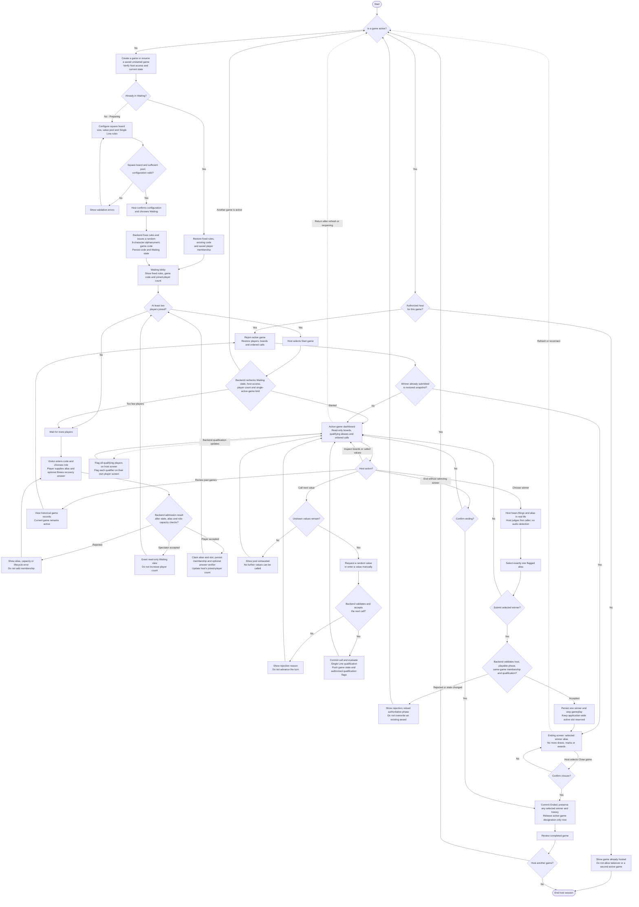
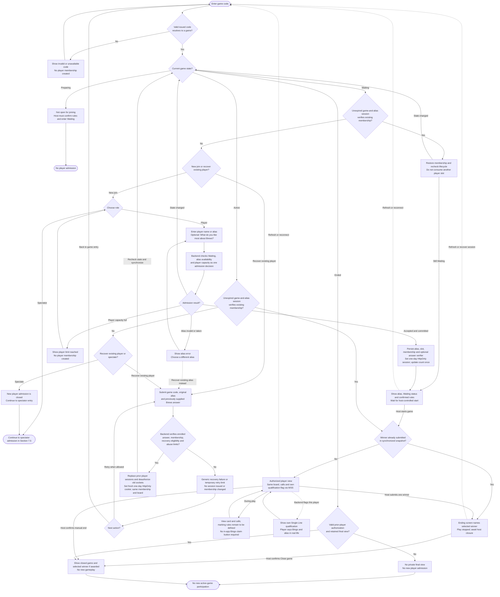
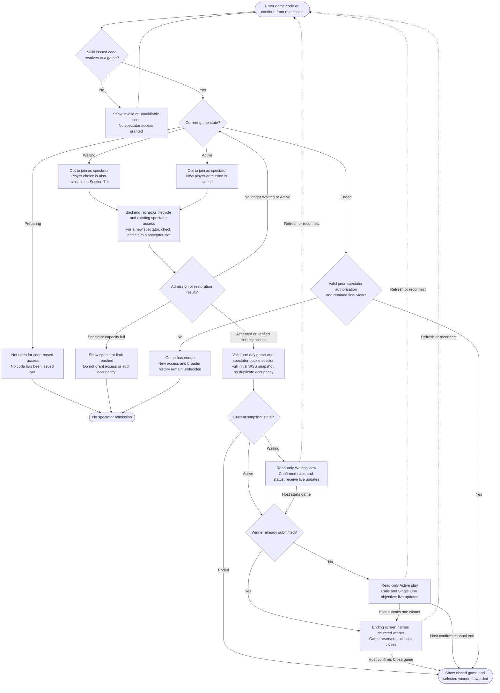

# Brews Bingo — High-Level Design

## 1. Document status and purpose

- **Status:** Cloudflare/Rust/Dioxus web-first baseline, durable WebSocket/session recovery, Single Line qualification through pattern-specific Rust traits, and host-selected single-winner presentation followed by explicit closure are confirmed. Remaining card rules, LLD mechanisms, and overall HLD sign-off stay open.
- **Business:** Rockville Brews.
- **Requirements source:** [Business requirements](requirements.md).
- **Design input:** [Hosting research](research.md), especially Section 4.1; Cloudflare and Dioxus capability references are listed below.
- **Confirmed architectural constraint:** The system includes a **backend server**, an **app layer**, and a **developer-only CLI layer** for account provisioning. Authentication and authorization are backend responsibilities exposed to app clients through the login and hosting flows.
- **Update scope:** Record separate Rust traits for winning patterns, with Single Line as the only specified pattern: a complete row, column or either full corner-to-corner diagonal on square boards only. Distinguish qualification flags from the host-submitted single winner; keep spoken Bingo/alias exchange outside implementation. Submission stops play and shows the winner but retains the active slot until confirmed host closure. Preserve default `5 × 5` and sufficient-pool validation. Reconcile HLD workflows, data, permissions and recovery without Rust signatures, schemas or code.
- **Approval boundary:** The directions recorded here are approved at HLD level, not authorization to implement, create accounts/tokens, scaffold applications, or deploy. Online-only recovery supersedes the earlier offline-play direction; unresolved game rules and detailed implementation remain separate review stages.

This document will describe the system's major components, responsibilities, interactions, and trade-offs. Detailed screen designs, database schemas, API payloads, and implementation tasks will follow after the relevant high-level decisions are approved.

**How to use this document:** Replace remaining `TBD` prompts as sections are reviewed, and track decisions in Section 13. Do not treat a listed design topic as a new business requirement or a documented design as implementation/test evidence.

## 2. Scope and design inputs

### 2.1 Confirmed inputs

- **Frontend and delivery order:** Use **Rust with Dioxus**, targeting its latest stable release when implementation begins. Desktop/mobile **web is the initial implementation target and must support all approved app features**. Dedicated Android/iOS implementation is deferred; those clients will use Dioxus-supported platform/distribution paths and support as many app features as technically feasible. Mobile-browser access remains part of the initial web scope (BR-022–BR-024; HLD-003).
- **Multi-platform organization:** Plan `platform/web` initially, with `platform/android` and `platform/ios` added in their later phases. Keep reusable Rust domain/contracts and Dioxus UI outside platform-specific entrypoints so later mobile work does not require duplicating the application (HLD-019; Section 4.3).
- **Compatibility timing:** Apply D-002's latest-generally-available policy at each platform's release. The initial acceptance matrix covers desktop/mobile browsers; Android/iOS app matrices are defined when their deferred phases begin.
- Separate host and audience views and digital player cards (BR-018, BR-026). Backend-validated Single Line qualification is flagged on the host screen and each qualifying player’s own screen. The host selects and submits exactly one qualified player by alias after the real-life Bingo call; this is the current winning-claim workflow, not a player-submitted in-app claim (BR-027; HLD-023, HLD-024).
- Host-controlled random selection or manual entry, with valid-pool and duplicate checks (BR-002, BR-006–BR-008).
- Bingo values represented as strings. First-release numeric values run from `1` through a host-defined upper bound, defaulting to `75` (BR-025, BR-028).
- Configurable **square boards only**, defaulting to `5 × 5`: width and height must be equal. Preserve sufficient-pool validation; reject non-square configuration before Waiting. Exact allowed square sizes and card-generation/free-cell rules remain open (BR-029; HLD-025).
- Active-game recovery and completed-game draw history remain required (BR-013, BR-021). The approved reconnect proposal supersedes the old offline-continuity wording in BR-016/D-005: gameplay requires connectivity; disconnected clients show stale/read-only state and recover from durable state after reconnecting (HLD-020; Section 8).
- Both a backend server and an app layer are required. For the Cloudflare option, the online backend is Rust on Workers with SQLite-backed Durable Objects; the web build is served through Workers Static Assets. This implements the server layer as managed server-side components, not a continuously running VM/container.
- Use ongoing Free-plan allowances for the Cloudflare baseline; do not depend on trial credits or paid upgrades. Usage capacity must still be validated before release.
- **User-directed authentication scope:** Only the developer provisions accounts using the CLI and privileged Cloudflare credentials delivered via environment variables; **admin** remains the only account type. Provisioning persists a single-use access-token verifier and returns an HTTPS access URL instead of an initial password. The access token expires one day after issuance or immediately on successful consumption. Valid redemption creates a restricted backend session in an HttpOnly cookie; the host must set a password before hosting and uses that password for later logins (HLD-009, HLD-010, HLD-021).
- **User-directed host capabilities:** An authenticated admin who has completed password setup can review past games; create/configure games and the supported objective; start after at least two players join; call random/manual values; inspect boards and ordered calls read-only; see qualifying aliases; select and submit one qualified winner; and explicitly close/end the game. Selecting the winner does not grant board-editing rights or bypass backend qualification. Existing designated-host restrictions remain.
- **Single-active-game constraint:** At most one game may be active across the application. Active means started and not yet explicitly ended/closed, including the winner-presented phase after winner submission when play has stopped. Winner submission, viewing/dismissing an ending screen, disconnection and session expiry do not release the active slot. Only committed host closure/end permits another game to start. Preparing/Waiting games do not occupy the slot; their count limits remain unspecified (HLD-012, HLD-024).
- **Confirmed workflow features:** The host can resume a saved unstarted game without recreating it. Ending/closing requires explicit confirmation; cancelling leaves the current play or winner-presented phase and active designation unchanged. Winner selection/submission and later Close game are separate actions: submission durably records one winner and stops play; confirmed Close ends the game. Existing manual end without a winner remains available and must not invent an award (HLD-013, HLD-014, HLD-024).
- **Waiting and code-based joining:** After creating a game and confirming its rules, grid configuration, and number/value pool, the host explicitly puts it into **Waiting**. The configuration is fixed in Waiting, and the backend generates a random **8-character alphanumeric game code** (letters and/or digits). Players enter that code in their client to join the game. At least two joined players make the Waiting game eligible for host-controlled start, not automatic start; the single-active-game constraint still applies (HLD-015).
- **Role choice and player alias:** After valid game-code entry while **Waiting**, a person may choose player or spectator. To join as a new player, they enter a name/alias not already taken by another player in that game, and player capacity must be available. The join screen also offers the optional free-text prompt **“What do you like most about Brews?”**; if supplied, retain a protected recovery verifier with that alias/membership. Skipping it does not prevent joining. Once **Active**, new entrants may only choose spectator; new player admission is closed. Existing players restore membership with a valid session or the game-code + original-alias + matching-answer recovery flow, not a new admission (HLD-017, HLD-022).
- **Audience/spectator joining:** The same game code supports read-only spectator entry in both Waiting and Active, subject to spectator capacity. Spectators see audience-visible state and subsequent updates; they do not receive player membership or count toward the two-player start prerequisite (HLD-016, HLD-017).
- **Configurable capacity with hard ceilings:** Maintain separate configurable per-game limits with backend-enforced hard-coded maxima of **20 players** and **50 audience spectators**. Configured limits may be lower but cannot exceed the corresponding ceiling. Defaults, remaining range rules, configuration controls/timing, and the source-code location of the ceilings remain open. Player-limit settings must permit the existing minimum of two players; these limits do not replace Cloudflare quotas or prove tested capacity (HLD-018).

### 2.2 Boundaries and unresolved scope

- Public account self-registration is not in scope; admin accounts are provisioned by the developer. Entering a per-game player alias is game membership, not account creation. Payments, prizes, and event administration are not currently requested.
- Digital-card generation, assignment and manual/automatic marking rules still require review. Single Line (complete row, complete column or either full corner-to-corner diagonal on a square board), backend qualification flags, one host-submitted winner and subsequent closure are confirmed. Square-only shape resolves diagonal geometry; allowed square sizes and free-cell/mark-dependent eligibility details remain open (HLD-023–HLD-025). No additional pattern is selected by trait extensibility.
- Waiting permits new players/spectators; Active permits only new spectators. Player sessions bind server-side to game code and player alias, with stable game/member identifiers; host sessions bind to the admin account, spectator sessions to game and spectator identity. Sessions have a fixed one-day TTL. HLD-022 defines optional answer-based recovery for lost/expired player sessions in Waiting/Active; unavailable/forgotten answers, forgotten-alias recovery and any new post-end answer-based recovery remain unresolved, not code-only fallbacks. Alias comparison/validation/rename, pre-start role changes, explicit departure, and new post-end admission/history remain open. HLD-020 fixes transient-disconnect retention and existing-participant final-state recovery; HLD-021 fixes session lifetimes and bindings. Rules/pool stay fixed from Waiting; no mid-game spectator promotion, automatic ending on low attendance, or host board editing is implied.
- Rust and Dioxus are selected, not merely evaluated alternatives. Native Android/iOS apps are later work rather than initial-release blockers; their supported packaging/distribution will follow Dioxus at that time. Exact mobile feature coverage, adapters, signing/store workflow, release timing, and detailed browser/device matrices remain open. Mobile limitations must not reduce the required web feature set or weaken backend authorization.
- Cloudflare is the sole authoritative gameplay backend in this scope. No venue-local/offline authority, offline admission, or queued offline gameplay is planned. Availability, authentication, and state synchronization must be restored before commands resume.
- Event date is not an implementation constraint.

**Source-alignment note:** This HLD incorporates later explicit decisions without rewriting `requirements.md` or renumbering BRs. In particular, its older BR-016/D-005 offline-play wording is **superseded for this design** by the approved online-only recovery proposal (HLD-020), not claimed satisfied by WebSockets. Source-document reconciliation remains a separate edit. Older source prose also leaves backend/accounts/history undecided. BR-023/BR-024 remain deferred native-platform scope, with D-002 applied at each platform release. Per-game membership is not persistent account self-registration. HLD-023–HLD-025 also refine BR-026/BR-027/D-004 with Single Line and host-selected winner closure, and constrain BR-029/D-001 board dimensions to equal width/height (square only); their earlier broad wording remains for separate source reconciliation.

## 3. System context and architecture overview

**Status:** Cloudflare online-only authority and durable recovery are confirmed. Detailed coordination, protocol/security implementation, and operational validation remain LLD work.

- **Actors and interactions:** The developer provisions admin access links. The host redeems a link, sets a password, then configures games and controls start/calls/winner selection/closure. Visitors join by code under state/alias/capacity rules. The backend flags qualifying players to the host and each affected player; the host judges the first real-life Bingo call and submits one qualifying alias. All roles receive the selected-winner ending screen over WSS and restore the persisted phase after reconnect. Card generation/marking rules remain open.
- **App layer boundary:** Host, audience, and player experiences use a Rust/Dioxus app, initially delivered as a client-rendered web build. Shared UI and application logic are separated from platform adapters; later Dioxus Android/iOS clients use the same backend contract. Framework choice does not transfer authority or privileged CLI capabilities to clients.
- **Backend server boundary:** Backend auth validates single-use access links and subsequent passwords, issues/revokes one-day sessions, and enforces first-password setup and server-held roles. The Worker authorizes requests and routes discovery through the Game Directory Durable Object, then gameplay to the owning Game Durable Object. Each Object keeps its own SQLite state; browsers never receive database/provisioning access.
- **Developer CLI boundary:** Account provisioning is a privileged operational path, not a public registration feature or an admin-user capability. Its Cloudflare database-access credentials remain in the developer's controlled execution environment and are never issued to app users.
- **State authority:** One Game Durable Object owns accepted state and win qualification. Persist accepted changes, selected winner, play-stopped phase, revision and command result before acknowledging or broadcasting. Clients cannot declare qualification, award a winner, resume stopped play or accept draws locally. The host supplies the real-life first-caller judgment; the backend validates that the selected player qualifies.
- **Application-wide lifecycle authority:** A SQLite-backed Game Directory Durable Object owns issued-code → stable game-ID mappings and the single-active-game designation. Per-game Objects own state, winning qualification, the selected winner and sockets. Winner submission stops play without releasing that designation; only confirmed end/closure coordinates its release. Start/end and code publication use durable pending operations and idempotent reconciliation, not a cross-Object transaction. No disconnection, result-screen dismissal or stale retry releases the slot. Concrete coordination/history-index layout remains LLD work.
- **Game-code resolution and admission:** Resolve the code to the owning game and enforce lifecycle, role, alias availability for new players, and the applicable capacity limit together. Waiting permits player/spectator admission; Active rejects new player admission but permits spectators. Preserve unambiguous code lookup through Active. Alias availability and the final slot cannot be awarded to competing requests; concrete atomicity/session mechanisms belong in the LLD. Code possession never grants host authority.

```text
Host / audience / player Dioxus clients (web first)
       | HTTPS: static client assets
       v
Cloudflare Workers Static Assets

Dioxus clients
       | HTTPS: enrollment/login/commands; WSS: snapshots/live updates
       | HttpOnly session cookie; backend validates role, binding and expiry
       v
Rust Worker: access checks and routing
       +--> Game Directory Durable Object + its SQLite storage
       |      Issued code -> stable game ID; single-active-game coordination
       |
       +--> Game Durable Object + its SQLite storage (one per game)
              Accepted state/revisions/command results/membership
              Role-filtered hibernating WebSocket connections

Developer-only CLI (privileged credentials from environment)
       | Create admin + persist single-use access-token verifier
       v
Backend account/token/session authority (physical store: LLD)
       | Access URL -> validate + consume -> restricted HttpOnly session
       | Required password setup -> normal admin access
       | Later password login -> one-day account session

No offline gameplay authority; durable recovery after reconnect (Section 8)
```

Rust Workers compile to WebAssembly through `workers-rs`; its tooling generates the JavaScript entrypoint, rather than deploying an ordinary native Rust server binary.[1]
The Rust SDK exposes Durable Object WebSocket and SQL-storage interfaces; exact crate versions and integration compatibility remain to be tested.[7][8]

**Trade-off:** Co-locating game coordination, sockets, and SQLite persistence avoids a second live-state store but couples the hosting adapter to Cloudflare. Keep shared domain rules independent of provider APIs. No additional D1/R2 database is required for reconnection; do not use eventually consistent Workers KV as the authoritative code/admission/active-game registry.[16]

## 4. App layer

### 4.1 Experiences and platform delivery

| Area | Design to complete | Requirements |
| --- | --- | --- |
| Host experience | Review history, configure games, enter Waiting/share code, and start when eligible. During play call values, inspect boards/calls and see every backend-qualified alias. After hearing Bingo and the player’s alias in real life, select and submit one qualified winner. Show that winner on the ending screen; keep play stopped and the active slot reserved until confirmed Close game. Layout details remain TBD; the winner workflow is settled in Section 7.7. | BR-002, BR-008, BR-010–BR-012, BR-015, BR-021, BR-026–BR-029; HLD-011–HLD-015, HLD-023, HLD-024 |
| Admin authentication | Open the developer-issued one-day access URL; the backend consumes its valid unused token and sets a one-day restricted session cookie. Complete password setup before hosting. Later password logins create one-day admin sessions. Expired/used links do not authenticate. Screen details remain TBD. | BR-015; HLD-007, HLD-009, HLD-010, HLD-021 |
| Audience experience | Enter the same game code and spectate in Waiting/Active within capacity. Display confirmed Single Line objective, status, current value and ordered calls through WSS; when a winner is submitted show the selected winner’s alias on the ending screen and follow explicit closure. Do not expose private boards, recovery data or host controls. Layouts remain TBD. | BR-001, BR-003, BR-005, BR-014, BR-017–BR-019; HLD-016–HLD-018, HLD-023, HLD-024 |
| Player experience | Join in Waiting with an untaken alias and optional Brews recovery answer; restore existing membership through the approved one-day session/recovery flow. See a backend-issued qualification flag on the player’s own screen when Single Line is satisfied. Bingo and alias announcement happen in real life, not through an app claim button. Multiple players can qualify, but only the host-submitted player becomes the selected winner. Show the ending screen with that alias and disable gameplay until host closure. Card-generation/marking details remain open. | BR-026, BR-027; HLD-017–HLD-018, HLD-020–HLD-024 |
| Platform delivery | Rust/Dioxus client-rendered web build on Workers Static Assets, covering all approved app features on desktop/mobile browsers. Dedicated Android/iOS clients are deferred, follow Dioxus-supported distribution, and target maximum feasible feature coverage with explicit limitations. Reuse shared code and the backend contract through platform adapters; detailed compatibility matrices remain TBD. | BR-022–BR-024, D-002; HLD-003, HLD-019 |
| Announcements | TBD — optional speech controls, playback ownership, platform support, and behavior during outages. | BR-020 |

### 4.2 App-side responsibilities

- **Presentation and interaction state:** TBD.
- **Host controls and visibility:** Distinguish Preparing, Waiting, Active play, Active winner-presented/play-stopped, and Ended. Preserve setup/code/start/call/board/history capabilities. Show qualifying aliases separately from the one selected winner; require explicit host selection and submission. The ending screen names that winner and offers confirmed Close game, never a new draw or implicit restart. Layouts remain open; backend phase/role checks enforce behavior.
- **Participant entry and capacity feedback:** Offer role choice in Waiting; collect a player alias and optional free-text Brews recovery answer only for new player admission. Explain that the answer is private recovery information, should be memorable and hard to guess, and cannot help if skipped or forgotten. Offer only spectator admission to new entrants in Active, alongside a clearly separate existing-player recovery path. Display applicable full-capacity or alias-unavailable results; never silently convert a rejected player join into spectator membership. Recovery does not reserve a new alias/slot. Client-side availability hints do not reserve aliases/slots or bypass backend checks. Configuration UI/operator and when capacity settings may change remain open.
- **Resume and end safeguards:** Restore saved Preparing/Waiting games without regenerating code or changing fixed rules. Reopening a started game restores either play or its persisted winner-presented screen, not a default playable dashboard. Require explicit confirmation for end/Close game; cancellation preserves the current phase and active slot. Refresh, navigation away, window closure or dismissal of a result screen is not the server-side Close game action.
- **Authentication experience:** Access-link redemption starts a restricted first-password-setup session, not immediate hosting access. The backend generates the cookie using `Set-Cookie`; frontend code never writes/reads its HttpOnly token. Later logins use the chosen password. Show expired/used-link and expired-session outcomes without revealing credentials; no public account creation is introduced.
- **Input feedback versus authoritative validation:** Clients provide immediate feedback, but online commands require validation and acceptance by the game's Durable Object. Reusing Rust rules in the Dioxus client does not make its inputs trusted.
- **Local persistence and refresh/restart recovery:** Remember non-secret game discovery context as appropriate and retain only a stale/read-only local view during disconnection. Restore from backend SQLite after refresh/reconnect; session secrets exist only in protected cookies, never localStorage/sessionStorage. Cache layout and clearing of role-private data on logout/expiry remain LLD details.
- **Receiving updates and representing stale/disconnected state:** Use Connecting → Synchronizing → Live → Reconnecting, plus expired/unavailable states. All roles receive a full authorized first snapshot and revision-aware WSS updates. Disable mutations until synchronized; no offline command queue. Retry with jittered exponential backoff capped at 30 seconds, heartbeat detection, and revision checks after foregrounding and periodically while live (Sections 7.6 and 8).
- **Accessibility, responsive layouts, and venue-display usability:** TBD — define review criteria without assuming a visual design.

**Web delivery decision for this option:** Serve the Dioxus client-rendered static build through Workers Static Assets; SSR and Dioxus fullstack server functions are not selected. Direct static-asset requests are free, while Worker execution consumes allowances.[3] The Rust Worker/Durable Object HTTPS/WSS backend remains authoritative. Asset caching may improve loading, but does not enable offline gameplay or bypass session expiry.

### 4.3 Dioxus baseline and multi-platform organization

**Confirmed direction (HLD-003, HLD-019):** Rust is the frontend language; Dioxus is the UI framework. Interpret "latest version" as the latest **stable** Dioxus release, not an alpha/beta or repository main branch. On **2026-10-01**, the official latest-release page resolves to **v0.7.10**.[9] Recheck when implementation begins and pin the selected Dioxus/CLI versions and compatible stable Rust toolchain in the LLD/build configuration; this dated lookup is not a permanent version freeze or an automatic-upgrade policy.

Dioxus documents a shared Rust codebase across web and mobile and allows platform API integration where first-party APIs are insufficient.[12] Its current bundling documentation covers Android and iOS outputs, while store distribution still requires platform-specific steps.[10][11] Use those supported paths for the later mobile phases, rechecking the then-current documentation; do not promise automatic mobile parity or store publication merely because the UI is shared.

**Feature coverage and delivery stages:**
- **Initial web:** Implement all approved app-facing host/player/spectator features on desktop/mobile browsers, including history, optional announcements, and the online-only recovery behavior in Section 8. Account provisioning remains a separate privileged CLI capability, not a web-admin feature.
- **Later Android/iOS:** Reuse the app and backend contract, supporting as many features as technically feasible through Dioxus and platform adapters. Record supported, adapted, and unavailable features with reasons during each mobile phase. Do not narrow web scope to a lowest-common-denominator mobile subset; neither role permissions nor game invariants may be bypassed for portability.
- **Design now, implement later:** Define the separation now without installing dependencies, creating platform packages, or requiring mobile SDKs/signing in the initial web development path. Detailed manifests, crate names, interfaces, and build commands belong in LLD.

**Planned logical folder layout — not an existing scaffold:** `platform/web` and future `platform/android` follow the user's requested names; `platform/ios` follows the same boundary for the deferred iOS target. The supporting folders below express high-level responsibilities, with detailed crate decomposition left to LLD.

```text
brews-bingo/
├── plans/                 # Requirements, research, HLD; future LLD
├── shared/                # Reusable code, independent of platform entrypoints
│   ├── domain/            # Pure Rust game rules and types
│   ├── contracts/         # Shared app/backend contract types
│   └── ui/                # Shared Dioxus components and app interaction logic
├── platform/
│   ├── web/               # Initial web entrypoint, browser adapters and assets
│   ├── android/           # Later: Dioxus Android entrypoint/adapters/packaging
│   └── ios/               # Later: Dioxus iOS entrypoint/adapters/packaging
├── backend/               # Cloudflare Worker, Durable Objects, auth/persistence
└── cli/                   # Developer-only account provisioning
```

**Dependency boundaries:** Platform entrypoints compose shared UI/domain/contracts with platform adapters. Shared domain/contracts must not depend on Dioxus, browser/mobile APIs, or Cloudflare runtime APIs. Keep browser-specific behavior in `platform/web` and later native behavior in the matching platform folder; shared UI must not import a platform entrypoint. The backend/CLI may reuse safe shared domain/contracts but must not become client dependencies or expose privileged credentials. Mobile implementations must be addable without copying the full web application. Exact adapter interfaces and dependency/build isolation are LLD work.

## 5. Backend server

**Status:** Rust/Cloudflare online responsibilities defined for this option; detailed rules and interfaces remain open.

| Concern | Cloudflare-option responsibility / remaining decision |
| --- | --- |
| Game lifecycle and configuration | Create Preparing with equal board width/height (square only, default `5 × 5`), valid string pool and Single Line. Reject unequal dimensions or insufficient pool before confirming/publishing Waiting. Start only for the designated host with at least two players and no other Active game. A valid winner submission stops gameplay in Active while retaining its slot; confirmed end/Close reaches Ended and preserves history. Configuration stays fixed in Waiting/Active; exact storage representation remains LLD. |
| Game code and player admission | Issue/persist the same random 8-character code in Waiting. For a new player, accept only in Waiting after checking the submitted alias is valid and not taken in this game and a player slot is available; claim alias/slot, record membership and any supplied recovery-answer verifier as one logical admission. Empty/omitted answers enable no recovery credential. Reject new players after start, even if the alias is unused or capacity remains. Competing joins/retries must not duplicate aliases, overfill capacity, or leave partial membership/recovery data; generation/session/atomicity mechanics belong in LLD. |
| Spectator admission and state delivery | Admit code-based spectators in Waiting or Active only when spectator capacity allows. Keep spectator membership/count separate from players. Supply audience-visible Waiting state or an Active snapshot including prior calls, then live updates across start/end. Never grant private board/account data or gameplay mutations. Recheck lifecycle/capacity on admission; a concurrent start may still permit a spectator, but an end must not be represented as ongoing play. |
| Capacity configuration and enforcement | Persist separate per-game limits bounded by hard-coded maxima of **20 players** and **50 audience spectators**. Reject invalid settings and over-capacity admissions server-side. Count memberships, not sockets; restore a valid session without a second slot. Defaults, configuration controls/timing, explicit-departure policies, and code-level constants remain LLD/later decisions; transient disconnects follow Section 8. |
| Resume and confirmed ending | Resume the persisted Preparing/Waiting state without resetting it; restore Active play or the winner-presented phase faithfully after reconnect. Winner submission and closure are distinct durable operations. Only confirmed, authorized end/Close game marks Ended and releases the global active designation; cancelling closure preserves the current phase/winner. Manual end without an awarded winner remains supported. Detailed persistence and request mechanics belong in LLD. |
| Application-wide lifecycle coordination | The Game Directory owns code lookup and the active designation; Game Objects own lifecycle and winner outcome. Winner submission retains the designation and cannot enable another start. Persist pending activation/end/publication and reconcile retries idempotently; never release a slot before the game is durably closed to play. No cross-Object atomic transaction is assumed. Concrete protocol remains LLD work. |
| Draw processing | Only the designated host may call a value during the playable phase of Active. Validate random/manual selection against pool and prior draws, commit one call, and evaluate affected winning qualification against authoritative state. Reject calls before start, after winner submission or after end; an accepted command retry returns its original result without a second turn. Pool exhaustion prevents further draws but does not automatically award a winner or close the game. Randomness/evaluation implementation belongs in LLD. |
| Cards and winning qualification | The Game Object validates Single Line on a square board (complete row/column or either full corner-to-corner diagonal) through its Rust pattern trait boundary. Flag every qualifier to the host and that player. Revalidate the host’s one-winner submission, persist the result/play-stopped phase before WSS, and never use a player claim button or audio detection to decide the award. Board generation, assignment, free-cell and marking rules remain separate decisions; host inspection stays read-only. |
| State distribution | Terminate all host/player/spectator WSS connections in the Game Object using hibernation. Send a role-filtered full snapshot first, then ordered revision-aware updates. Keep snapshot/subscription consistent with concurrent mutations and recheck authorization/expiry for delivery. Only small connection metadata belongs in socket attachments. |
| Persistence and history | Retain completed-game records, ordered draws and the selected winner’s stable membership identity plus alias at submission, if awarded. Persist the winner-presented/play-stopped phase before closure so reconnect cannot resume play or lose the winner. History-index placement, retention/export and additional historical player-board detail remain TBD. |
| Authentication and account lifecycle | Persist admin identity, role, access-token verifier/issuance/expiry/consumption, mandatory-password-setup state, chosen password verifier, and session verifier/binding/expiry/revocation. Atomically consume one valid one-day enrollment token and create one restricted one-day session, then set its HttpOnly cookie. Hosting stays blocked until password setup. Backend ownership/transaction guarantees are required; concrete physical account-store placement remains LLD work. |
| Access control | Enforce server-held roles, completed password setup and designated-host checks. Bind player sessions to both game code and alias plus stable game/member IDs; bind host sessions to account and spectator sessions to game/identity. Code or alias possession alone never restores ownership. For HLD-022 player recovery, verify the enrolled answer for the specific game/alias before issuing a fresh session and invalidating prior player sessions/sockets for that membership. Never grant host/spectator authority through this answer. Apply session validity to HTTPS, WebSocket handshakes and ongoing access. Host assignment/handoff and cross-admin history policy remain open. |
| Retry and concurrency safety | Persist each accepted game mutation, revision and result under an actor/game-scoped command ID before acknowledgement/broadcast. Resolve interrupted commands by that ID rather than creating another draw. A failed broadcast does not undo a committed mutation; reconnect snapshots and periodic revision checks repair client state. Token redemption similarly requires atomic consume-and-session-create; mechanisms remain LLD work. |

**Server structure, runtime, and scaling model:** Rust Worker and Durable Object classes via `workers-rs`, compiled for Wasm, remain the baseline.[1][7][8] One directory Object supplies durable discovery/global coordination and each game Object handles its own state and sockets. Separate objects do not authorize simultaneous active games. SDK versions, transaction/hibernation integration, account-store placement, data-location policy and measured capacity remain LLD/verification work.

### 5.1 Developer-only CLI layer

- **Operator:** Only the developer coding the app is authorized to invoke provisioning. App admins, players, and audience clients do not gain CLI or account-provisioning access.
- **Credentials:** The CLI requires privileged Cloudflare database-access credentials obtained through environment variables in the developer's controlled environment. Environment-variable delivery is not itself proof of operator identity; access to the CLI execution environment and credentials must be restricted to the developer. Missing or insufficient credentials must prevent provisioning.
- **Capability:** Create an admin account pending password setup, generate an unpredictable one-day single-use enrollment access token, and persist its verifier, account/purpose binding, issue/expiry timestamps and unused state through the authorized backend/storage path. Return its HTTPS access URL only after persistence succeeds. No random initial password is generated. The URL is a bearer credential and must be delivered privately; exact CLI commands and protected delivery/reissue mechanics remain LLD work.
- **Boundary:** This is a privileged provisioning path, not a public endpoint or a capability granted by an app-level admin role. Do not assume the environment credentials are a conventional SQL username/password or that the CLI connects directly to per-game SQLite storage; the authorized Cloudflare access mechanism and account-store placement belong in the LLD.
- **Deferred detail:** CLI language/packaging, command syntax, environment-variable names, credential scopes, storage/API access, error handling, and operational procedures are not selected here. No credentials or accounts are created by this document.

## 6. Domain concepts and data ownership

**Status:** High-level ownership and lifecycle concepts; not database tables or an approved schema.

**Online ownership and persistence:** Each Game Durable Object owns committed configuration, lifecycle/phase, draws, boards, qualification and the selected winner. Persist these in SQLite, not only process memory; winner submission must survive before host closure. The Free plan supports SQLite-backed Durable Objects.[4] Retain completed-game draw/result records independently of later games. No D1, KV, R2 or external database is added; any extra store needs a demonstrated purpose and free-tier review.

**Cross-game ownership:** The Game Directory Durable Object persists code-to-game-ID mappings and the active-game designation in its own SQLite storage. Game Objects persist their gameplay state separately. Store stable game IDs rather than treating a reusable display code as identity; Durable Object namespaces support referring back to stored IDs.[15] History-index layout, retention/deletion and backups remain open. Lifecycle/publication recovery must use explicit cross-Object coordination, not assumed shared transactions.

**Waiting-state ownership:** Commit fixed configuration and Waiting state in the Game Object and publish its code association in the directory through a retry-safe operation. Reopening restores the existing code and saved membership; a failed publication cannot expose an unready game. Unknown codes never initialize games. The code remains stable through Waiting/Active and approved recovery; post-end expiry/reuse/retention policy remains open.

**Admission ownership:** The Game Object persists per-game alias claims, memberships, optional recovery-answer verifiers, role limits, participant-session bindings, and spectator disconnect-grace deadlines. A player join losing a race with start fails. Verified reconnection or HLD-022 recovery restores a membership, not another slot. Answer-based recovery replaces prior player sessions/sockets for that membership before serving its fresh authorized snapshot. Reserve Active player membership until game end; a disconnected spectator has five minutes before capacity must be rechecked. Session expiry is independent of membership and recovery-verifier retention. Exact presence detection/cleanup, recovery transactions and explicit-leave rules remain LLD/later policy.

**Account data ownership:** Backend auth owns persistent admin identity/role, enrollment access-token verifier/consumed state, password-setup state, chosen password verifier, and account session verifiers with absolute expiry/revocation. Account/session data outlives process and socket lifetimes. Initial consume-and-session-create must be one atomic logical operation under a strongly consistent owner; physical placement and privileged provisioning access remain LLD choices. Game Objects consume verified account/session context, never client-asserted roles.

| Concept | Definition and ownership to complete |
| --- | --- |
| Game configuration | Host-selected square board size with equal width/height, string pool and Single Line as the only currently specified objective. Default `5 × 5`; retain numeric-range defaults and sufficient-pool validation. Reject non-square boards before entering Waiting. Complete row, column or either full corner-to-corner diagonal qualifies. Allowed square sizes, free-cell/marking rules and future return-to-preparation behavior remain open. |
| Game lifecycle and active designation | Preparing → Waiting → Active → Ended. Active has a playable phase and, after a valid one-winner submission, a winner-presented phase with gameplay stopped. Both retain the application-wide active designation. Only confirmed end/Close game reaches Ended and releases it. Exact state/schema representation is deferred to LLD; an ending screen does not itself mean Ended. |
| Game code | Backend-generated random sequence of exactly 8 alphanumeric characters issued in Waiting. Allows player/spectator choice in Waiting and spectator-only new entry in Active. Preserve its association through Active; case rules and remaining lifecycle/reuse policies stay open. It is not an admin or existing-player credential. |
| Player alias and membership | A player-chosen alias is unique within the game and claimed with a Waiting membership/slot. Player sessions link to both issued game code and alias and to stable game/member IDs. The alias is a display/uniqueness field, not a credential. Optional Brews-answer recovery requires code + original alias + the enrolled answer (HLD-022); the answer is associated with this membership only. Comparison, validation and rename/reuse remain open; any future rename or code reuse must not transfer an old token or answer verifier to another membership. |
| Optional Brews recovery answer | Optional free text collected with the player alias at initial join. The Game Object stores a salted, non-reversible answer verifier with the stable game/member identity, not readable feedback. Omission/blank means no answer-based recovery. Answers need not be unique across players; verification is scoped to the supplied game code and original alias. Matching/normalization and retention mechanics belong in LLD (Section 9.4). |
| Capacity limits and occupancy | Separate configurable per-game maxima bounded by **20 players** and **50 audience spectators**; defaults TBD and player capacity must allow the two-player start prerequisite. Count distinct memberships, not socket handles. Reconnect restores existing occupancy; reserve Active player slots until end and disconnected spectator slots for five minutes. Expired sessions do not become valid merely because a slot remains reserved. Explicit departures, pre-start abandonment and detailed presence/cleanup remain open. |
| Spectator access | Capacity-limited read-only Waiting/Active audience access, separate from players and the start count. Includes the selected-winner ending screen while Active is play-stopped. No cards, marking, winner selection, host controls or private boards. Session/subscription mechanics belong in LLD; no spectator account or alias requirement is introduced. |
| Active game state | Backend-owned configuration, membership, ordered draws, player-board state and derived winning qualification. Retain the selected winner, if any, and whether play is stopped awaiting host closure. This phase is authoritative state, not only a UI flag. |
| Draw record | Committed string values in call order; the host can inspect the complete current-game sequence. Consistency/recovery metadata belongs in the LLD. |
| Digital player card | Player-associated board layout, values, and marking state, visible read-only to the designated host. Assignment, marking ownership, synchronization details, and integrity rules remain TBD. |
| Winning qualification and selected winner | A qualifier is an existing player whose board satisfies Single Line against authoritative game data. Multiple players may qualify; this is not an award. The designated host submits exactly one qualifier, identified by stable membership and displayed alias, after judging the real-life first Bingo caller. Persist at most one selected winner per game and the play-stopped phase; no in-app player claim or microphone detection is required. |
| Completed-game record | Ended-game history retains ordered draws and the selected winner’s stable identity/alias at submission when one was awarded; manual end may have no winner. Later games must not overwrite it. Additional historical board details and retention duration remain TBD. |
| Provisioned account | Backend-owned account ID/type (admin initially), pending/completed password setup, and chosen password verifier. Enrollment uses a one-time access link, not an initial password. Concrete schema/physical storage remain LLD work. |
| Enrollment access token | Opaque bearer token linked server-side to an admin account and enrollment purpose; verifier and unused/consumed state persisted. One-day TTL from issuance; successful use permanently consumes it. No game code or player alias required for admin enrollment. |
| Browser session | Backend-generated opaque token, persistently verifiable, sent only in a Secure/HttpOnly/SameSite cookie. Fixed one-day TTL from session creation, no activity/reconnect extension. Successful HLD-022 recovery issues a new one-day player session, not a revived/extended old credential. Player binding: game code + alias + stable member/game IDs; host: account; spectator: game + spectator identity. Membership, recovery-verifier and session lifetimes are distinct. |

**Cross-cutting decisions:** Online ownership, token lifetimes and session bindings are defined; exact identifiers, serialization, value/alias comparison, retention/deletion, and non-secret local cache layout remain LLD/later decisions. No authoritative offline copy exists. Preserve bingo values as strings rather than silently converting them into integer identifiers.

### 6.1 Winning-pattern trait boundaries

**Confirmed direction (HLD-023):** Model each distinct winning pattern behind its own **Rust trait** boundary. **Single Line** is the only concrete pattern currently specified; row, column and diagonal are qualifying orientations of that pattern, not three separately approved game modes. Future distinct patterns get distinct pattern-specific traits; their behavior is not in current scope. A common orchestration interface may be designed in LLD, but must not silently replace the requested separate pattern traits with only one generic trait.

Keep pattern evaluation in the provider-independent Rust domain layer (`shared/domain`); the backend invokes it against authoritative game/card state. Pattern logic determines qualification, not host permissions, networking, UI, who yelled first or who receives the final award. Client-side reuse may assist presentation but cannot become authoritative.

**Single Line semantics:** Only square boards are permitted (HLD-025). One complete row, one complete column, or either complete corner-to-corner diagonal is sufficient; these orientations are alternatives, not a requirement to complete all. The diagonals are top-left to bottom-right and top-right to bottom-left across the full board, not shorter offset or wrapping lines. The default stays `5 × 5`, with other valid square sizes configurable. Board generation, allowed square sizes, free-cell treatment and whether accepted manual marks are required for eligibility remain separate decisions. Validate qualification against authoritative board/called-value data; client assertions and arbitrary marks cannot substitute for valid calls.

**LLD boundary:** Trait names/signatures, common bounds, types, dispatch, evaluator algorithms, error handling and tests belong in LLD. No Rust trait code, concrete implementations, scaffold or dependencies are created by this HLD update; implementation remains separately authorized after detailed design.

## 7. Communication and key workflows

### 7.1 App–backend contract

- **Interaction and update mechanisms:** HTTPS handles enrollment redemption, password login/setup, admission, player-answer recovery, mutations, command-result queries and history. Recovery answers travel only in protected request bodies, never URLs or WebSocket messages. All roles use WSS for the initial full snapshot and subsequent authorized live updates from the owning Game Object. Prefer push over routine state polling; periodic lightweight revision checks are a repair path, not replacement for WSS.
- **Authentication boundary:** Backend validation consumes the single-use access token and sets a restricted one-day HttpOnly session; successful password setup permits admin access, and subsequent password logins issue one-day account sessions. Participant joins create role-bound one-day sessions. HLD-022 answer recovery creates a fresh player session only after verification against the enrolled game/alias membership, invalidating its predecessors. Backend validity/expiry applies on commands, snapshot/subscription, and ongoing delivery; token and cookie details are in Section 9.3 and recovery in Section 9.4.
- **Operation boundaries:** The Worker routes code resolution/start/end coordination through the directory, and per-game commands, snapshot delivery and WSS through the Game Object. Admission checks code, lifecycle, role, alias and capacity together. Directory mapping publication/lifecycle transitions need durable pending state and retry-safe completion; history-index and account-store layouts remain LLD decisions.
- **Spectator synchronization:** After capacity-checked admission in Waiting or Active, supply the appropriate audience-visible snapshot and WSS updates. A Waiting spectator stays a spectator when play starts; an Active entrant sees calls already made, not only future calls. Reconnect restores verified existing access without duplicating occupancy. Enforce read-only data server-side and deliver the ended status; exact payload/session mechanics remain LLD work.
- **Host observations:** Supply joined-player count, lifecycle/phase, start eligibility, read-only boards, ordered calls and all qualifying aliases. Give each player their own qualification flag; do not expose private boards to other participants. After host submission, send the selected-winner alias and play-stopped phase to host/player/spectator ending screens. Observation does not allow board editing, and a qualification flag does not equal the final award.
- **Consistency contract:** Commit accepted state, new revision and deduplicated command result before acknowledgement/broadcast. Each reconnect starts from a fresh authorized snapshot; no transport-message replay archive is required for v1. Serialize snapshot/subscription with game mutations; use base/result revisions scoped to visible state, discard old-connection messages, and resync on mismatch. Periodic/foreground revision checks catch committed-but-unbroadcast state. Exact fields and protocol algorithms remain LLD work.
- **Compatibility:** TBD — how app and server versions remain compatible.

**Hibernation decision:** Use hibernatable WebSockets so eligible idle Objects sleep without disconnecting clients.[5] Reconstruct from SQLite when waking; attachments hold only connection metadata and disappear when the socket closes.[5] Persist accepted changes incrementally: shutdown can terminate sockets and has no reliable last-minute save hook.[14] Heartbeats may use the runtime’s fixed automatic response without waking a hibernating Object.[17] Expiry/grace scheduling must use durable deadlines/alarms or equivalent hibernation-safe checks, not permanent in-memory timer loops.

Endpoint names, payload schemas, cookie namespace, transaction mechanisms and adapter APIs remain LLD work; one-day TTLs, role bindings, WSS snapshots/updates and HTTPS commands are HLD decisions.

### 7.2 Workflows to document

For each workflow, add its trigger, participating components, validation, state changes, success outcome, and failure/recovery behavior.

| Workflow | Design status |
| --- | --- |
| Provision an admin account | Developer CLI with privileged environment credentials creates an admin pending password setup and persists a one-day access-token verifier before returning its private HTTPS URL. No generated initial password. Failed persistence returns no usable link. |
| Access-link redemption and first password setup | Load the issued URL → backend validates purpose/account, unused state and one-day expiry → atomically consume token and create restricted session → `Set-Cookie` HttpOnly one-day session → require a chosen password → persist password setup and rotate the restricted credential into an admin session without extending its original deadline. Failed/abandoned setup cannot unlock hosting; later authentication uses password login. |
| Subsequent login and hosting authorization | Validate the chosen password and completed setup; issue a fresh one-day backend account session in a protected cookie. Resolve server-held permissions and designated-host authority per game. Reconnect/activity never extends a session deadline; expired sessions require a fresh login. |
| Review past games | Authenticated admin → discover retained completed games → open a past game's record and ordered calls without changing any active game. History layout, additional retained details, and cross-admin history-access policy remain TBD. |
| Create/configure a new game | Authenticated admin with completed password setup → configure square board size (default `5 × 5`), value pool and Single Line objective → validate equal dimensions/sufficient pool and save Preparing with no calls. Do not enter Waiting, start play or overwrite prior history merely by saving. Preserve confirmation safeguards for clearing/replacing active records. |
| Confirm configuration and enter Waiting | Host confirms the rules, grid size, and number/value pool and selects entry to Waiting → backend validates authorization/configuration, fixes the rules, generates and persists the random 8-character alphanumeric code and its game association, and commits Waiting → display the code for the host to share. Failure must not be presented as a successful joinable Waiting state. Detailed consistency and retry mechanics are LLD work. |
| Resume an unstarted game | Authorized host selects a saved unstarted game → verify access/current lifecycle → restore that same game. Preparing returns to setup; Waiting restores its fixed rules, existing code, and saved membership directly to the lobby, without reissuing the code or returning to rule editing. Re-evaluate current membership and start prerequisites; resuming neither starts play nor reopens an ended game. Membership-presence and code-lifetime policies remain open. |
| Choose a role before start | Resolve code to Waiting and offer player/spectator. For a player, collect the alias and optional Brews answer; atomically claim valid available alias, capacity and membership with any supplied answer verifier, then issue a one-day cookie session bound to that code/alias and stable IDs. Spectators use separate capacity and a game/identity-bound one-day session, without alias or recovery question. Failed/retried joins cannot inflate counts or allow a code/alias-only ownership claim. Session delivery/retry details remain LLD. |
| Recover an existing player session | In Waiting/Active, submit game code + original alias + the enrolled Brews answer → backend applies abuse controls and verifies that membership’s answer → serialize replacement of its old player sessions with a fresh one-day HttpOnly session → close/deauthorize old sockets → receive the same board and committed state through a fresh WSS snapshot. No new alias, card or slot; failed recovery changes no membership/session authority. See Section 9.4. |
| Enter after start | For a new entrant, offer only spectator access; reject new player admission even with an unused alias and available player slots. Verify any claimed existing player membership before restoring it. Reconnection is not new admission; an alias alone cannot reclaim a card. |
| Configure capacity | Maintain separate effective per-game player/spectator limits within backend-enforced hard-coded ceilings of **20 players** and **50 audience spectators**. Reject out-of-range settings; player capacity must support the two-player start prerequisite. Defaults, remaining range rules, configuration operator/timing, and source-code location remain open; no capacity-setting freeze is inferred from fixed game rules. |
| Start a game | At least two joined players enable host start eligibility; the host explicitly requests Start → backend checks authorization, Waiting state, confirmed configuration, at least two distinct joined players, and no other active game → durably coordinate activation → acknowledge and notify clients. Reaching two players never starts play automatically. Reject ineligible starts without activating the game; concurrent starts for different games cannot both succeed. |
| Connect host to the intended game | Reauthorize and recover the host view of committed state; a host connection is not automatically a joined player. Host-assignment/handoff mechanics remain TBD. |
| Join as a spectator in Waiting or Active | Validate code, lifecycle and spectator capacity → accept membership and issue its one-day game/identity-bound cookie session → open WSS and receive the audience-scoped snapshot then updates. A valid returning session restores its five-minute reserved slot; after grace expiry, run normal capacity admission. Waiting spectators remain spectators at start. Authorized return after end is read-only under Section 8; new post-end admission remains open. |
| Generate or assign a digital card and mark it during play | TBD — domain rules require review |
| Randomly draw or manually record a value, then update relevant views | During Active play only, the designated host requests the next turn → owning Object validates host/phase/pool/non-duplication → commit call and evaluate qualification → acknowledge and push authorized state/qualification updates. Reject new calls once a winner is submitted, even before Ended. Idempotent retries do not create an extra turn. UI/error details remain TBD. |
| Inspect player boards and ordered calls | Designated host views each joined player's current board state and the full committed call sequence through authorized snapshots/updates. Inspection is read-only; visibly distinguish unavailable/stale board state. Detailed board-marking and synchronization rules remain open. |
| Qualify players and select the winner | Backend evaluates Single Line and flags qualifying aliases on the host screen and each qualifying player’s own screen → Bingo and alias are spoken in real life → host selects exactly one qualifier and submits → backend revalidates host, lifecycle, membership and qualification → persist one winner plus play-stopped phase → show ending screen through WSS while retaining the active designation. Multiple qualifiers are allowed, multiple selected winners are not. Detailed flow is Section 7.7. |
| End/close a game | Designated host chooses End game during play or Close game on the winner-presented screen → explicit confirmation → backend commits Ended, preserving any awarded winner and history, and coordinates active-slot release → publish closure. Cancelling leaves the current phase unchanged. Winner submission alone never releases the slot. Manual ending without a winner remains possible; no winner is invented. Retry/failure details belong in LLD. |
| Exhaust the pool or detect a qualifier | Pool exhaustion stops further draws but does not award or close. Detecting one or several qualifying players only raises qualification flags; the host decides which first real-life Bingo caller to submit. Winner submission stops play; later confirmed closure ends the game. No auto-award, audio detection, software tie-breaking or late second winner. Reopening/cancellation and post-submit correction remain separate unapproved policies. |
| Refresh/restart, lose connectivity, and reconnect | Restore entered/saved code and validate the unexpired cookie; resolve the same Game Object, restore membership or run permitted new admission, then subscribe with a full first snapshot. Keep controls disabled until synchronized. For lost/expired player credentials, offer HLD-022 recovery using code + original alias + previously enrolled answer; code/alias alone still cannot reclaim a card. Host reauthenticates by password. Detailed recovery and attendance behavior is in Sections 7.6–8 and 9.4. |

### 7.3 Typical host workflow

**Status:** High-level workflow recorded at the user's request, including confirmed resume/end safeguards (HLD-013, HLD-014) and explicit Waiting-state/code-based joining (HLD-015). Remaining detailed rules and formal HLD sign-off are still open.

**Precondition:** The admin has an unexpired account session, has completed first-login password setup, and is online/synchronized before game actions. This diagram uses Mermaid and requires a Markdown renderer with Mermaid support.



**Review notes:**

- **Active** means started and not yet explicitly ended/closed, including a winner-presented phase that retains the active slot with play stopped. Preparing/Waiting are not Active; another game cannot start merely because a winner is shown.
- **Waiting** is an explicit host-selected state after configuration confirmation. Its rules/pool are fixed; visitors enter the random 8-character code and choose player (available alias and player slot) or spectator (spectator slot). Joining continues within separate configured limits; the diagram shows the path to the two-player minimum, not the capacity ceiling. Only the host can start, with eligibility rechecked by the backend.
- **Confirmed features:** Resume an existing saved unstarted game, and require explicit confirmation before ending. Resuming restores the same game's saved state without starting it; cancelling end confirmation leaves the game active.
- Resuming a Waiting game bypasses setup and restores its existing code and membership; it does not regenerate a code or unlock the rules. Code lifetime and player-presence semantics remain open.
- **No automatic ending:** Qualification flags and pool exhaustion never choose a winner or close the game. Host submission awards exactly one eligible player and stops play; later confirmed Close releases the active slot. The real-life first Bingo call is judged by the host, not software (Section 7.7).
- Spectators can independently join Waiting or Active using the existing code, subject to spectator capacity (Section 7.5). This does not add players or grant host controls. New player entry after start is prohibited; Section 7.4 distinguishes it from verified existing-player reconnection.
- **Rejoining does not reset the game.** Revalidate host session (or password login) and designated-host authority, then restore the committed phase. If a winner was submitted, reopen the ending screen with play still stopped; never infer closure or restart play. Gameplay remains online-only (Sections 7.7–8).
- This is a typical high-level workflow, not an exhaustive error/recovery model. Backend authorization and lifecycle checks in Sections 5 and 7.1 still apply; detailed failure paths belong in the LLD.

### 7.4 Player flow by game state

**Entry point:** Enter/restore the game code and present the backend cookie. Waiting offers new player/spectator admission; Active permits only new spectators. Existing players restore via their game/alias session or approved answer recovery. Then gate the view by the authorized snapshot: playable Active shows board and own qualification; winner-presented Active shows the ending screen without gameplay. Recovery never creates membership or resets a result. Card generation/marking and concrete session mechanisms remain LLD/later work (HLD-017, HLD-020–HLD-024).



- **Preparing:** No join code is issued yet, so ordinary code entry cannot reach this state. The explicit branch documents the lifecycle guard; an unissued/unknown code follows the invalid-code path.
- **Waiting:** Player and spectator are explicit choices; rejection of a player attempt does not automatically admit a spectator. Accept/claim the player alias, slot, and membership as one logical operation; only an accepted distinct player increases the host count. If start wins a race with alias submission, reject player admission and show current role options. Only the host can start, after at least two players join and no other game is Active.
- **Active:** No new players or spectator promotion. Restore existing players with a valid session or HLD-022 recovery, preserving membership/capacity. In the playable phase, show backend qualification on the player’s own screen; saying Bingo/giving the alias is outside the app. In winner-presented Active, show the host-selected winner and disable gameplay. Code/alias alone cannot restore access; missing/forgotten answers have no approved fallback. Card generation/marking rules remain open.
- **Ended:** Valid prior participants may restore ended status and the selected winner, if awarded, with permitted final state while retained. No new award, gameplay, code-only private access or reopening follows. New post-end admission, extended history, retention/reuse and any correction/dispute process remain separate decisions.
- **Capacity ceiling:** The configurable player limit cannot exceed **20 players per game**; a lower configured limit still governs admission.
- **Remaining admission details:** Alias comparison/validation/rename/reuse, answer matching and abuse-control mechanisms, fallback for unavailable/forgotten answers, forgotten-alias recovery, pre-start role changes, capacity defaults/configuration timing, explicit leave and pre-start abandonment remain open. Session TTL/bindings, optional-answer recovery and transient-disconnect policies are settled at HLD level in Sections 8–9.4; concrete mechanisms belong in LLD.

### 7.5 Spectator flow by game state

**Confirmed direction (HLD-016–HLD-018, HLD-020, HLD-021):** Code-based read-only entry in Waiting/Active requires spectator capacity. Issue a one-day session bound to game and spectator identity, with no alias or host login. Supply audience-scoped WSS snapshot/updates through start/end. Valid previously authorized participants may restore permitted ended-state views; new post-end admission and extended history access remain open.



- **Preparing:** As in the player flow, a newly created game has no issued code; the state branch is a guard, not a promise that it is discoverable before Waiting.
- **Capacity ceiling:** The configurable spectator limit cannot exceed **50 audience spectators per game**; a lower configured limit still governs admission in both Waiting and Active.
- **Waiting:** Spectator entry is confirmed, optional, and capacity-limited; it does not create a player or start play. A visitor can instead choose the player flow while player admission is still open and capacity allows. Pre-start conversion of an already admitted spectator remains a separate open policy.
- **Active:** New entrants can only spectate within capacity; Waiting spectators retain their role. A fresh snapshot shows existing calls and Single Line during play, or the selected-winner ending screen if submission already stopped play. Keep read-only WSS updates through host closure; never render the winner-presented or Ended phase as ongoing gameplay.
- Spectating never grants private boards, marking/winner-selection controls or gameplay mutations and never increases player count. Spectators see the selected winner’s displayed alias, not other private player data. Valid prior spectators may restore ended status/result while retained; new post-end admission and broader history remain open.
- **Reconnect and capacity:** An unexpired session restores the same spectator slot within the five-minute disconnection grace period; healthy hibernation is not disconnection. After grace expiry/release, require normal lifecycle/capacity admission. A valid one-day token is not a perpetual seat reservation. Expired tokens grant no access and cannot be refreshed merely by reconnecting; eligible new spectator admission is distinct from renewal. Keep counts unchanged for verified restoration and supersede older sockets.

Both diagrams are high-level admission flows. Every connected view uses the snapshot/expiry gates in Sections 7.6–9.4 even when not drawn inline. Saved code/cookies support automatic reconnect; retyping is not required each time. Answer-based recovery is separate fresh authentication, not renewal by reconnect. No offline joining, mutation, or synchronization authority is planned.

### 7.6 Snapshot-based reconnection protocol

**Confirmed direction (HLD-020):** All hosts, players and spectators use hibernating WSS for live delivery and HTTPS for admission/commands. SQLite-backed Durable Object storage is transactional and strongly consistent within its owning Object.[13] The game code discovers a game through the directory; it never replaces a session credential.

1. Resolve entered or remembered code to the existing stable game ID. Reject unknown/unpublished codes without creating games.
2. Validate session, expiry, account/role and membership binding. Restore prior membership or run state-appropriate new admission; code/alias alone cannot restore a player. Hosts may password-login again. Players with a lost/expired cookie may first complete Section 9.4 answer recovery to obtain a fresh session, then continue here.
3. Open the authorized socket in the Game Object. Supersede the older gameplay connection for that participant session without consuming another slot.
4. Send a **full role-specific snapshot as the first application state message**: lifecycle and play-stopped/winner-presented phase, confirmed objective, ordered calls, authorized membership/board/qualification, selected-winner alias when awarded, and revision. Host receives all qualifying aliases; a player receives their own qualification; no player or spectator receives another player’s private board.
5. Order snapshot capture/subscription with mutations: each concurrent committed change is either in the snapshot or delivered afterward. Do not perform an uncoordinated fetch-then-subscribe sequence that can miss a draw/start/end.
6. Replace stale local state, ignore obsolete socket-generation messages, and enable controls only when synchronized and allowed by the persisted phase. Winner-presented Active restores the ending screen with gameplay disabled; Ended restores closed status. Neither can be turned back into playable state by reconnect.

**Live consistency:** Delta updates carry base/result revisions for the authorized view; mismatches cause resynchronization rather than blind application. Invisible private updates must not look like missing public events. Check revisions after foregrounding and periodically while connected to repair committed-but-unbroadcast changes; heartbeat success alone proves neither state freshness nor authorization. Exact intervals, fields, bounded buffers/backpressure and protocol compatibility are LLD work.

**Snapshot-first v1:** Reconnect uses a fresh role-scoped full snapshot, not a transport-message replay archive. Persist ordered calls, accepted boards/marks, qualification and selected winner/phase independently of WSS messages. Bypass public caches for private snapshots, bound payloads and retain command results for the supported recovery window. Exact limits are LLD work; no measured throughput/free-tier capacity is implied.

### 7.7 Single Line qualification, winner selection, and closure

**Confirmed direction (HLD-023, HLD-024):** Separate **qualifying players** from the **selected winner**. More than one board may meet Single Line at the same time; all qualifying players are flagged to the designated host and individually on their own player screens. Exactly one may receive the host-submitted award. A flag means eligible for host selection, not that the player has already won the award.

1. During Active play, the backend evaluates the configured Single Line rule against authoritative board/called-value data and any applicable accepted marking rules. Update qualification after relevant accepted changes and include current flags in role-scoped WSS snapshots/updates. The exact evaluation triggers and unresolved marking rules belong in LLD/rule review; there is no required player-initiated digital claim.
2. A qualifying player calls **Bingo** and gives their alias to the host **in real life**. This exchange is outside implementation scope: no microphone access, audio recognition, in-app shout/claim button, timestamp race or network-arrival tie-break is introduced.
3. The host identifies the first person to yell Bingo, finds that alias among the flagged players, selects **one**, and explicitly submits the choice. The host supplies the human first-caller judgment; the app neither measures it nor automatically chooses among qualifiers. UI selection alone is not a committed award and does not stop play.
4. The Game Object revalidates designated-host authority, playable Active phase, same-game player membership and Single Line qualification. Persist the selected stable player identity and alias-at-submission, result revision, command result and play-stopped phase together before acknowledgement/broadcast. Reject non-qualifying, foreign-game or unauthorized selections. Serialize racing submissions so no more than one award is committed; a retry of the accepted command returns the same outcome, never a second award or silent replacement. Post-submission correction/replacement is not implicitly authorized.
5. Show the **ending screen naming the selected winner** to authorized host, player and spectator clients through WSS. Persist this winner-presented phase so refresh, host/session loss, recovery or Object restart restores the result instead of restarting play. Stop further draws, board-mark mutations and winner submissions; do not disable authentication, authorized read-only synchronization or the host’s Close operation. Other qualifiers are not co-winners and cannot become an additional award.
6. The host may then select **Close game** and confirm it. Only committed closure transitions to Ended and releases the application-wide active designation, preserving the selected winner and history. Cancelling confirmation stays on the ending screen. Closing a browser/tab, dismissing a screen, or losing connectivity never closes the server-side game or frees its slot.

| Phase | Gameplay and result | Application-wide active slot |
| --- | --- | --- |
| Active — playing, including one or more qualifiers | Continue permitted play until a winner is submitted or the host explicitly ends; flags alone do not stop/close the game. | Reserved. |
| Active — winner presented, awaiting host closure | Exactly one selected winner displayed; gameplay is stopped. Host may confirm Close; participants receive authorized read-only state. | Still reserved; another game cannot start. |
| Ended — after confirmed closure/end | Preserve the selected winner, if awarded, and history under existing access/retention rules. No gameplay or reopening by reconnect. | Released after durable closure coordination. |

These are logical phases inside the existing lifecycle, not selected Rust enum variants or a schema. Admission/session policies continue to use Waiting/Active/Ended: a capacity-eligible new Active spectator may see the result while awaiting closure, but no new player is admitted. Existing-player recovery in this Active phase restores the ending screen only; it cannot resume mutations. New answer-based recovery after Ended remains unresolved as before.

**Preserved safeguards and boundaries:** The earlier explicit manual end path remains available even without a selected winner; preserve a no-winner outcome rather than inventing one. Qualification and pool exhaustion do not auto-award or auto-end. A winner selection racing a manual end/Close is serialized so an already Ended game cannot gain an award, and a committed result is not discarded by closure. Future new commands are rejected after submission as appropriate; idempotent retries of previously committed commands return their original outcomes without replaying effects. Reopening, cancellation policies beyond existing confirmed end, dispute handling and winner correction need separate decisions. Card-generation/free-cell/marking rules and allowed square sizes are not resolved by this workflow; square-only shape and its two full diagonals are settled by HLD-025.

## 8. Online-only operation, disconnection, and recovery

**Confirmed scope (HLD-020):** Gameplay requires backend connectivity and synchronization. No local drawing, marking, winner submission, start/end or queued offline gameplay. Last received state may remain stale/read-only. HLD-024 additionally keeps winner-presented Active read-only for gameplay even when online. This supersedes old BR-016/D-005 offline-play wording, which `requirements.md` retains pending separate reconciliation.

| Scenario | Confirmed behavior |
| --- | --- |
| One player or spectator loses connectivity | Mark their view stale and disable mutations; other connected participants can continue. Restore from SQLite through the authorized reconnect protocol, not the stale client state. |
| Host loses connectivity | Preserve Active play or winner-presented/play-stopped phase, selected winner, history and active designation. No further host action until authorized recovery. Reconnect restores the correct dashboard/ending screen; disconnection never implies closure or frees the slot. |
| Entire venue loses internet, or backend/quota failure | No client becomes authoritative. Disable gameplay, show unavailable/reconnecting status, and resume only when backend authorization and synchronization succeed. |
| Refresh/restart | Restore code context and the persistent HttpOnly cookie if still valid; fetch the authorized fresh snapshot. No regeneration of cards, code or already committed calls. A cleared/expired player credential can use game code + original alias + an enrolled matching Brews answer under Section 9.4. Without that answer, this recovery method is unavailable. |
| Interrupted command / acknowledgement lost | The outcome is unknown, not automatically failed. Query the durable result using the original actor/game-scoped command ID; any deliberate retry reuses it. Do not generate a second random draw. A request already received before the disconnect may still commit. |
| Commit succeeds but broadcast fails | Keep the committed state. Reconnect snapshots and periodic/foreground revision checks repair stale clients; do not roll back an accepted game action because a client missed delivery. |
| Waiting publication/start/end interrupted | Reconcile the directory's durable pending operation with the game's state. Do not publish an unready game, activate two games, or release the active designation early. Exact crash/retry protocol is LLD work. |
| Winner submitted or game closed during absence | Restore the authoritative result with valid authorization. If only the winner was submitted, show the ending screen, keep gameplay disabled and the active slot reserved. If host closure committed, show Ended with the preserved winner if awarded. No new award, reopening or expanded history rights follows. |
| Session expires while connected or reconnecting | Backend rejects further access, stops authorized delivery and closes/deauthorizes affected sockets at the fixed deadline. A reserved slot does not extend the session. Host password re-login, normal eligible spectator admission, and HLD-022 player-answer recovery are distinct fresh-authentication/admission paths. Successful player recovery issues a new one-day session; it never reactivates the expired token. |

**Client recovery state:** Connecting → Synchronizing → Live → Reconnecting, with explicit expired/unavailable states. Use exponential backoff with jitter capped at **30 seconds**; retry promptly after connectivity returns. Browser online hints do not establish recovery. Heartbeats detect silent loss; runtime auto-responses can preserve hibernation.[17] Session/grace deadlines must still be enforced independently of heartbeat success, even while the Object sleeps.

**Attendance and connection policies:**
- **Players:** Retain alias, board and slot across transient loss; once Active, reserve the membership until game end. Never admit a replacement late player. Expired credentials do not delete membership or prove ownership; explicit-leave and pre-start-abandonment policies remain open.
- **Spectators:** Reserve a disconnected slot for **five minutes** from server-detected loss. A valid returning session within grace reuses that slot; after grace, run normal admission and capacity checks. Healthy hibernating sockets are not disconnected. Persist deadlines and enforce them on admission/cleanup; exact loss detection and alarm scheduling are LLD work.
- **Connections versus seats:** Count admitted memberships, not socket handles. **One live gameplay connection per participant session**; a newly authorized connection supersedes the old one. Old-socket closure events must not release the replacement connection's seat. Multiple anonymous browsers are not assumed to be one physical person; host account multi-login policy is separate.
- **Code and retention:** Keep issued code stable through Waiting/Active and the approved recovery period. Define post-end recovery/retention duration and safe code reuse in later design; reuse must never allow an old session to access a different game.
- **Privacy on expiry/logout:** Remove private local views when authorization expires or is revoked; clear relevant cookies and reject commands/subscriptions. Final-state availability remains bounded by both retention and valid authorization.

**Implementation boundary:** Share message/command-result types in `shared/contracts`, keep browser cookie/WebSocket handling in `platform/web`, and reuse connection-state UI where portable. Future mobile adapters use the same backend rules. No offline authority or conflict-merge mechanism is needed under the approved scope; transaction, session and failure-handling details and real tests remain LLD/implementation work.

## 9. Security and privacy

### 9.1 Account lifecycle and permission boundaries

| Actor / account state | Allowed capability | Restriction |
| --- | --- | --- |
| Developer operating the CLI | Provision an account and assign its supported type using privileged environment credentials. | Developer-only operational authority; this is not an additional app account type. |
| Admin account awaiting first-password setup | Redeem its valid single-use access URL for a restricted one-day cookie session and set a personal password. | No hosting/history/game-creation operations until password setup succeeds. Consumption alone never grants full admin access. |
| Admin after password setup | Review history; create/configure games; as designated host start, call, inspect boards/qualifiers, select and submit one eligible winner, and confirm end/closure. | Valid one-day account session, designated-host authority and correct phase required. Winner submission cannot bypass backend qualification, edit boards, select multiple winners or release the active slot. No provisioning privilege. |
| Player | In Waiting, choose player and claim an available per-game alias and player slot; optionally enroll a Brews recovery answer. Participate or restore existing membership through a valid session or Section 9.4 recovery. | No new player admission after start; recovery does not bypass lifecycle or confer admin/provisioning authority. Alias is not a session credential; player accounts are not assumed. |
| Audience / spectator | Choose spectator via the game code in Waiting or Active, within the separate spectator limit, to receive audience-visible state and updates. | Read-only; no player membership/count, private cards/boards, marking or winner-selection controls, host controls, or provisioning authority. Spectator is not a new account type. |

- **Account-type permissions:** The developer assigns the account type during provisioning. Only **admin** exists for now; clients cannot choose or elevate their role. Additional types and permissions require later design approval. Admin means hosting capability here, not blanket authority over infrastructure or every other host's game.
- **Enrollment and password lifecycle:** The one-day single-use access link replaces the generated initial password. Redeem it for a restricted backend session, require the host to choose a password, then rotate the credential on privilege change and invalidate its restricted predecessor without extending the original session deadline. Later password login creates a new one-day account session. Store chosen-password verifiers, not plaintext passwords. Password hashing/policy/reset/recovery and exact storage are LLD work; expired/used links never revive.
- **Provisioning security:** Restrict privileged CLI execution and credential possession to the developer; use only the access required for provisioning. Environment variables are the required credential input channel, not a substitute for access control. The CLI's privileged access and normal app authentication must remain distinct.

### 9.2 Game access and remaining security design

- **Host session authorization:** Require unexpired admin session and completed password setup, then designated-host permission for configuration/start/calls, read-only board/qualification inspection, one-winner submission and confirmed end/closure. Validate phase and eligibility server-side even if a client shows a flag. Host sessions bind to account. Handoff and cross-admin history access remain TBD.
- **Player/card access:** New admission only in Waiting with valid code, available alias and slot. Backend-generated player sessions bind to both game code and alias and stable membership/game identity. Neither a visible alias/code nor an expired cookie proves ownership. Valid reconnection or successful enrolled-answer recovery restores the same board. Section 9.4 defines this limited recovery method and its guessing risk; exact assignment/tamper protection and additional recovery fallbacks remain later decisions.
- **Spectator boundary:** Admit via code in Waiting/Active only within capacity. Spectators may see the selected-winner alias/result, never private boards or qualification data beyond their audience view. Reject card marking, self-declared awards, winner selection and all host/gameplay mutations. No spectator becomes a new Active player, counts toward the start minimum or gains authority from an alias/code. Revalidate access on reconnect.
- **Admission integrity:** Enforce alias uniqueness and role capacities under forged/concurrent requests, including joins racing start and reconnects racing slot expiry. Player/spectator admission sessions are backend-issued, not CLI-provisioned accounts. Apply Section 8 retention and Section 9.3 expiry independently. Detailed validation, transactions, cleanup and explicit-leave policies remain LLD/later work.
- **Trust and validation boundaries:** Untrusted clients reach Worker endpoints; only server-side bindings reach Object state. Authenticate and authorize before mutation or subscription and on ongoing delivery. No offline writes are accepted and no client can self-select a trusted role or rebind a token. A valid browser cookie is not proof of CSRF-safe intent.
- **Data protection:** HTTPS/WSS only; Secure/HttpOnly/SameSite session cookies set by backend responses. Persist verifiers/hashes and server-owned token bindings; redact raw access URLs, session tokens, cookies and recovery answers from routine logs/analytics. Recovery answers/verifiers are absent from public, host, spectator and player snapshots; host board-inspection permission does not authorize reading them. Never embed Cloudflare secrets in client builds. Data minimization, retention and safe token handoff are LLD/operational work.
- **Abuse and operational safeguards:** Plan request/payload bounds, per-actor command controls, protection against game-code guessing/join flooding, and reconnect backoff to protect shared free allowances. Random codes do not replace authorization or abuse controls; exact mechanisms and thresholds belong in the LLD. Do not add a paid security or identity dependency by default.

### 9.3 Access-link and browser-session lifecycle

**Confirmed direction (HLD-021):** Access tokens and session tokens are distinct opaque bearer credentials. Neither is derived from the game code or alias; those are server-side associations, not token contents or authentication substitutes. Cryptographically generated, securely stored, single-use expiring URL tokens and restricted sessions are established security patterns.[19] Session-token values should be meaningless to clients, with bindings held server-side.[20] Exact algorithms, lengths, cookie names and endpoints belong in LLD.

| Credential | Creation and binding | Validity / end condition |
| --- | --- | --- |
| **Enrollment access token** | Developer CLI generates an unpredictable token; authorized backend/storage persists its verifier linked to the new admin account, enrollment purpose, issue/expiry timestamps and unused state. Only then return its trusted-origin HTTPS URL. | **One day (24 hours / 86,400 seconds) from issuance**, or earlier consumption/revocation. The first successful backend validation permanently consumes it. No reuse, including after its replacement session expires. |
| **Restricted enrollment session** | Backend generates a new token after valid access-token redemption, persists its verifier/account binding and password-setup-only capability, and sets an HttpOnly cookie. | **One day from session creation**, independent of the access link's remaining life. Password completion rotates/invalidates the restricted credential; the resulting admin session retains this original absolute deadline. No hosting before completed setup. |
| **Normal admin session** | Later valid password login issues a fresh backend token bound to the admin account. Host authority is rechecked against the target game on every protected operation. No game/player alias prerequisite for creating a game or reviewing permitted history. | **One day from that authenticated session's creation**, or earlier logout/revocation. Activity, reconnects and cookie reissue do not renew the deadline. |
| **Player session** | Backend issues after accepted Waiting-state admission or successful HLD-022 recovery of an existing membership. Persist binding to **both game code and player alias**, plus stable game/member ID and role. Recovery replaces prior player sessions for that membership and restores the exact board, never an alias-selected replacement. | **One day from creation**, or earlier revocation. Session expiry does not discard the retained membership, but ends its authority. Answer recovery needs the originally enrolled answer plus code and original alias; without it, lost/expired-session or cross-device recovery has no approved fallback. |
| **Spectator session** | Backend issues on permitted admission; binds to stable game/code and spectator identity, without a player alias. No CLI account generation is required. | **One day from creation**, or earlier revocation. The five-minute disconnected-seat grace is independent: a still-valid token after grace does not bypass capacity/readmission checks. |

**Redemption and enrollment flow:**
1. CLI creates the admin pending password setup and registers the access-token verifier using privileged developer credentials. It returns a private HTTPS URL only after durable success; no browser cookie is created by the CLI.
2. Loading the link initiates backend redemption. Verify token/purpose/account, unused/unrevoked state and server-time expiry. The check, token consumption and restricted-session creation must form one atomic logical operation; concurrent requests cannot both win.
3. On committed success, set the new cookie in the HTTPS response using **`Set-Cookie` with `HttpOnly`, `Secure`, and an explicit restrictive `SameSite` policy**. Use one-day expiry initially and only remaining lifetime on resend; the backend's persisted absolute expiry is authoritative. JavaScript does not set/read this secret.
4. Remove the bearer token from subsequent navigation/history and use a clean password-setup page. The session remains restricted until the backend durably records a chosen-password verifier and completion flag. Rotate the session credential when granting admin scope; invalidate the old credential and keep the original absolute deadline.
5. Subsequent normal sign-in uses the chosen password and establishes a fresh one-day admin session. Used/expired/revoked access URLs fail closed; neither refresh nor logout makes them reusable.

**Cookie and transport safeguards:** Scope cookies to the app origin and intended paths without broad domain sharing. Keep enrollment/admin/player/spectator authority separate so joining a game cannot overwrite or elevate another role's session. Exact cookie namespaces and simultaneous game-session handling belong in LLD. Never store session credentials in localStorage/sessionStorage, response bodies exposed to app code, or WebSocket query strings. `HttpOnly` prevents script access to cookies but does not by itself prevent CSRF; enforce explicit Origin checks on socket upgrades, CSRF protection for mutations/redemption, and server-side authorization throughout.[18][20]

**Expiry enforcement:** Fixed absolute TTL, not sliding idle renewal. Validate stored expiry on requests and socket handshakes and stop authorized delivery/commands on already-open sockets at expiry/revocation, including hibernation/wake. Cleanup may run later, but records past their deadline are immediately invalid. Cookie expiry is not the security boundary. Hibernation-safe durable scheduling and checks, not a forever-running interval, must enforce long-lived-connection deadlines. A new session requires a legitimate fresh authentication/admission flow, including HLD-022 answer verification; mere reconnect never renews or revives an expired player token.

**Access-URL exposure and failure handling:** Treat the URL as an enrollment secret: trusted HTTPS origin, no open redirects, no third-party analytics/resources on the redemption path, no-store responses, restrictive referrer policy, and secret-redacted routine logs. Prevent preview scanners/prefetch from unintentionally consuming it and account for login-CSRF; the exact protected navigation/exchange mechanism is LLD work, not permission to weaken single-use behavior. Store only verifiers/hashes as appropriate, not reusable raw credentials. If consumption commits but the response/cookie is lost, the link remains consumed; do not issue a second session by replaying it. Safe recovery/reissue through the controlled developer path remains to be specified; never bypass password setup or revive the token.

**Unresolved detail:** Password policy/hash and reset/reissue UX, exact account-store/transaction owner, session verifier format, alias rename/rebind policy, Section 9.4 answer matching/abuse controls and unsupported recovery fallbacks, native-client credential storage and operational retention are LLD/later decisions. The one-day lifetimes, role bindings and optional-answer recovery direction are fixed HLD constraints, not TBDs.

### 9.4 Optional Brews-answer player-session recovery

**Confirmed direction (HLD-022):** The initial player-join screen asks **“What do you like most about Brews?”** in an **optional free-text field**. The user clarified that recovery requires **game code + original alias + matching answer**. This restores an existing player's session, not a forgotten alias and not a new player. Scope is Waiting/Active recovery when a cookie is lost, cleared, expired or unavailable on another browser; existing post-end access/retention rules are unchanged, and issuing a new session by answer after Ended remains a separate decision.

**Enrollment and storage:** Explain at join time that the response is private recovery information, not public feedback; encourage a memorable, hard-to-guess answer without collecting other sensitive information. Skipping the field must not block joining. An omitted, empty or whitespace-only answer means no answer-based recovery, never an empty-string credential. Persist a salted, non-reversible verifier alongside the alias's stable game/member association as part of successful admission; do not retain or display readable answers. No separate database or player account is introduced. Exact text limits, normalization (case, whitespace, Unicode), verifier algorithm/cost and storage representation belong in LLD. Use the same deterministic comparison rules at enrollment and recovery; never accept fuzzy, substring or semantic similarity as proof. Two players may give the same answer; scope verification to the submitted original alias and game, never search for matching aliases across memberships/games.

**Recovery flow:**
1. Select Recover player session and submit the game code, original alias and remembered answer over HTTPS. No admin access link or surviving player cookie is required; this is a separate recovery authentication path. Protect it against request forgery, guessing and automated abuse.
2. Resolve the existing game/membership, apply recovery eligibility and attempt limits, and verify that a non-empty answer was enrolled and matches. Missing enrollment, wrong answers, unknown membership, unavailable game or disabled recovery fail without granting access or changing gameplay. Never let this form enroll/change an answer, claim an unowned alias, bypass explicit membership removal/revocation, or restore another game's player via code reuse.
3. Under the owning Game Object's serialized authority, replace prior player sessions for that membership with a newly generated session bound to the same game code, alias and stable IDs. Persist its fixed **one-day TTL from creation** and invalidate the replaced credentials; stop their authorized WebSocket delivery/actions. Concurrent successful recoveries must not leave multiple current replacement sessions. Failures before successful verification must not revoke a legitimate player's session or release their slot.
4. Set the new **Secure, HttpOnly, SameSite** cookie from the backend. Restore the same alias, membership, board, accepted marks, qualification, ordered calls and any selected-winner result using a fresh authorized snapshot. Recheck phase: winner-presented Active remains play-stopped, and a racing closure shows Ended. No new card, slot, count increment, auto-start or reopening results, including at full capacity.

**Lifetimes and failure handling:** This answer is a game-membership recovery secret, not the developer's single-use enrollment token, and does not inherit that token's one-day expiry/consumption rule. It may be re-verified for later losses while the membership remains recovery-eligible; ordinary reconnect never submits it or extends a session. Bound verifier retention to the membership's recovery needs, with the exact deletion schedule and change/reset policy left for review. If session replacement commits but cookie delivery fails, the old credentials remain invalid; retry requires fresh answer verification and the same abuse limits, not revival or exposure of the committed token. Detailed retry/concurrency mechanics belong in LLD.

**Privacy and abuse boundaries:** Do not echo answers/verifiers, include them in URLs/WSS messages, keep them in browser storage, or expose them through host board views, snapshots, logs, telemetry or feedback exports. Use generic recovery errors and comparable response behavior that do not disclose whether an alias enrolled an answer or how close a guess was. Apply bounded attempts/backoff per membership plus caller/game-wide controls so rotating identifiers cannot bypass protection; size-limit inputs before expensive verification. Failed recovery attempts must not permanently lock out an already authenticated player. Exact thresholds and CPU/quota-safe hashing require LLD design and testing; rate limits must survive Object restarts and be enforced server-side.

**Security limitation:** This is a convenience recovery choice, not strong identity verification. Common preferences can be guessed or shared; game code and alias are identifiers, not additional secret factors. OWASP warns against security-question answers as the sole password-reset mechanism because they are frequently guessable or obtainable.[19] Hashing and rate limits reduce exposure and guessing opportunities but do not make predictable answers strong. Limit this mechanism to the requested player membership; it cannot recover admin credentials, bypass host authorization, or create spectator/player role upgrades. If stronger identity assurance is later needed, a stronger recovery method requires a separate decision.

**No-answer and forgotten-answer cases:** If the player skipped the field or cannot reproduce the enrolled answer, this method cannot restore the lost session. Do not fall back to code/alias alone, choose another matching alias, silently issue a new Active player, or invent host override/recovery privileges. Forgotten-alias lookup, alternate recovery and post-end answer-based session issuance remain open. Spectator normal admission and admin password/enrollment flows are unchanged.

## 10. Quality attributes and verification approach

| Attribute | Target / evidence to define |
| --- | --- |
| Correctness | Verify square-board validation (equal width/height), default `5 × 5`, sufficient pool, string handling, duplicate prevention and ordered calls. Enforce two-player start and global exclusivity. Validate Single Line for complete rows, columns and both full diagonals once remaining card/free-cell/marking rules are settled. Multiple qualifiers do not become multiple awards; no new gameplay after winner submission, and no active-slot release before closure. These are future tests. |
| Optional player-answer recovery | Plan tests for omitted/blank answer joining successfully but enabling no recovery; enrolled matching answer + correct game/alias restoring the same membership, board and counts in Waiting/Active, including at full capacity and after cookie expiry/data loss. Test wrong/missing answers, wrong code/alias, same answer on different aliases/games, text-normalization boundaries, generic errors, bounded retries across Object restarts, secret exclusion from every view/log, new fixed one-day expiry, old-token/socket invalidation, concurrent recoveries, commit-before-cookie loss and races with start/end. Failure must not mutate gameplay or revoke a valid session. No application tests have been run. |
| Single Line and single-winner flow | Plan complete row/column and both full corner-to-corner diagonal tests on supported square sizes, including default `5 × 5`; reject non-square boards, incomplete/offset/wrapped lines and forged qualification. Verify host sees all qualifiers and each player their own flag; no auto-award, digital player claim or audio/timestamp tie-break. Test one eligible host-selected winner, racing/retried submissions, stopped play, result privacy/recovery and confirmed closure/slot release. Manual end without a winner remains valid. Allowed sizes and free-cell/marking semantics still need decisions before their implementation tests. |
| Recovery and reconnection | Verify each role survives refresh, network loss, Object hibernation/restart and deployment using a fresh authorized snapshot. Race mutations/start/end with snapshot subscription; test commit-before-ACK loss, commit-before-broadcast failure, revision repair, stale socket replacement, simultaneous reconnects and ended-while-away behavior. Disconnected clients must not mutate/queue gameplay, and host loss must not release the global active slot. These are planned tests, not executed results. |
| Resume and confirmation safeguards | Verify saved Preparing/Waiting resumes without reset or auto-start. Verify winner submission shows the ending screen and stops play but cannot enable another game. Cancelled end/Close preserves phase/winner/slot; confirmed closure preserves history and releases the slot. Browser close, session expiry and network loss are not server-side closure. Reconnect/answer recovery into winner-presented Active must not enable gameplay. Detailed cases belong in LLD. |
| Waiting and code-based joining | Verify only host-confirmed valid configuration enters Waiting; rules/pool remain fixed; issued codes contain exactly 8 allowed letters/digits and resolve without ambiguity. Exercise valid, malformed, unknown, and unavailable-game codes; unsuccessful/duplicate joins must not inflate membership. Verify Waiting resume preserves code/rules, reaching two players never auto-starts, and only an eligible host start changes Waiting to Active. Exercise interrupted/retried code issuance and join/start races in the LLD. |
| Role and alias admission | Verify Waiting offers player/spectator choice; new players require an available alias in that game, with aliases in other games not blocking admission. Competing claims to the same alias must not both succeed. Verify taken aliases give retry feedback; Active rejects new players even when slots are free, while verified prior players can reconnect. Exercise join/start races and ensure code/alias alone cannot reclaim membership. Detailed normalization/session cases depend on later policy. |
| Waiting and Active spectating | Verify capacity-eligible joins and correct read-only snapshots through Waiting, Active play, winner-presented Active and explicit Ended closure. Preserve separate counts/roles and privacy; new spectators during winner-presented Active see the result, not a live-play screen. No cards, marking or winner selection. Exercise simultaneous submission/join/closure and reconnect; these are planned tests, not executed evidence. |
| Configurable admission limits | Verify configured player limits cannot exceed **20** and spectator limits cannot exceed **50**, with settings at those ceilings accepted when otherwise valid. At ceiling settings, verify the final available player/spectator slot is accepted only when otherwise eligible and any further new admission for that role is rejected once full; repeat with lower configured limits. Race multiple joins for the last slot; retries/reconnects must not duplicate occupancy. Filling one role must not consume the other's slots. Player-limit settings must support the two-player minimum; defaults, remaining range rules and release/change policies remain TBD. |
| Performance and capacity | At most one game is Active. Hard-coded per-game ceilings are **20 players** and **50 audience spectators**; lower configured limits are supported, but tested capacity remains TBD. Load-test both populations together at their ceilings, updates/fan-out, reconnects, and storage/CPU/quota use before treating them as safe operating capacity. Retained-game volume and latency targets remain open. |
| Usability and accessibility | TBD — host operation, mobile interaction, and shared-display readability criteria. |
| Compatibility and feature coverage | Initial release: verify all approved app features in the Rust/Dioxus web client across the selected latest-generally-available desktop/mobile browsers; the concrete matrix remains TBD. Later Android/iOS phases: define Dioxus-supported OS/device/distribution matrices and record feature parity, adaptations, and limitations. Native mobile implementation/testing is deferred, not a web release gate; online-only disconnect/reconnect correctness remains a gate. |
| Multi-platform isolation | In LLD/implementation, verify the web app can build/test without Android/iOS SDKs or signing; shared domain/contracts remain platform-independent; shared UI does not import platform entrypoints; and client builds exclude backend/CLI secrets and privileged code. Exercise each later mobile adapter in its own phase rather than claiming portability from folder names alone. |
| Security | Verify developer-only enrollment, no generated initial password, one-day single-use access redemption, atomic rejection of concurrent double-redemption, mandatory first-password setup, rotated restricted-session invalidation, and subsequent password login. Test exact session-expiry boundaries for HTTP/WSS, role/game/alias mismatch, revocation, CSRF/Origin, private-view cleanup, and absence of secrets in logs/URLs/client artifacts. No app tests have been executed. |

**Cloudflare-specific evidence required:** Exercise selected Rust/Wasm crates/SDKs, retried and concurrent commands, winner submission versus calls/closure, commit-before-broadcast/cookie failures, hibernation/restarts, snapshot recovery, reconnect bursts, quota exhaustion and backup/restore. Measure card generation, qualification evaluation, winner validation, storage/CPU/duration and fan-out against attendance targets. These are future gates, not completed tests or proven free-tier capacity.

## 11. Deployment and operations

- **Backend location and hosting:** Cloudflare Workers Free with SQLite-backed directory/game Durable Objects is the authoritative online path. No VM, venue-local gameplay server, paid tier, or additional state store is assumed. Exact account-store placement and data-location requirements remain LLD decisions.
- **App distribution:** Initially serve the Rust/Dioxus client-rendered web build through Workers Static Assets; reserve Worker execution for APIs and subscriptions rather than every asset request. Android/iOS apps are deferred and will follow Dioxus-supported packaging/distribution at their implementation phase; exact signing/store steps and release channels are later work. No mobile store account, paid distribution service, or publication is authorized here. SSR is not a baseline dependency.
- **Environments and releases:** Separate production game data from development/test bindings and namespaces; do not assume separate environments multiply account-wide free quotas. Build/deployment tooling, migration sequencing, compatible client/backend releases, and rollback procedures remain TBD.
- **Account provisioning operations:** Developer-only CLI credentials come from the controlled environment. Commit the admin and access-token verifier/expiry before privately returning the bearer access URL. No initial password is generated. Secure URL handoff, replacement links after expiry/failed delivery, account password recovery, revocation, token cleanup and backups require LLD/runbooks; no public provisioning/reset feature is implicitly added.
- **Persistence operations:** Keep durable state independent of process lifetime, including the shared active-game designation. Define SQLite migration, export/backup, restore, retention, and completed-game lookup before production; recovery must not reactivate an ended game or permit two active games. A code rollback must not be assumed to roll back persisted data.
- **Observability and support:** Record enough diagnostic context to investigate failed commands, stale subscriptions, and storage failures without logging secrets. Monitor request/CPU/duration/storage quotas and run a pre-event recovery/remaining-quota check. Logging tools, retention, ownership, and alert thresholds remain TBD.
- **Operating costs and constraints:** Stay on recurring free allowances; paid upgrades require a separate decision. Domain/native-distribution expenses are not covered by this hosting choice. No production deployment or tested $0 capacity is claimed.
- **Capacity operations:** Per-game settings cannot exceed the hard-coded backend ceilings of **20 players** and **50 audience spectators**. These approved ceilings are not proof that the workload fits free allowances; operation at those ceilings still needs measured headroom. Configuration defaults, ownership/timing and treatment of existing occupancy when limits change remain open; constant locations and deployment mechanics belong in the LLD.

**Free-tier capacity guardrails from the research:**

| Component | Planning constraint | Design consequence |
| --- | --- | --- |
| Static web assets | Direct asset requests are free and unlimited; Worker-invoking requests are separate.[3] | Keep the client static and serve assets without unnecessary API/SSR work. |
| Ordinary Worker | **100,000 requests/day**, **10 ms CPU/HTTP request**, **128 MB per isolate**.[6] | Keep the entrypoint bounded; measure Rust/Wasm CPU and account-wide request use. The CPU figure is not a blanket Durable Object limit. |
| Durable Object compute | Separate **100,000 request-units/day** and **13,000 GB-seconds/day**.[4] | Use hibernation and avoid frequent polling/keepalive work that unnecessarily consumes quotas. One command may consume both Worker and Object allowances. |
| Durable Object SQLite | **5 million rows read/day**, **100,000 rows written/day**, **5 GB total storage**.[4] | Budget joins, cards, qualification/results, history, indexes, and retention together; storage capacity alone does not establish throughput. |
| Free-plan exhaustion | Affected operations fail when a Durable Object allowance is exceeded; Workers also enforce their daily cap.[4][6] | Handle unavailable/failed writes explicitly; no silent paid upgrade or successful acknowledgment without a committed change. |

These are selected guardrails, not a complete quota catalog or a guaranteed TPS/player count. Recheck current limits and measure the intended workload before release; use [research.md](research.md) for the wider comparison and trade-offs.

## 12. Requirements traceability

This is a planning index, **not evidence that a requirement has been designed or implemented**. Update it as sections are approved.

| Requirements | Design coverage to develop |
| --- | --- |
| BR-001, BR-017 | Section 4 — application identity and Rockville Brews branding. |
| BR-002, BR-006, BR-007, BR-008, BR-009, BR-025, BR-028, BR-029 | Sections 5–7 — string pools, validated calls, duplicate prevention, square-only configuration and sufficient-pool validation. HLD-025 narrows board dimensions to equal width/height while preserving default `5 × 5`; source-document alignment remains a separate edit. |
| BR-003, BR-004, BR-005, BR-010 | Sections 4–7 — latest value, draw records, visibility, and order. |
| BR-011, BR-012, BR-021 | Sections 4–7 — distinct new-game configuration, gated start/end lifecycle, confirmation safeguards, and past-game review; HLD-011/HLD-012 add the user's host-management and concurrency directions. |
| BR-013, BR-016 | Sections 6–8 and HLD-020 — durable refresh/reconnect recovery. **Source divergence:** old BR-016/D-005 offline-play wording is superseded by approved online-only gameplay, not satisfied by this design. `requirements.md` reconciliation is a separate edit; preserve the IDs. |
| BR-014, BR-018, BR-019, BR-020 | Section 4 — separate views, venue display, objective, and announcements; Sections 5–10 and HLD-016–HLD-018 add code-based Waiting/Active spectating, audience boundaries, and capacity constraints. |
| BR-015 | Sections 4–9 — developer-issued enrollment link, mandatory password setup, one-day account session, per-game designated-host checks, and no offline mutation authority; HLD-021 defines token boundaries. |
| BR-022, BR-023, BR-024 | Sections 4, 10, and 11; HLD-003/HLD-019 — full-feature desktop/mobile web first with Rust/Dioxus, reusable platform boundaries, and deferred Dioxus Android/iOS apps with maximum feasible feature coverage. Native mobile delivery is not an initial-release acceptance requirement under the user's subsequent direction. |
| BR-026, BR-027 | Sections 4–9, especially 6.1/7.7 and HLD-023–HLD-025 — square-board Single Line, distinct Rust pattern traits, qualification flags, real-life Bingo followed by one host-submitted winner, durable result and explicit closure. Card generation/assignment/free-cell/marking details remain open; no digital player-claim button is inferred. |

**Additional design input:** HLD-023–HLD-025 resolve the initial winning-pattern/host-award workflow and square-board constraint, without claiming these details were already approved in `requirements.md`. HLD-007/HLD-009/HLD-010 reflect the clarified enrollment link replacing the generated initial password, with password setup and later password login retained. HLD-017/HLD-021 distinguish per-game player aliases from credentials and define role-specific session bindings. HLD-022 records the subsequent optional Brews-answer field and game-code + original-alias + matching-answer recovery decision; it adds recovery scope without changing BR IDs or claiming it was in the earlier requirements source. These are explicit later HLD directions; source-document reconciliation remains a separate review task.

The user's subsequent host-capability and lifecycle instructions are recorded in **HLD-011** and **HLD-012**, including the new two-player start gate, player-board visibility, explicit ending, and application-wide active-game limit. They refine the HLD without changing the existing BR numbering or claiming those additions were already present in the requirements document; source-document reconciliation remains a review task.

**HLD-013** and **HLD-014** record the user's explicit confirmation of the two workflow proposals: resume saved unstarted games and confirm before ending. These extend the workflow in Section 7.3; the existing BR IDs are unchanged, and requirements-document reconciliation remains a separate review task.

**HLD-015** records the subsequent explicit Waiting state, fixed configuration, random 8-character alphanumeric join code, player-entered code flow, and host start after at least two joined players. Existing BR references are preserved; this HLD update does not silently add or renumber business requirements.

**HLD-016** records code-based audience entry after start. **HLD-017** extends spectator choice to Waiting, requires an available per-game alias for new players in Waiting, and closes new player admission after start. **HLD-018** requires separate configurable per-game limits with user-confirmed hard-coded maxima of **20 players** and **50 audience spectators**. These clarify the HLD without adding account types or changing BR numbering; defaults and remaining range rules stay open, and implementation is not approved by this update.

**HLD-003** now records the user's selection of Rust/Dioxus, full-feature web-first delivery, and deferred Dioxus-supported Android/iOS clients with maximum feasible feature coverage. **HLD-019** records the requested `platform/web` and future `platform/android` organization, with the same separation for iOS and shared reusable code. This clarifies sequencing without deleting BR-023/BR-024 or silently rewriting requirements; detailed design and implementation remain separately gated.

## 13. Design decision register

HLD IDs track architectural choices separately from business requirements and the D-series business clarifications. `Confirmed constraint` and `Confirmed direction` record explicit user instructions, not implementation approval. `Cloudflare option defined` records the working hosting design, not complete HLD approval. `Partially defined` keeps remaining decisions visible; `Open` is not approval of a solution.

| ID | Decision topic | Status | Decision / rationale |
| --- | --- | --- | --- |
| HLD-001 | Backend server, app, and developer CLI layers | Confirmed constraint | The backend and app remain required; the user's subsequent instruction adds a developer-only provisioning CLI. Sections 3–5 define the logical boundaries without requiring separate deployments. |
| HLD-002 | Online-only state authority and backend location | Confirmed direction | The approved reconnect proposal replaces offline gameplay. Each Game Durable Object owns accepted game state; a SQLite-backed Game Directory owns issued-code lookup and the application-wide active designation. No venue-local authority or offline mutation queue. Detailed cross-Object coordination and failure testing remain LLD work (Sections 3, 5–8; HLD-020). |
| HLD-003 | Rust/Dioxus frontend and web-first platform delivery | Confirmed direction | Rust with the latest stable Dioxus at implementation; current version evidence and pinning policy are in Section 4.3. Full-feature desktop/mobile web first, client-rendered on Workers Static Assets with the existing backend. Android/iOS implementation is deferred, follows Dioxus-supported packaging/distribution, and targets maximum feasible feature coverage without reducing web scope. Specific mobile coverage, compatibility matrices, signing/store workflows, and release dates remain later decisions; no mandatory SSR or implementation approval (Sections 2–4 and 10–11; BR-022–BR-024). |
| HLD-004 | Backend structure and technology choices | Cloudflare option defined | Rust via `workers-rs`/Wasm; Worker for access/routing and an Object per game for online commands/state. Keep domain logic separate from provider APIs; exact framework/crates and capacity need verification (Sections 3 and 5; BR-002, BR-006–BR-009, BR-027–BR-029). |
| HLD-005 | Persistence and retention approach | Partially defined | SQLite game/directory stores own configuration, membership, calls, qualification, selected-winner identity/alias, play-stopped phase and global coordination. Persist result before acknowledgement so host loss cannot discard it or release the slot. HLD-022 recovery verifiers and atomic account/token/session ownership remain required. Account-store placement, history indexes, retention, backups and schemas remain LLD/later work (Sections 5–8, 9, 11; HLD-024). |
| HLD-006 | Communication and synchronization approach | Confirmed direction | HTTPS commands/auth/admission and WSS snapshots/live updates for all roles. Commit-before-ack/broadcast, actor/game-scoped command deduplication, fresh full snapshot on every reconnect, gap-free subscription and role-aware revisions. Hibernation and lightweight revision/heartbeat checks; no transport replay archive needed for v1. Exact protocols remain LLD (Sections 7.1, 7.6–8; HLD-020). |
| HLD-007 | Authentication, permissions and participant identity | Partially defined | Enrollment access link and restricted session precede mandatory password setup; later host login uses the chosen password. One-day host account sessions, player game-code/alias sessions and spectator game/identity sessions are confirmed. HLD-022 defines optional enrolled-answer recovery for a known player alias. Role/designated-host boundaries remain; host handoff, cross-admin history rights and alternate/forgotten-alias recovery remain open (Sections 4–9; HLD-021–HLD-022). |
| HLD-008 | Cloudflare hosting and cost boundary | Cloudflare option defined | Workers Free + Static Assets + SQLite-backed directory/game Durable Objects. No paid dependency or provisioning authorized; quota, online recovery and security evidence are release gates. Online-only approval supersedes the earlier offline-evidence gate (Sections 10–11; HLD-020). |
| HLD-009 | Developer-only account-provisioning CLI | Confirmed direction | Developer alone uses privileged environment credentials to create admin accounts and persist one-day enrollment access-token verifiers, then privately return HTTPS access URLs. This replaces random initial-password generation. App admins have no provisioning authority. Privileged access, commands, delivery/reissue and physical account-store layout remain LLD work (Sections 3, 5.1, 9.3, 11). |
| HLD-010 | Access-link enrollment and first-password setup | Confirmed direction | As clarified by the user, a single-use one-day access link replaces the initial password, not password-based later login. Successful redemption creates a restricted one-day HttpOnly session. Require chosen-password setup before hosting, rotate/invalidate the restricted credential without extending its deadline, and use password authentication for later one-day account sessions. Concrete mechanics remain LLD (Sections 4, 7.2, 9.3; HLD-021). |
| HLD-011 | Admin/host game-management capabilities | Confirmed direction | After authentication/password setup, admins review history and configure games. The designated host starts eligible games, calls values during playable Active, inspects boards/calls/qualifiers read-only, submits exactly one qualified winner based on the real-life first Bingo caller, then confirms closure. Submission stops play without releasing the active slot. Manual end without an award remains available; no board editing or in-app audio adjudication (Sections 4–7, 9; HLD-023–HLD-025). |
| HLD-012 | Start prerequisite and single-active-game lifecycle | Confirmed direction | Start requires at least two players and no other Active game application-wide. Active includes winner-presented/play-stopped awaiting host closure. Winner submission, navigation, disconnection and session expiry never free its slot; only durable confirmed end/Close releases it. Directory/game reconciliation and history preservation remain mandatory. Waiting-game count and precise presence eligibility remain open (Sections 2–8, 10–11; HLD-024). |
| HLD-013 | Resume saved unstarted games | Confirmed direction | Restore the same Preparing/Waiting game without reset or automatic start. Waiting retains rules, code and memberships. Apply current session/authorization and start checks; snapshot recovery and transient retention follow HLD-020/HLD-021. Pre-start abandonment, precise presence eligibility and remaining code-lifetime policies remain open (Sections 2, 4–8, 10). |
| HLD-014 | Explicit confirmation before ending a game | Confirmed direction | Require confirmation for manual end or Close game after winner submission. Cancellation preserves the current playable or winner-presented phase, selected winner if any and active slot. Submitting a winner is separate from closure: show result/stop play first, close only on later confirmed host action. Preserve authorization, history and retry-safe slot release. UI/request mechanics remain LLD (Sections 4–8, 10; HLD-024). |
| HLD-015 | Waiting state and game-code joining | Confirmed direction | Host confirms valid rules/grid/pool and enters Waiting with fixed configuration and an 8-character alphanumeric code. At least two joined players permit explicit host start subject to no other Active game. Resume preserves state/code. HLD-016–HLD-018 govern admission/capacity, HLD-020/HLD-021 govern recovery/sessions. Exact alphabet/case, issuance/publication protocol, retention/reuse and reconfiguration policy remain open (Sections 2–10). |
| HLD-016 | Audience joins an Active game as spectator | Confirmed direction | Keep the same issued code usable during Active for read-only audience snapshots/live updates. No player membership/count, cards, claims, private boards, or host/admin authority results. HLD-017 adds Waiting spectator choice and prohibits late new-player entry; HLD-018 bounds occupancy. New post-end access and implementation details remain open (Sections 2–10, especially 7.5). |
| HLD-017 | Role choice, aliases and state-based admission | Confirmed direction | Waiting offers player/spectator; a new player needs an untaken per-game alias and may enroll a Brews recovery answer. Active offers only new spectator admission, never a new player or promotion. Valid game-code/alias-bound sessions or HLD-022 answer recovery restore existing membership; alias/code alone cannot. Alias normalization/rename/reuse, alternate recovery, pre-start role changes and new post-end access remain open (Sections 2–10; HLD-020–HLD-022). |
| HLD-018 | Configurable player and spectator limits with hard maxima | Confirmed direction | Per-game configurable limits cannot exceed **20 players** or **50 audience spectators**, enforced by the backend and not defaults/account-wide quotas. Admission/retry safety prevents duplicate/excess occupancy. HLD-020 fixes transient-disconnect retention; defaults, remaining range rules, setting ownership/timing, explicit leave and constant locations remain open. No measured capacity claimed (Sections 2–11). |
| HLD-019 | Extensible platform folder boundaries | Confirmed direction | Plan `platform/web` for the initial target and `platform/android` plus `platform/ios` for later clients. Separate reusable Rust domain/contracts and Dioxus UI from platform entrypoints/adapters; keep backend and privileged CLI isolated from client builds. Section 4.3 records the logical layout, not a created scaffold. Cargo/crate decomposition, interfaces, build isolation, and mobile packages remain LLD/implementation work (Sections 2–4 and 10). |
| HLD-020 | Durable WSS recovery and online-only gameplay | Confirmed direction | User approved the reviewed proposal: directory/code lookup + per-game SQLite Objects, all-role WSS, HTTPS commands, full initial reconnect snapshot, revisions/deduplication, capped 30-second jittered retries, Active-player membership retention, five-minute spectator grace, one live gameplay socket per participant session, and authorized ended-state recovery. No offline actions or local authority. Supersedes legacy BR-016/D-005 intent for this HLD; source wording remains separately tracked (Sections 3–8, 10–12). |
| HLD-021 | Single-use access URLs and one-day role-bound sessions | Confirmed direction | CLI provisioning persists a one-day enrollment access-token verifier and returns its HTTPS URL. Backend atomically validates/consumes it and issues a one-day restricted HttpOnly cookie session; password setup stays mandatory, later login uses password. All sessions have fixed one-day TTL, enforced server-side including open WSS. Players bind to game code + alias/stable membership; hosts to account; spectators to game/identity. No reconnect renewal or alias-only ownership. HLD-022 separately authorizes verified answer-based replacement of a lost player session with a fresh one-day session; concrete protocols remain LLD (Sections 5–9.4). |
| HLD-022 | Optional Brews-answer player-session recovery | Confirmed direction | User requests optional initial-join free text asking what the player likes most about Brews, associated privately with that alias. Clarification requires game code + original alias + matching enrolled answer. Store a protected verifier, not readable feedback; successful Waiting/Active recovery replaces prior player sessions with a fresh one-day HttpOnly session for the same membership/board, with no extra slot or late admission. No answer means no recovery by this method. Section 9.4 records guessing risk, privacy/abuse safeguards and remaining matching/fallback/retention details; no admin recovery authority is added (Sections 2, 4–10). |
| HLD-023 | Pattern-specific Rust traits and Single Line qualification | Confirmed direction | Each distinct winning pattern has its own Rust trait boundary; Single Line is the only currently specified pattern. A complete row, column or either full corner-to-corner diagonal on the square board qualifies. Backend evaluates authoritative state and flags all qualifiers to the host and individually to qualifying players. Trait signatures, algorithms and implementation belong in LLD/later authorized implementation; card/free-cell/marking rules remain separate (Sections 4–7, 10; HLD-025). |
| HLD-024 | One host-selected winner, ending screen, then explicit closure | Confirmed direction | Player says Bingo and alias in real life; the host identifies the first caller, selects one flagged qualifier and submits. Backend permits only one award, stops play and broadcasts/persists the winner-presented ending screen. As explicitly clarified, keep the game Active/reserved until later confirmed Close game; only then release its slot and retain history. No digital player claim, audio detection, automatic tie-break, extra winner or result reset on reconnect. Manual end without an award remains (Sections 2–10, especially 7.7). |
| HLD-025 | Square boards only | Confirmed constraint | User explicitly excludes rectangular boards. Configurable width/height must be equal; retain default `5 × 5` and sufficient-pool validation before Waiting. Single Line diagonals are the two full corner-to-corner diagonals. Allowed square-size bounds, card generation, free-cell and marking rules remain open; no schema, trait code or implementation is created (Sections 2, 5–7, 10; BR-029/D-001 refinement). |

For each reviewed decision, record options, trade-offs, the selected approach, affected BRs, and explicit approval. Keep unresolved game rules visible rather than resolving them implicitly through architecture.

**Provenance:** The user requested the Cloudflare HLD baseline, then developer-provisioned admin authentication, and subsequently defined host capabilities and the two-player/single-active-game constraints. These are recorded as explicit high-level directions, not implementation approval. Unspecified UI/game/player-identity decisions and formal HLD review remain pending; implementation details stay with the LLD.

After reviewing the host-workflow diagram, the user explicitly requested both previously proposed features: resuming unstarted games and confirming game endings. HLD-013/HLD-014 and the diagram now reflect that confirmation; this does not resolve unrelated open decisions or authorize implementation.

The user subsequently specified the Jackbox-style Waiting/code flow: confirm configuration, enter Waiting with fixed rules, issue a random code of 8 letters/digits, accept player code entry, and allow the host to start once at least two players have joined. HLD-015 and the revised workflow capture that direction without selecting detailed code/session mechanics.

The user then specified that audience members can enter the game code after the game has started to join as spectators; HLD-016 records this read-only Active-game access separately from player admission.

The participant clarification allows Waiting player/spectator choice with an untaken per-game player alias, spectator-only new Active entry, and configurable limits subsequently fixed at hard maxima of 20 players and 50 audience spectators. HLD-017/HLD-018 record those decisions; HLD-020/HLD-021 subsequently settle ordinary reconnection, transient retention, session bindings and TTLs. Unspecified alias, explicit-departure and configuration policies remain open.

The user subsequently selected Rust/Dioxus, with the latest stable-release interpretation recorded in Section 4.3; required all app features on web; deferred dedicated Android/iOS implementation with maximum feasible feature coverage through Dioxus-supported delivery; and requested platform-specific folders beginning with `platform/web` and later `platform/android`. HLD-003 is no longer an open framework choice, and HLD-019 records multi-platform separation without authorizing scaffolding or mobile implementation.

The user approved the WebSocket/reconnect proposal and asked for one-day single-use enrollment URLs and one-day HttpOnly browser sessions. Follow-up clarification explicitly replaced only the generated initial password: first-password setup and subsequent password login remain. Player sessions bind to game code + alias; admin sessions bind to account and spectator sessions to game/identity. HLD-020/HLD-021 and revised HLD-009/HLD-010 capture these approvals, not implementation authorization.

The user subsequently requested optional initial-join free text about what a player likes most about Brews, stored with the alias for lost-session recovery. In follow-up clarification the user selected **game code + original alias + matching Brews answer**, not answer-only alias discovery. HLD-022 records this direction and the associated privacy/guessing-risk constraints, while keeping implementation, alternate recovery and post-end answer-based issuance separately gated.

The user subsequently specified separate Rust traits per winning pattern, initially only Single Line (row, column, diagonal), automatic qualification flags, a real-life Bingo/alias exchange, and host selection/submission of one winner. The user clarified that the result stops play but holds the active slot until explicit host closure, then further constrained boards to squares only. HLD-023–HLD-025 record these directions and replace broad pattern/claim and rectangular-diagonal TBDs. Detailed design belongs in LLD; no implementation is authorized.

## 14. Review checklist and next planning steps

- [x] Populate the Cloudflare online architecture, persistence, communication, and free-tier operating baseline without completing unrelated template decisions.
- [x] Record the user-directed auth layer, developer-only provisioning CLI, mandatory first-password setup, and admin hosting permissions.
- [x] Record past-game review, configurable new games, two-player start eligibility, per-turn calls, host board inspection, ordered calls, host ending, and the application-wide single-active-game constraint.
- [x] Confirm resuming saved unstarted games and explicit end-game confirmation; remove proposal labels from the workflow and diagram.
- [x] Define host-confirmed entry to Waiting, fixed rules/pool, random 8-character alphanumeric code generation, player code-entry joining, and host-only start after the two-player prerequisite; update the diagram and resume behavior.
- [x] Define spectator entry to Active games using the same code, audience-scoped snapshots/live updates, and separation from player membership and host controls.
- [x] Add separate player and spectator Mermaid diagrams starting from game-code entry and branching by lifecycle state (Sections 7.4 and 7.5); preserve unresolved policies rather than deciding them implicitly.
- [x] Define Waiting player/spectator choice, player aliases unique within the game, spectator-only new entry during Active, and separate configurable capacities with hard-coded maxima; reconcile all three workflow diagrams and admission boundaries.
- [ ] Set alias comparison/validation/rename/reuse, alternate recovery for skipped/forgotten answers or aliases, pre-start role changes, explicit departure/abandonment and post-end admission/history. Decide post-end answer-based issuance, code lifetime/reuse, future return-to-preparation, Preparing/Waiting-game counts and any winner correction/dispute or cancellation/reopening policies. These do not reopen the approved single-winner/explicit-closure flow.
- [x] Record user-confirmed hard-coded per-game maxima of **20 players** and **50 audience spectators**, separate from configurable defaults and measured capacity.
- [ ] Select capacity defaults/range rules, configuration ownership/timing, detailed presence/start eligibility and explicit-leave/pre-start-abandonment policies. Implement five-minute spectator grace and Active player retention independently of one-day session expiry. LLD must enforce ceilings and race-safe admission/limit changes; validate real load.
- [ ] In the LLD, define the code alphabet/case rules, generation and collision handling, durable code lookup, join/session validation, abuse protection, and retry/recovery behavior without changing the agreed code length or lifecycle.
- [ ] In LLD, define shared lifecycle coordination, membership counting, winner-submission/play-stopped persistence, confirmed closure, result/board-state delivery and history discovery. Verify racing submissions/calls/closure, interrupted transitions and retained active designation until closure.
- [ ] In LLD, define account/token/session storage and atomic transaction owner, secure CLI URL delivery/reissue, redemption/prefetch safeguards, password hashing/setup/reset, cookie namespaces and fixed-expiry/revocation scheduling. For HLD-022 define deterministic answer matching/normalization, private verifier storage/cost, bounded abuse controls, replacement-session concurrency, and retention/change/reset policy. Preserve one-day single-use access links, one-day role-bound sessions, developer-only provisioning and separate player recovery.
- [ ] Verify Rust/Wasm compatibility, hibernation, quota headroom, and failure/recovery behavior with an authorized technical test before production use.
- [x] Record distinct Rust pattern traits, initially Single Line; square-only boards and both full diagonals; host/own-player qualification flags; real-life first-Bingo judgment; one host-submitted winner; stopped-play result screen; and separate confirmed closure retaining the active slot until then (HLD-023–HLD-025).
- [ ] In LLD, design pattern-trait signatures/types/dispatch, qualification evaluation, one-winner submission/retry handling and result-phase guards without changing approved domain rules. Test all supported square sizes, authorization/privacy, competing qualifiers/submissions, restore of stopped play and closure-slot coordination; no code is authorized yet.
- [ ] Resolve remaining card generation/assignment, free-cell, marking/qualification-input rules and allowed square sizes. Square-only shape, Single Line orientations and one-winner host workflow are settled; do not silently add patterns or rectangular support.
- [ ] Review system boundaries and app/backend responsibilities.
- [x] Approve online-only gameplay, durable snapshot reconnect for every role, 30-second capped retries, five-minute spectator grace and one live gameplay socket per participant session; replace obsolete offline-continuity prompts (HLD-020).
- [x] Approve access-link enrollment replacing initial passwords, mandatory first-password setup, one-day single-use access TTL, and one-day backend HttpOnly session TTL with clarified role bindings (HLD-021).
- [x] Record optional Brews-answer enrollment and game-code + original-alias + matching-answer recovery (HLD-022), with private verifier storage, fresh one-day replacement cookie, unchanged membership/board/capacity, and explicit no-answer/guessing-risk limitations.
- [ ] Verify real network/commit/broadcast failure recovery, simultaneous token redemption, lost-cookie-after-consumption handling, session expiry on hibernating/live sockets, role privacy and measured Cloudflare headroom. Include optional-answer enrollment, lost/expired-cookie recovery, omitted/wrong-answer rejection, concurrent replacement and old-socket invalidation; documentation checks are not executed application tests.
- [ ] Review domain ownership, communication, security, and recovery.
- [x] Select Rust/Dioxus, full-feature web-first delivery, deferred Dioxus-supported Android/iOS clients, and reusable platform folder boundaries (`platform/web`, later `platform/android` and `platform/ios`).
- [ ] In LLD, recheck/pin the latest stable Dioxus/CLI and compatible Rust toolchain, define shared-code/adapter contracts and crate/build boundaries, and keep the initial web build independent of mobile SDKs/signing.
- [ ] Define the initial desktop/mobile browser matrix, web quality targets, and deployment/recovery procedures. In later Android/iOS phases, assess feature coverage, supported devices/OS versions, and Dioxus packaging/signing/distribution without reducing web scope.
- [ ] Verify every approved BR has design coverage and reconcile stale source-document prose.
- [ ] Record HLD approval before progressing to detailed technical design or implementation planning.
- [ ] Obtain separate authorization before implementing app or backend code.

## Sources

[1] https://developers.cloudflare.com/workers/languages/rust — Cloudflare Workers — Rust language support · Cloudflare Workers docs
[3] https://developers.cloudflare.com/workers/static-assets/billing-and-limitations — Billing and Limitations · Cloudflare Workers docs
[4] https://developers.cloudflare.com/durable-objects/platform/pricing — Pricing · Cloudflare Durable Objects docs
[5] https://developers.cloudflare.com/durable-objects/best-practices/websockets — Use WebSockets · Cloudflare Durable Objects docs
[6] https://developers.cloudflare.com/workers/platform/limits — Limits · Cloudflare Workers docs
[7] https://docs.rs/worker/latest/worker/durable/struct.State.html — Rust Durable Object state
[8] https://docs.rs/worker/latest/worker/durable/struct.Storage.html — Rust Durable Object storage
[9] https://github.com/dioxuslabs/dioxus/releases/latest — Dioxus latest stable release
[10] https://dioxuslabs.com/learn/0.7/tutorial/bundle — Dioxus | Fullstack crossplatform app framework for Rust
[11] https://dioxuslabs.com/learn/0.7/tutorial/deploy — Dioxus | Fullstack crossplatform app framework for Rust
[12] https://dioxuslabs.com/learn/0.7 — Dioxus | Fullstack crossplatform app framework for Rust
[13] https://developers.cloudflare.com/durable-objects/api/sqlite-storage-api — SQLite-backed Durable Object Storage · Cloudflare Durable Objects docs
[14] https://developers.cloudflare.com/durable-objects/concepts/durable-object-lifecycle — Lifecycle of a Durable Object · Cloudflare Durable Objects docs
[15] https://developers.cloudflare.com/durable-objects/api/namespace — Durable Object Namespace · Cloudflare Durable Objects docs
[16] https://developers.cloudflare.com/kv/concepts/how-kv-works — How KV works · Cloudflare Workers KV docs
[17] https://developers.cloudflare.com/durable-objects/api/state — Durable Object State · Cloudflare Durable Objects docs
[18] https://cheatsheetseries.owasp.org/cheatsheets/WebSocket_Security_Cheat_Sheet.html — WebSocket Security - OWASP Cheat Sheet Series
[19] https://cheatsheetseries.owasp.org/cheatsheets/Forgot_Password_Cheat_Sheet.html — Forgot Password - OWASP Cheat Sheet Series
[20] https://cheatsheetseries.owasp.org/cheatsheets/Session_Management_Cheat_Sheet.html — Session Management - OWASP Cheat Sheet Series
